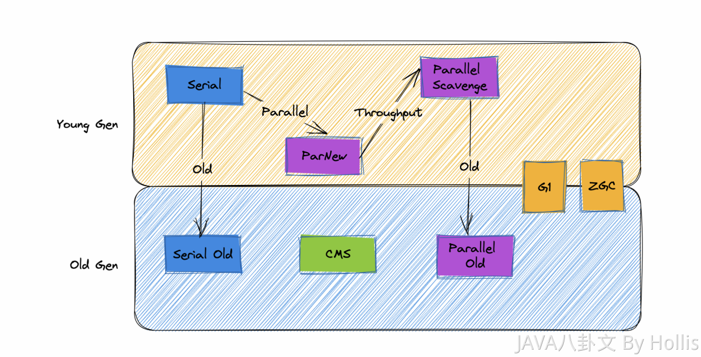

# 1. JMM - Java 内存模型

- Java 内存区域
- Java 内存回收算法
- Java 垃圾回收器模型

## 1.0 重点问题

1.  Java 线程分配对象，会进行逃逸分析，并不是所有对象都会分配在堆上

   参考：https://juejin.cn/post/6844903930351058958

2. Java 新生代的老年代晋升年龄判断，是动态年龄和估计次数的综合考虑

   > 一个是设置的阈值，默认为15，-XX:MaxTenuringThreshold 来设置在躲过多少次垃圾收集后进去老年代。
   >
   > 算法大概这样：年龄排序，1，2，3 ... n，如果为n的时候，对象在S0/S1 的大小超过50%，会把 n代及以上的对象直接投放到老年代去。

   参考：https://gitee.com/SnailClimb/JavaGuide/blob/main/docs/java/jvm/jvm-garbage-collection.md#%E9%95%BF%E6%9C%9F%E5%AD%98%E6%B4%BB%E7%9A%84%E5%AF%B9%E8%B1%A1%E5%B0%86%E8%BF%9B%E5%85%A5%E8%80%81%E5%B9%B4%E4%BB%A3

## 1.1 垃圾回收算法

**基本的垃圾回收算法有哪些？这几种算法的优缺点有哪些？**

1. 标记清除法

   优点，速度快，不需要移动和复制对象

   缺点，会产生内存碎片，造成内存浪费

2. 标记复制法

   优点，不会产生内存碎片

   缺点，浪费了一半的内存空间，复制对象会造成一定性能损耗

3. 标记整理法

   优点，不会产生内存碎片，并且不会浪费内存空间

   缺点，性能相对较低

## 1.2 如何判断对象是否存活

判断对象是否存活的两种算法：

- 引用计数器
- 可达性分析（GC root）

> 引用计数器存在的问题：
>
> 循环引用的问题

> 可达性分析可能会存在的问题：
>
> 多标（多标记了存活的，漏了一些垃圾，不严重）
>
> 漏标（少标记存活的，回收了正常对象，致命）
>
> STW，stop the world，在标记的过程中，耗时太长

重点算法：

- 三色标记法

## 1.3 Java 的四种引用

- 强引用

  OOM 也不会 GC

- 软引用

  OOM 会GC

- 弱引用

  不OOM 也会GC 

- 虚引用

  可以视为不存在

重点内容：

- ThreadLocal

## 1.4 垃圾回收器

可以简单分类如下：

1. 串行垃圾回收器

   Serial，Serial Old

2. 并行垃圾回收器

   Parallel, parallel scavenger, Parallel Old

3. CMS

4. G1, garbage first

5. ZGC

可以根据作用年代进一步分为：

- 新生代，Serial，ParNew，Parallel Scavenge
- 老年代，Serial Old，Parrallel Old，CMS
- 全域 GI，ZGC

