# 1. API 参考

## 1.1 LockSupport 

- park() / park(Object blocker)

  阻塞当前线程/阻塞传入的具体线程

- unpark(Thread thread)

  唤醒处于阻塞状态的指定线程

  > park 和 unpark 先后顺序可以不一致

Q: 为什么可以先唤醒线程后阻塞线程？

因为unpark获得了一个凭证，在之后再调用park方法，就可以名正言顺的消费，因此不会阻塞

> 因为 `Unpark` 可以让 permit 先为1，然后 park 的时候就直接让信号量的值从1变为0

## 1.2 UnSafe 类


# 2. AQS

https://blog.csdn.net/oneby1314/article/details/113789332

Q: 简单谈以下自己对 AQS 的理解？

> AQS，全程为 抽象队列同步器，AbstractQueneSynchoronized。
>
> 实现，Syn，具体实现，FairSyn，NoFairSyn。
>
> 具体使用到的类，ReentrantLock，Sympore，栅栏，闭锁countdwon等
>
> 方法调用链：lock -> tryAquire -> qunue -> addwaiter
>
> 非公平锁：尝试获取锁，加入到队尾，设置前一个节点 waitStatus 为 -1，阻塞自己等待唤醒，lockSupport.park
>
> 公平锁：查看是否队列有等待的，如果有，加入队尾，如果没有，则尝试抢占锁

## 2.1 前置知识

- 公平锁和非公平锁
- 可重入锁
- LockSupport
- 自旋锁
- 数据结构
- 模板模式

## 2.2 AQS 延申

- AbstractOwnableSynchronizer
- AbstractQueuedLongSynchronizer
- AbstactQueuedSynchronizer 抽象队列同步器

## 2.3 简介

AQS 是用来构建锁或者其它同步器组件的重量级基础框架及整个JUC体系的基石， 通过内置的FIFO队列来完成资源获取线程的排队工作，并通过一个int类变量（state）表示持有锁的状态

CLH：Craig、Landin and Hagersten 队列，是一个双向链表，AQS中的队列是CLH变体的虚拟双向队列FIFO

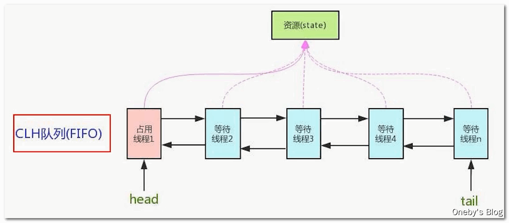

**和AQS有关的并发编程类**

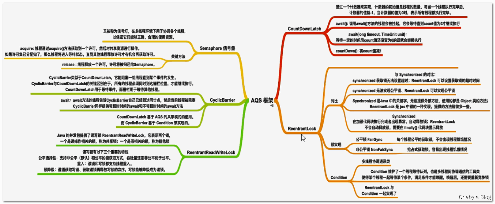

## 2.4 AQS 的三大组成

- AQS的同步状态State成员变量
- AQS的CLH队列
- 内部类Node（Node类在AQS类内部）

### 2.4.1 State成员变量

似于银行办理业务的受理窗口状态：零就是没人，自由状态可以办理；大于等于1，有人占用窗口，等着去

```java
**
 * The synchronization state.
 */
private volatile int state;
```

### 2.4.2 AQS的CLH队列

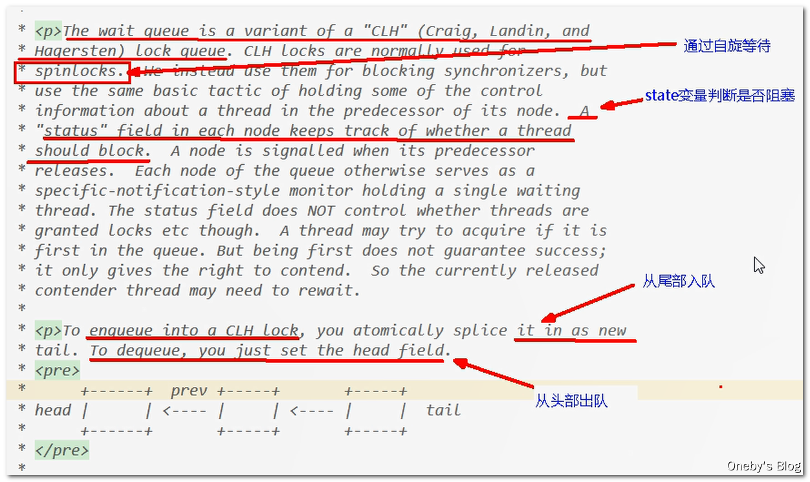

### 2.4.3 内部类Node（Node类在AQS类内部）

```java
static final class Node{
    //共享
    static final Node SHARED = new Node();
    
    //独占
    static final Node EXCLUSIVE = null;
    
    //线程被取消了
    static final int CANCELLED = 1;
    
    //后继线程需要唤醒
    static final int SIGNAL = -1;
    
    //等待condition唤醒
    static final int CONDITION = -2;
    
    //共享式同步状态获取将会无条件地传播下去
    static final int PROPAGATE = -3;
    
    // 初始为e，状态是上面的几种
    volatile int waitStatus;
    
    // 前置节点
    volatile Node prev;
    
    // 后继节点
    volatile Node next;

    // ...
    
```

## 2.5 AQS 的基本组成 (以ReentrantLock为例)

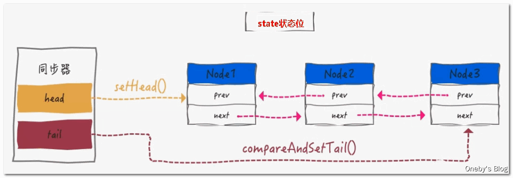

`ReentrantLock` 实现了 Lock 接口，在 `ReentrantLock` 内部聚合了一个 `AbstractQueuedSynchronizer` 的实现类

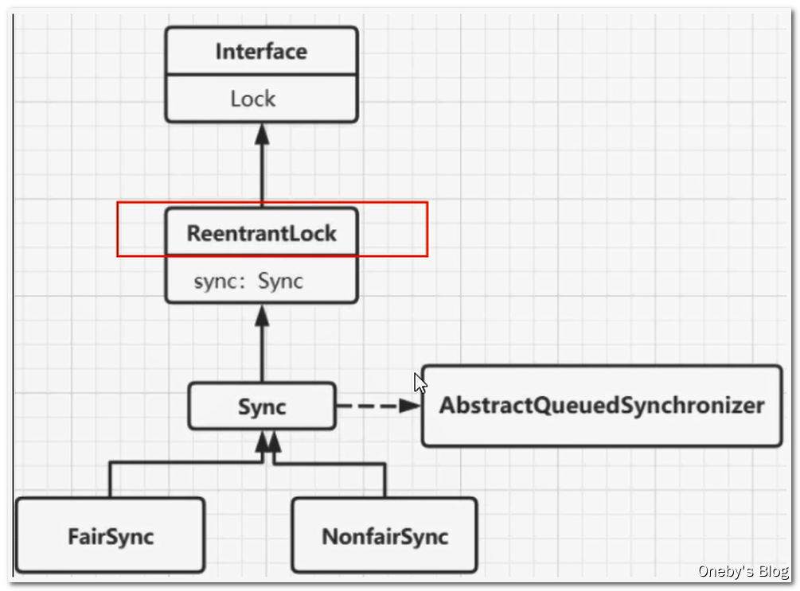

### 2.5.1 公平锁 or 非公平锁

在 `ReentrantLock` 内定义了静态内部类，分别为 `NoFairSync`（非公平锁）和 `FairSync`（公平锁）

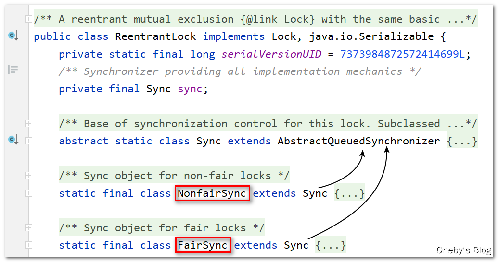

对比公平锁和非公平锁的tryAcqure()方法的实现代码， 其实差别就在于非公平锁获取锁时比公平锁中少了一个判断`!hasQueuedPredecessors()`，`hasQueuedPredecessors()`中判断了是否需要排队，导致公平锁和非公平锁的差异如下:

- 公平锁：公平锁讲究先来先到，线程在获取锁时，如果这个锁的等待队列中已经有线程在等待，那么当前线程就会进入等待队列中；

- 非公平锁：不管是否有等待队列，如果可以获取锁，则立刻占有锁对象。也就是说队列的第一 个排队线程在unpark()，之后还是需要竞争锁(存在线程竞争的情况下)

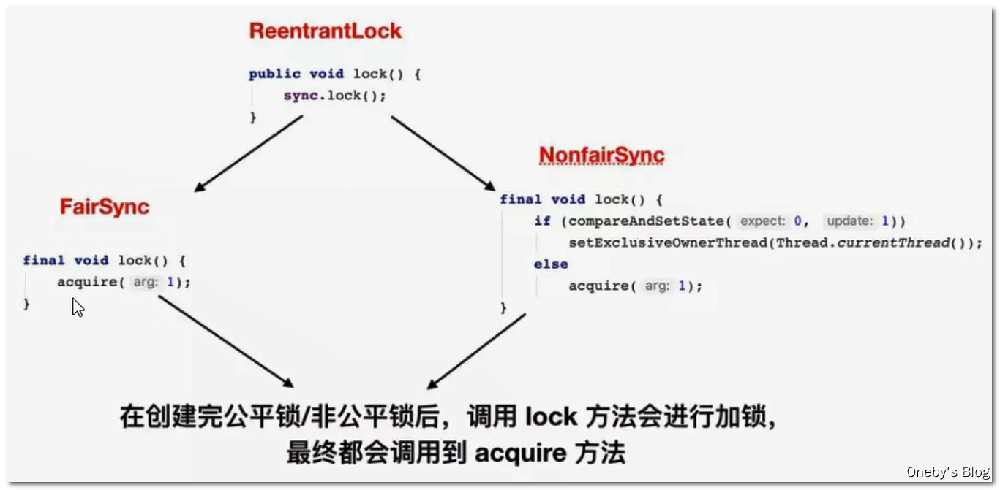

在 `NonfairSync` 和 `FairSync` 中均重写了其父类 `AbstractQueuedSynchronizer` 中的 `tryAcquire()` 方法

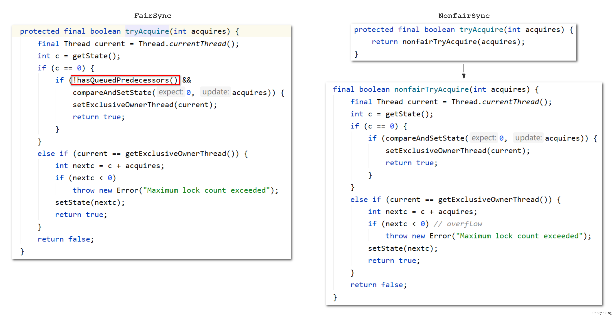


### 2.5.2 ReentrantLock`lock()` 方法的执行流程：以 `NonfairSync` 为例

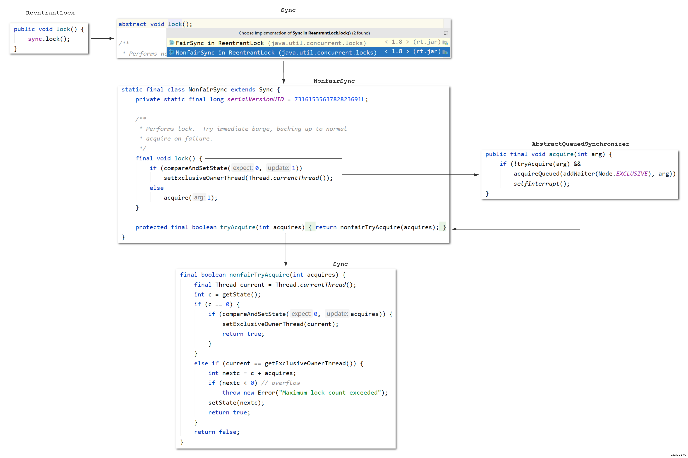

> compareAndSetState：尝试获取锁 --> 失败：acquire(1) 包含三个方法:
>
> ```java
>     public final void acquire(int arg) {
>         if (!tryAcquire(arg) &&
>             acquireQueued(addWaiter(Node.EXCLUSIVE), arg))
>             selfInterrupt();
>     }
> ```

在 `ReentrantLock` 中，`NoFairSync` 和 `FairSync` 中 `tryAcquire()` 方法的区别，可以明显看出公平锁与非公平锁的`lock()`方法唯一的区别就在于公平锁在获取同步状态时多了一个限制条件:`hasQueuedPredecessors()`

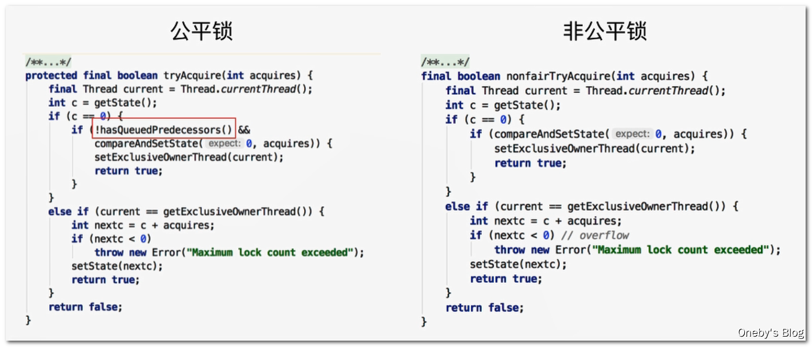

`hasQueuedPredecessors()` 方法是公平锁加锁时判断等待队列中是否存在有效节点的方法

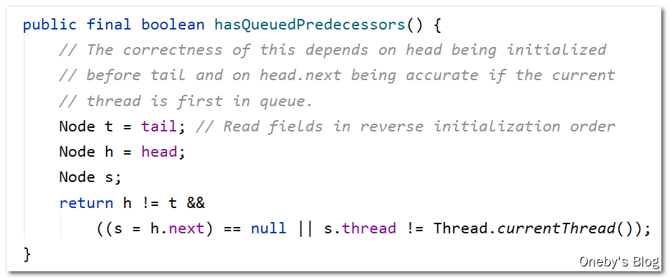

**第一次执行 lock() 方法**

由于第一次执行 `lock()` 方法，`state` 变量的值等于 0，表示 lock 锁没有被占用，此时执行 `compareAndSetState(0, 1)` CAS 判断，可得 `state == expected == 0`，因此 CAS 成功，将 `state` 的值修改为 1

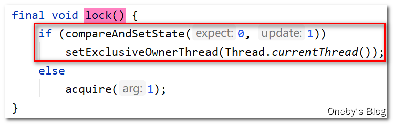

再来复习下 CAS：通过 Unsafe 提供的 compareAndSwapXxx() 方法保证修改操作的原子性（通过 CPU 原语保证），如果变量的值等于期望值，则修改变量的值为 update，并返回 true；若不等，则返回 false。this 代表当前对象，stateOffset 表示 state 变量在该对象中的偏移量

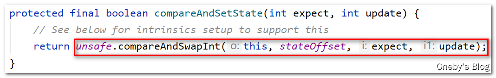

再来看看 `setExclusiveOwnerThread()` 方法做了啥：将拥有 lock 锁的线程修改为线程 A

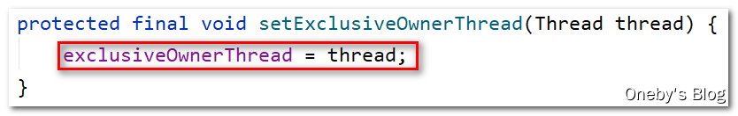

第二次执行 lock() 方法

由于第二次执行 lock() 方法，state 变量的值等于 1，表示 lock 锁没有被占用，此时执行 compareAndSetState(0, 1) CAS 判断，可得 state != expected，因此 CAS 失败，进入 acquire() 方法
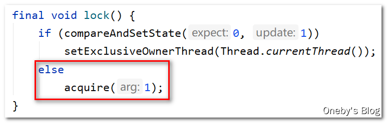

`acquire()` 方法主要包含如下几个方法，下面我们一个一个来讲解

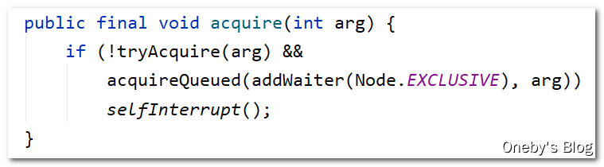

这里以非公平锁 `NonfairSync` 为例，在 `tryAcquire()` 方法中调用了 `nonfairTryAcquire()` 方法，注意，这里传入的参数都是 1

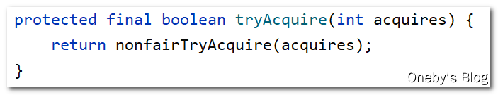

nonfairTryAcquire(acquires) 正常的执行流程：

在 nonfairTryAcquire() 方法中，大多数情况都是如下的执行流程：线程 B 执行 int c = getState() 时，获取到 state 变量的值为 1，表示 lock 锁正在被占用；于是执行 if (c == 0) { 发现条件不成立，接着执行下一个判断条件 else if (current == getExclusiveOwnerThread()) {，current 线程为线程 B，而 getExclusiveOwnerThread() 方法返回正在占用 lock 锁的线程，为线程 A，因此 tryAcquire() 方法最后会 return false，表示并没有抢占到 lock 锁

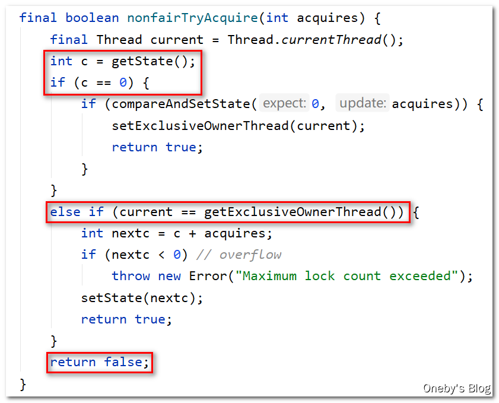

**补充**：`getExclusiveOwnerThread()` 方法返回正在占用 lock 锁的线程（排他锁，exclusive）

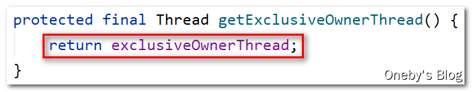

`nonfairTryAcquire(acquires) `比较特殊的执行流程：

- 第一种情况是，走到 int c = getState() 语句时，此时线程 A 恰好执行完成，让出了 lock 锁，那么 state 变量的值为 0，当然发生这种情况的概率很小，那么线程 B 执行 CAS 操作成功后，将占用 lock 锁的线程修改为自己，然后返回 true，表示抢占锁成功。其实这里还有一种情况，需要留到 unlock() 方法才能说清楚

- 第二种情况为可重入锁的表现，假设 A 线程又再次抢占 lock 锁（当然示例代码里面并没有体现出来），这时 current == getExclusiveOwnerThread() 条件成立，将 state 变量的值加上 acquire，这种情况下也应该 return true，表示线程 A 正在占用 lock 锁。因此，state 变量的值是可以大于 1 的

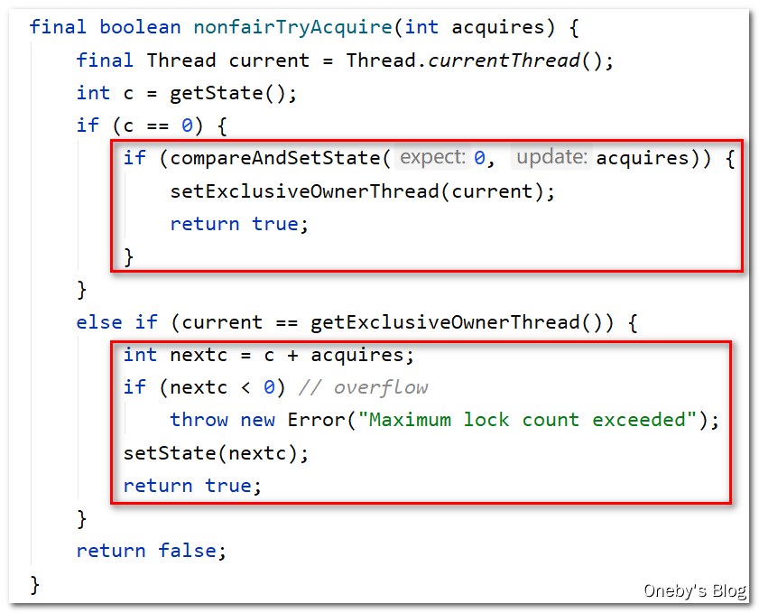

#### **执行 `addWaiter(Node.EXCLUSIVE)` 方法**

在 `tryAcquire()` 方法返回 `false` 之后，进行 `!` 操作后为 `true`，那么会继续执行 `addWaiter()` 方法

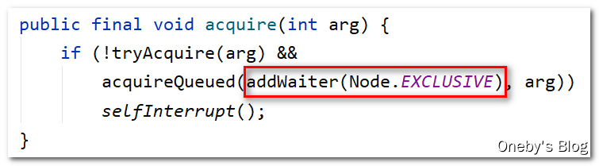

之前讲过，Node 节点用于封装用户线程，这里将当前正在执行的线程通过 Node 封装起来（当前线程正是抢占 lock 锁没有抢占到的线程）

判断 tail 尾指针是否为空，双端队列此时还没有元素呢~肯定为空呀，那么执行 enq(node) 方法，将封装了线程 B 的 Node 节点入队

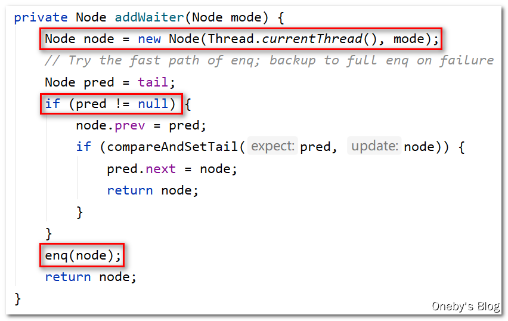

#### **`enq(node)` 方法：构建双端同步队列**

也许看到这里的代码有点蒙，需要有些前置知识，在双端同步队列中，第一个节点为虚节点（也叫哨兵节点），其实并不存储任何信息，只是占位。 真正的第一个有数据的节点，是从第二个节点开始的。

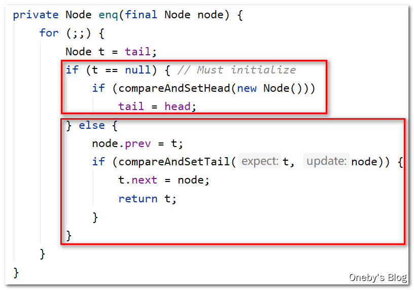

第一次执行 for 循环：现在解释起来就不费劲了，当线程 B 进来时，双端同步队列为空，此时肯定要先构建一个哨兵节点。此时 tail == null，因此进入 if(t == null) { 的分支，头指针指向哨兵节点，此时队列中只有一个节点，尾节点即是头结点，因此尾指针也指向该哨兵节点

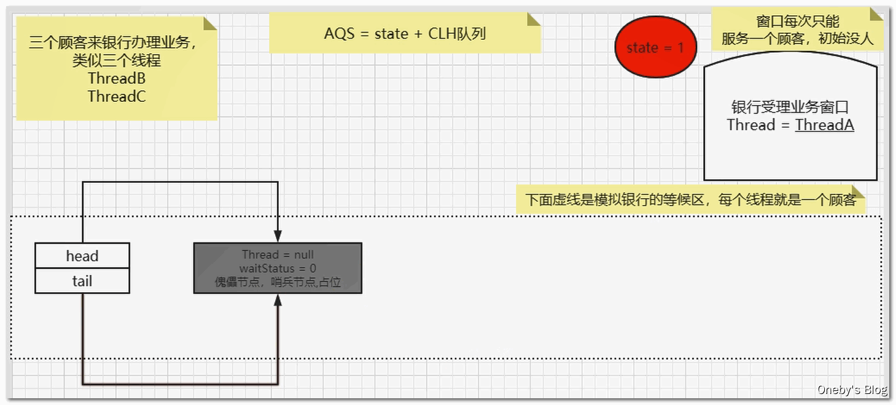

第二次执行 for 循环：现在该将装着线程 B 的节点放入双端同步队列中，此时 tail 指向了哨兵节点，并不等于 null，因此 if (t == null) 不成立，进入 else 分支。以尾插法的方式，先将 node（装着线程 B 的节点）的 prev 指向之前的 tail，再将 node 设置为尾节点（执行 compareAndSetTail(t, node)），最后将 t.next 指向 node，最后执行 return t结束 for 循环

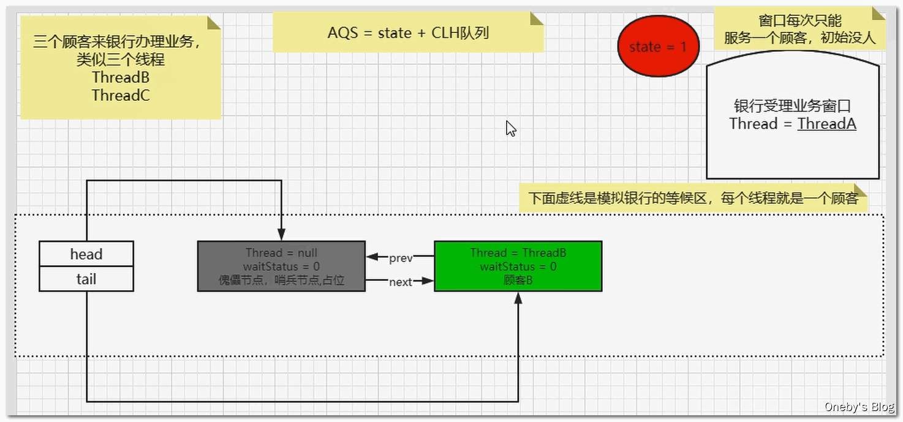

#### `compareAndSetTail(t, node)` 方法的实现

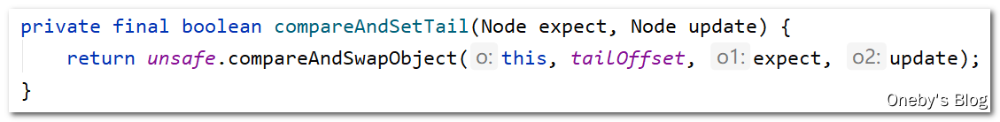

线程 C 和线程 B 的执行流程很类似，都是执行 `acquire()` 中的方法

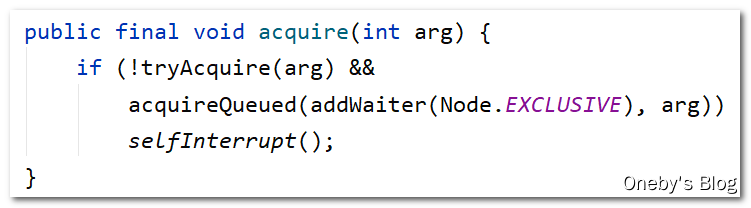

但是在 `addWaiter()` 方法中，执行流程有些区别。此时 `tail != null`，因此在 `addWaiter()` 方法中就已经将 `nodeC` 添加至队尾了

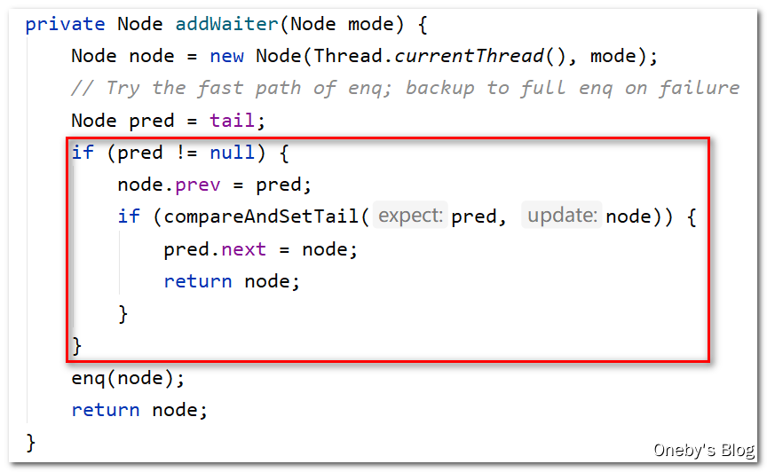

执行完 `addWaiter()` 方法后，就已经将 nodeC 挂在了双端同步队列的队尾，不需要再执行 `enq(node)` 方法

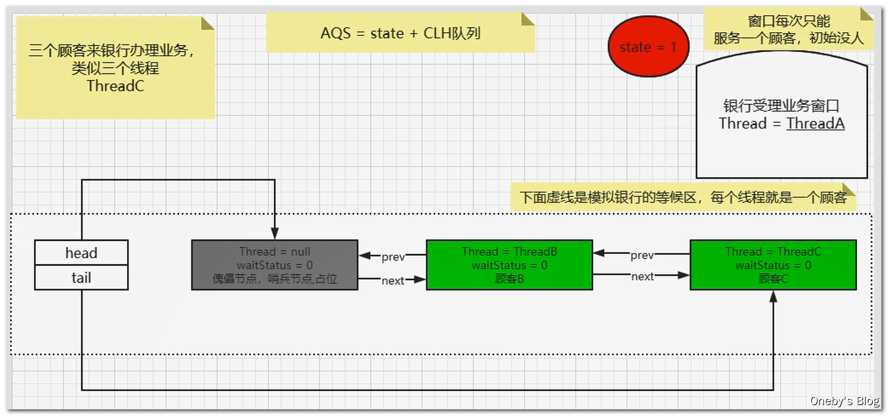

#### **`acquireQueued()` 方法的执行**

先来看看看看 `acquireQueued()` 方法的源代码，其实这样直接看代码有点懵逼，我们接下来举例来理解。注意看：两个 `if` 判断中的代码都放在 `for( ; ; )` 中执行，这样可以实现自旋的操作

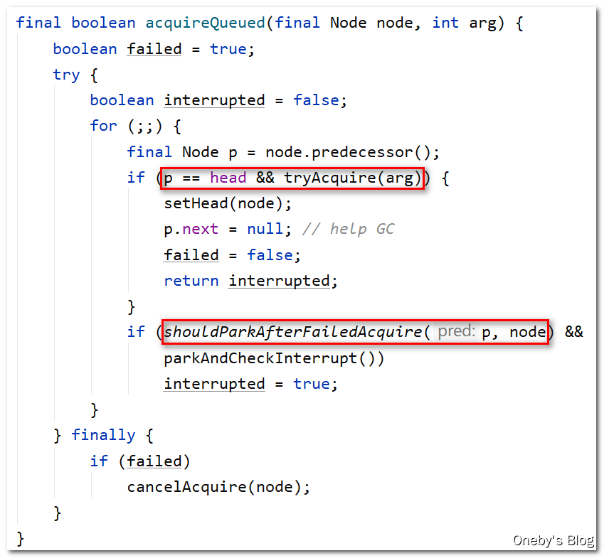

线程 B 执行 addWaiter() 方法之后，就进入了 acquireQueued() 方法中，此时传入的参数为封装了线程 B 的 nodeB 节点，nodeB 的前驱结点为哨兵节点，因此 `final Node p = node.predecessor()` 执行完后，p 将指向哨兵节点。哨兵节点满足 `p == head`，但是线程 B 执行 `tryAcquire(arg)` 方法尝试抢占 lock 锁时还是会失败，因此会执行下面 if 判断中的 `shouldParkAfterFailedAcquire(p, node)` 方法，该方法的代码如下：

```java
private static boolean shouldParkAfterFailedAcquire(Node pred, Node node) {
    int ws = pred.waitStatus;
    if (ws == Node.SIGNAL)
        /*
         * This node has already set status asking a release
         * to signal it, so it can safely park.
         */
        return true;
    if (ws > 0) {
        /*
         * Predecessor was cancelled. Skip over predecessors and
         * indicate retry.
         */
        do {
            node.prev = pred = pred.prev;
        } while (pred.waitStatus > 0);
        pred.next = node;
    } else {
        /*
         * waitStatus must be 0 or PROPAGATE.  Indicate that we
         * need a signal, but don't park yet.  Caller will need to
         * retry to make sure it cannot acquire before parking.
         */
        compareAndSetWaitStatus(pred, ws, Node.SIGNAL);
    }
    return false;
}

```

哨兵节点的 `waitStatus == 0`，因此执行 CAS 操作将哨兵节点的 `waitStatus` 改为 `Node.SIGNAL(-1)`

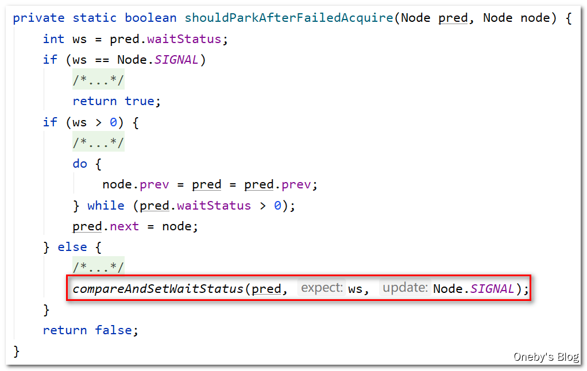

注意：`compareAndSetWaitStatus(pred, ws, Node.SIGNAL)` 调用 `unsafe.compareAndSwapInt(node, waitStatusOffset, expect, update)`; 实现，虽然 `compareAndSwapInt()` 方法内无自旋，但是在 `acquireQueued()` 方法中的 for( ; ; ) 能保证此自选操作成功（另一种情况就是线程 B 抢占到 lock 锁）

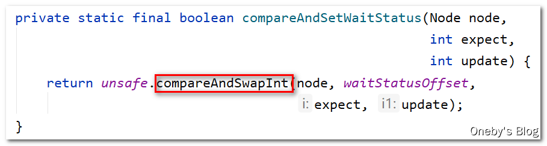

执行完上述操作，将哨兵节点的 `waitStatus` 设置为了 -1

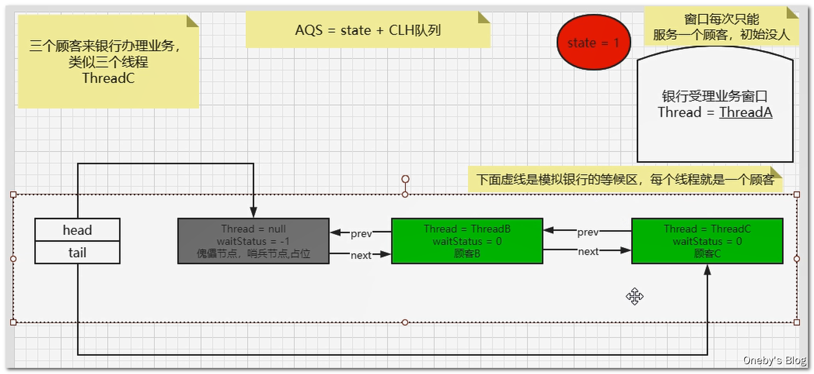

执行完毕将退出 `if` 判断，又会重新进入 `for( ; ; )` 循环，此时执行 `shouldParkAfterFailedAcquire(p, node)` 方法时会返回 `true`，因此此时会接着执行 `parkAndCheckInterrupt()` 方法

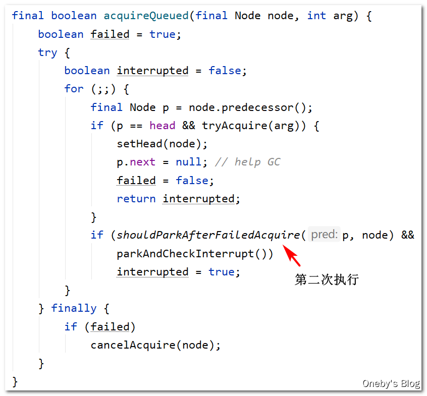

线程 B 调用 `park()` 方法后被挂起，程序不会然续向下执行，程序就在这儿排队等待

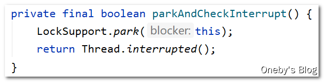

程 C 最终也会执行到 `LockSupport.park(this);` 处，然后被挂起，进入等待区

#### 总结：

如果前驱节点的 `waitstatus` 是 SIGNAL 状态（-1），即 `shouldParkAfterFailedAcquire()` 方法会返回 true，程序会继续向下执行 `parkAndCheckInterrupt()` 方法，用于将当前线程挂起

根据 park() 方法 API 描述，程序在下面三种情况会继续向下执行：

1. 被 unpark
2. 被中断（interrupt）
3. 其他不合逻辑的返回才会然续向下执行

因上述三种情况程序执行至此，返回当前线程的中断状态，并清空中断状态。如果程序由于被中断，该方法会返回 true

#### **执行 `unlock()` 方法**

`unlock()` 方法调用了 `sync.release(1)` 方法

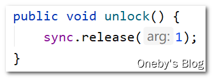

其实主要就是看看 tryRelease(arg) 方法和 unparkSuccessor(h) 方法的执行流程，这里先大概说以下，能有个印象：线程 A 即将让出 lock 锁，因此 tryRelease() 执行后将返回 true，表示礼让成功，head 指针指向哨兵节点，并且 if 条件满足，可执行 unparkSuccessor(h) 方法
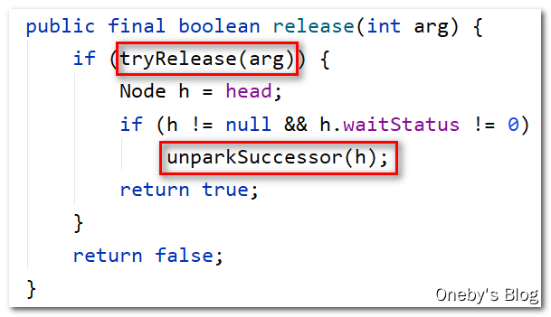

#### **`tryRelease(arg)` 方法的执行逻辑**

线程 A 只加锁过一次，因此 `state` 的值为 1，参数 `release` 的值也为 1，因此 `c == 0`。将 `free` 设置为 `true`，表示当前 lock 锁已被释放，将排他锁占有的线程设置为 `null`，表示没有任何线程占用 lock 锁

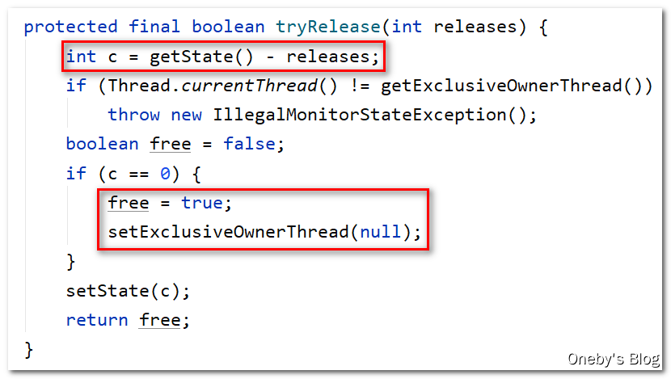

**`unparkSuccessor(h)` 方法的执行逻辑**

在 release() 方法中获取到的头结点 h 为哨兵节点，`h.waitStatus == -1`，因此执行 CAS操作将哨兵节点的 waitStatus 设置为 0，并将哨兵节点的下一个节点`（s = node.next = nodeB）`获取出来，并唤醒 nodeB 中封装的线程`（if (s == null || s.waitStatus > 0)` 不成立，只有 `if (s != null)` 成立）

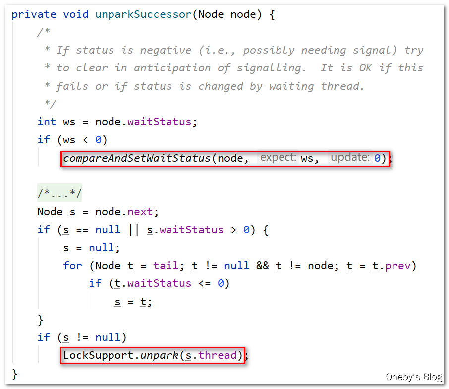

执行完上述操作后，当前占用 lock 锁的线程为 `null`，哨兵节点的 `waitStatus` 设置为 0，`state` 的值为 0（表示当前没有任何线程占用 lock 锁）

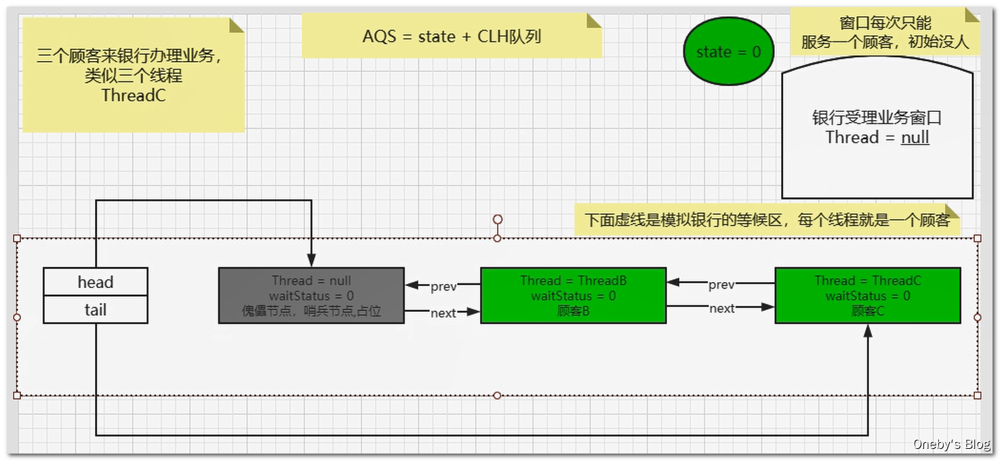

#### **来看 B 线程被唤醒之后的执行逻辑**

再次回到 `lock()` 方法的执行流程中来，线程 B 被 `unpark()` 之后将不再阻塞，继续执行下面的程序，线程 B 正常被唤醒，因此 `Thread.interrupted()` 的值为 `false`，表示线程 B 未被中断

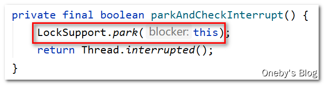

回到上一层方法中，此时 lock 锁未被占用，线程 B 执行 `tryAcquire(arg)` 方法能够抢到 lock 锁，并且将 `state` 变量的值设置为 1，表示该 lock 锁已经被占用

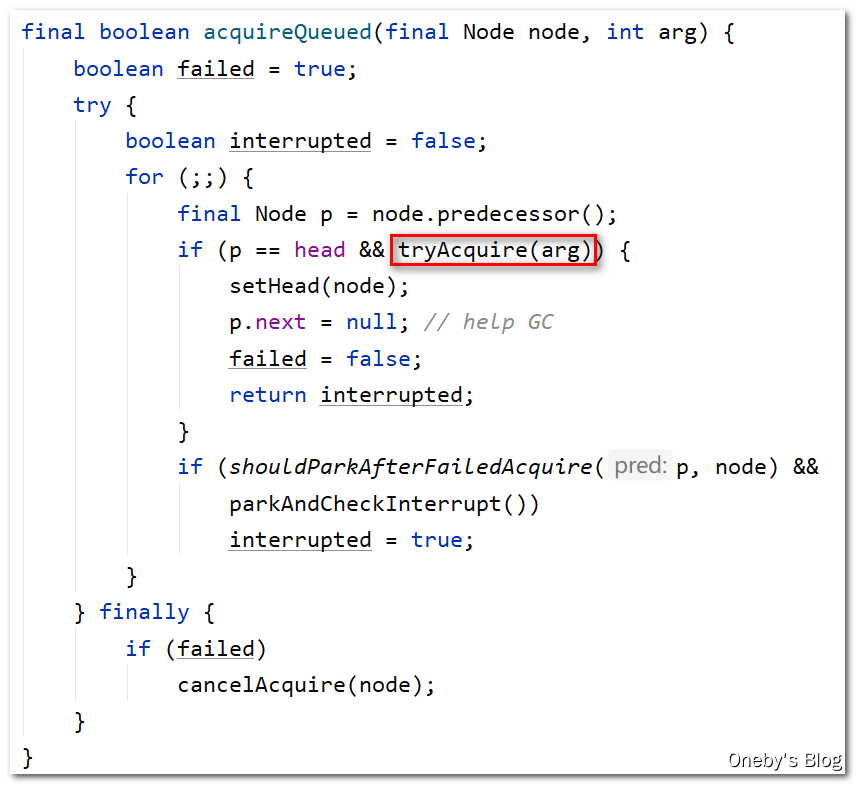

接着来研究下 `setHead(node)` 方法：传入的节点为 `nodeB`，头指针指向 `nodeB` 节点；将 `nodeB` 中封装的线程置为 `null`（因为已经获得锁了）；`nodeB` 不再指向其前驱节点（哨兵节点）。这一切都是为了将 `nodeB` 作为新的哨兵节点

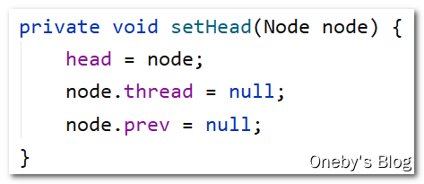

执行完 `setHead(node)` 方法的状态如下图所示

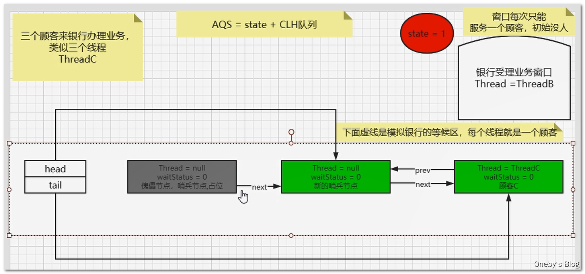

将 `p.next` 设置为 `null`，这是原来的哨兵节点就是完全孤立的一个节点，此时 `nodeB` 作为新的哨兵节点

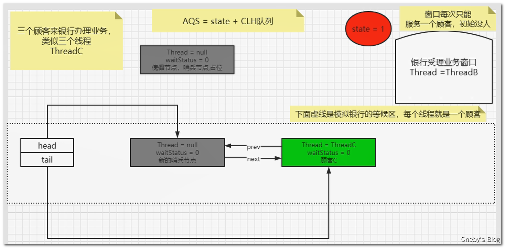

#### **AQS 的考点**

**第一个考点**：我相信你应该看过源码了，那么AQS里面有个变量叫State，它的值有几种？

**答**：3个状态：没占用是0，占用了是1，大于1是可重入锁

**第二个考点**：如果锁正在被占用，AB两个线程进来了以后，请问这个总共有多少个Node节点？

**答**：答案是3个，分别是哨兵节点、nodeA、nodeB

#### **AQS 源码解读案例图示**

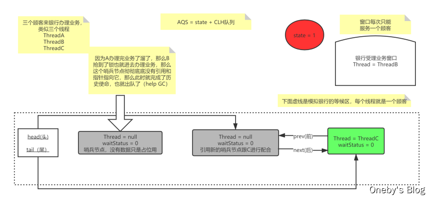

