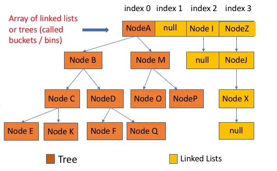

# 1. HashMap

## 1.1 HashMap 底层的变化

### JDK1.8 之前

JDK1.8 之前 HashMap 底层是 **数组和链表** 结合在一起使用也就是 **链表散列**。

HashMap 通过 key 的 hashCode 经过扰动函数处理过后得到 hash 值，然后通过 `(n - 1) & hash` 判断当前元素存放的位置（这里的 n 指的是数组的长度），如果当前位置存在元素的话，就判断该元素与要存入的元素的 hash 值以及 key 是否相同，如果相同的话，直接覆盖，不相同就通过拉链法解决冲突。

所谓扰动函数指的就是 HashMap 的 hash 方法。使用 hash 方法也就是扰动函数是为了防止一些实现比较差的 hashCode() 方法 换句话说使用扰动函数之后可以减少碰撞。


### JDK1.8 之后

相比于之前的版本，JDK1.8 以后在解决哈希冲突时有了较大的变化。

当链表长度大于阈值（默认为 8）时，会首先调用 `treeifyBin()`方法。这个方法会根据 HashMap 数组来决定是否转换为红黑树。只有当数组长度大于或者等于 64 的情况下，才会执行转换红黑树操作，以减少搜索时间。否则，就是只是执行 `resize()` 方法对数组扩容。



## 1.2 HashMap 的主要组成

- Node

  ```java
  // 继承自 Map.Entry<K,V>
  static class Node<K,V> implements Map.Entry<K,V> {
         final int hash;// 哈希值，存放元素到hashmap中时用来与其他元素hash值比较
         final K key;//键
         V value;//值
         // 指向下一个节点
         Node<K,V> next;
         Node(int hash, K key, V value, Node<K,V> next) {
              this.hash = hash;
              this.key = key;
              this.value = value;
              this.next = next;
          }
          public final K getKey()        { return key; }
          public final V getValue()      { return value; }
          public final String toString() { return key + "=" + value; }
          // 重写hashCode()方法
          public final int hashCode() {
              return Objects.hashCode(key) ^ Objects.hashCode(value);
          }
  
          public final V setValue(V newValue) {
              V oldValue = value;
              value = newValue;
              return oldValue;
          }
          // 重写 equals() 方法
          public final boolean equals(Object o) {
              if (o == this)
                  return true;
              if (o instanceof Map.Entry) {
                  Map.Entry<?,?> e = (Map.Entry<?,?>)o;
                  if (Objects.equals(key, e.getKey()) &&
                      Objects.equals(value, e.getValue()))
                      return true;
              }
              return false;
          }
  }
  ```

  TreeNode:

  ```java
  // 继承自 Map.Entry<K,V>
  static class Node<K,V> implements Map.Entry<K,V> {
         final int hash;// 哈希值，存放元素到hashmap中时用来与其他元素hash值比较
         final K key;//键
         V value;//值
         // 指向下一个节点
         Node<K,V> next;
         Node(int hash, K key, V value, Node<K,V> next) {
              this.hash = hash;
              this.key = key;
              this.value = value;
              this.next = next;
          }
          public final K getKey()        { return key; }
          public final V getValue()      { return value; }
          public final String toString() { return key + "=" + value; }
          // 重写hashCode()方法
          public final int hashCode() {
              return Objects.hashCode(key) ^ Objects.hashCode(value);
          }
  
          public final V setValue(V newValue) {
              V oldValue = value;
              value = newValue;
              return oldValue;
          }
          // 重写 equals() 方法
          public final boolean equals(Object o) {
              if (o == this)
                  return true;
              if (o instanceof Map.Entry) {
                  Map.Entry<?,?> e = (Map.Entry<?,?>)o;
                  if (Objects.equals(key, e.getKey()) &&
                      Objects.equals(value, e.getValue()))
                      return true;
              }
              return false;
          }
  }
  ```

  

- **loadFactor 加载因子**

  loadFactor 加载因子是控制数组存放数据的疏密程度，loadFactor 越趋近于 1，那么 数组中存放的数据(entry)也就越多，也就越密，也就是会让链表的长度增加，loadFactor 越小，也就是趋近于 0，数组中存放的数据(entry)也就越少，也就越稀疏。

  **loadFactor 太大导致查找元素效率低，太小导致数组的利用率低，存放的数据会很分散。loadFactor 的默认值为 0.75f 是官方给出的一个比较好的临界值**。

  给定的默认容量为 16，负载因子为 0.75。Map 在使用过程中不断的往里面存放数据，当数量达到了 16 * 0.75 = 12 就需要将当前 16 的容量进行扩容，而扩容这个过程涉及到 rehash、复制数据等操作，所以非常消耗性能。

- **threshold**

  **threshold = capacity \* loadFactor**，**当 Size>=threshold**的时候，那么就要考虑对数组的扩增了，也就是说，这个的意思就是 **衡量数组是否需要扩增的一个标准**。

## 1.8 HashMap 的长度为什么是 2 的幂次方

为了能让 HashMap 存取高效，尽量较少碰撞，也就是要尽量把数据分配均匀。我们上面也讲到了过了，Hash 值的范围值-2147483648 到 2147483647，前后加起来大概 40 亿的映射空间，只要哈希函数映射得比较均匀松散，一般应用是很难出现碰撞的。但问题是一个 40 亿长度的数组，内存是放不下的。所以这个散列值是不能直接拿来用的。用之前还要先做对数组的长度取模运算，得到的余数才能用来要存放的位置也就是对应的数组下标。这个数组下标的计算方法是“ `(n - 1) & hash`”。（n 代表数组长度）。这也就解释了 HashMap 的长度为什么是 2 的幂次方。

**这个算法应该如何设计呢？**

- 我们首先可能会想到采用%取余的操作来实现。但是，重点来了：**“取余(%)操作中如果除数是 2 的幂次则等价于与其除数减一的与(&)操作（也就是说 hash%length==hash&(length-1)的前提是 length 是 2 的 n 次方；）。”** 并且 **采用二进制位操作 &，相对于%能够提高运算效率，这就解释了 HashMap 的长度为什么是 2 的幂次方。**

- **HashMap 扩容的时候，会使用的是2次幂的扩展(指长度扩为原来2倍)。所以，元素的位置要么是在原位置，要么是在原位置再移动2次幂的位置。**

  因此，我们在扩充HashMap的时候，不需要重新计算hash，只需要看看原来的hash值新增的那个bit是1还是0就好了，是0的话索引没变，是1的话索引变成“原索引+oldCap”。可以看看下图为16扩充为32的resize示意图：


# 2. ArrayList

## 2.1 ArrayList 扩容原理

> 说下ArrayList 扩容的原理吧？
>
> 如果开始不指定容量：
>
> 默认为空数组，添加第一个元素的时候，长度会修改为 10 
>
> 如果指定容量，使用指定的容量
>
> 如果是 new ArrayList<>(Collection); 会使用 Collection 的容量
>
> `elementData = collection.toArray();`
>
> 如果 collection 为空，则使用空数组
>
> 
>
> 添加元素的时候，如果 mini_size > size，size + size * 0.5(位运算，实际向下取整)。
>
> 如果 newSize 还是小于 mini_size，那么直接使用 mini_size。
>
> 如果newCapacity 超过了 MAX_ARRAY_SIZE（Integer.MAX_VALUE - 8），会执行 hugeCapacity 方法，
>
> - 如果 mini_size > MAX_ARRAY_SIZE，size = Integer.MAX_VALUE，否则 size = MAX_ARRAY_SIZE
>
> 扩容的 `grow(int minCapacity)`  方法，如果 mini_size > size，需要使用到 
>
> ```java
> elementData = Arrays.copyOf(elementData, newCapacity);
> ```
>
> ————————————————————————————————————————————————
>
> 额外的，还有其它两个用法
>
> System.arraycopy() 和 Arrays.copyOf()
>
> 其中 System.arraycopy() 是复制源数组到目标数组中，Arrays.copyOf() 底层其实还是 System.arraycopy()
>
> ```
>     // 我们发现 arraycopy 是一个 native 方法,接下来我们解释一下各个参数的具体意义
>     /**
>     *   复制数组
>     * @param src 源数组
>     * @param srcPos 源数组中的起始位置
>     * @param dest 目标数组
>     * @param destPos 目标数组中的起始位置
>     * @param length 要复制的数组元素的数量
>     */
>     public static native void arraycopy(Object src,  int  srcPos,
>                                         Object dest, int destPos,
>                                         int length);
> ```
>
> Arrays.copyOf() 只是在底层 new 了一个新的数组，调用了System.arraycopy()方法
>
> ```
>     public static int[] copyOf(int[] original, int newLength) {
>     	// 申请一个新的数组
>         int[] copy = new int[newLength];
> 	// 调用System.arraycopy,将源数组中的数据进行拷贝,并返回新的数组
>         System.arraycopy(original, 0, copy, 0,
>                          Math.min(original.length, newLength));
>         return copy;
>     }
> ```
>
> 
>
> 还有一个 ensureCapacity 方法，可以提前分配好容量
>
> 理论上来说，最好在向 `ArrayList` 添加大量元素之前用 `ensureCapacity` 方法，以减少增量重新分配的次数
>
> 实际上效果有限
>
> ```
> public class EnsureCapacityTest {
>     public static void main(String[] args) {
>         ArrayList<Object> list = new ArrayList<Object>();
>         final int N = 10000000;
>         long startTime1 = System.currentTimeMillis();
>         list.ensureCapacity(N);
>         for (int i = 0; i < N; i++) {
>             list.add(i);
>         }
>         long endTime1 = System.currentTimeMillis();
>         System.out.println("使用ensureCapacity方法后："+(endTime1 - startTime1));
>     }
> }
> 
> ```


