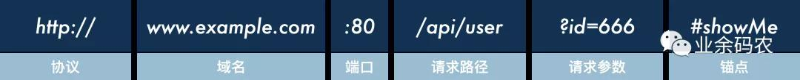
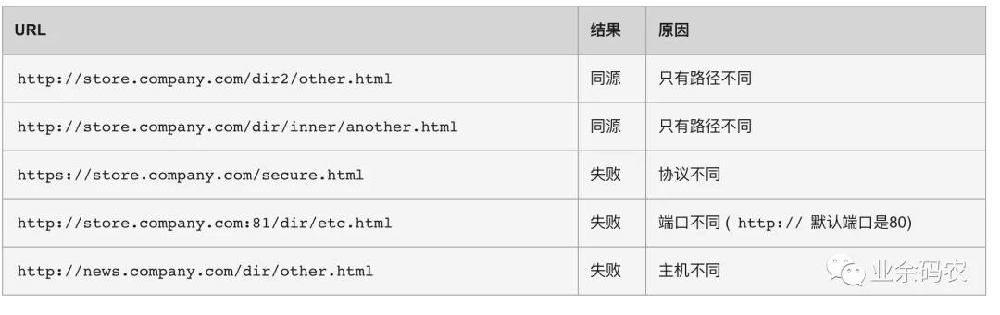
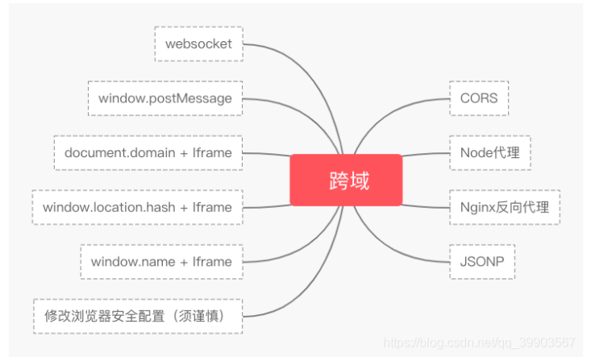

# 1. Web 基础

## 1.1 http 请求头

主要可以分为以下四类：

- **通用头标**：即可用于请求，也可用于响应，是作为一个整体而不是特定资源与事务相关联。
- **请求头标**：允许客户端传递关于自身的信息和希望的响应形式。
- **响应头标**：服务器和于传递自身信息的响应。
- **实体头标**：定义被传送资源的信息。即可用于请求，也可用于响应

根据上面的分类我们可以把他们分为:**Request**和**Response**两部分。

> 应该是http请求头也可以划分成Request 和 Response两类
>
> 以下的字段不全，而且可能存在问题！
>
> 详情可以参考https://juejin.cn/post/6844903745004765198

#### HTTP Request Header 请求头

> **Accept：**指定客户端能够接收的内容类型。
>
> **Accept-Charset：**浏览器可以接受的字符编码集。
>
> **Accept-Encoding：**指定浏览器可以支持的web服务器返回内容压缩编码类型。
>
> **Accept-Language：**浏览器可接受的语言。
>
> **Accept-Ranges：**可以请求网页实体的一个或者多个子范围字段。
>
> **AuthorizationHTTP：**授权的授权证书。
>
> **Cache-Control：**指定请求和响应遵循的缓存机制。
>
> **Connection：**表示是否需要持久连接。（HTTP 1.1默认进行持久连接）
>
> **Cookie：**请求发送时，会把保存在该请求域名下的所有cookie值一起发送给web服务器。
>
> **Content-Length：**请求的内容长度。
>
> **Content-Type：**请求的与实体对应的MIME信息。
>
> **Date：**请求发送的日期和时间。
>
> **Expect：**请求的特定的服务器行为。
>
> **From：**发出请求的用户的Email。
>
> **Host：**指定请求的服务器的域名和端口号。
>
> **If-Match：**只有请求内容与实体相匹配才有效。
>
> **If-Modified-Since：**如果请求的部分在指定时间之后被修改则请求成功，未被修改则返回304代码。
>
> **If-None-Match：**如果内容未改变返回304代码，参数为服务器先前发送的Etag，与服务器回应的Etag比较判断是否改变。
>
> **If-Range：**如果实体未改变，服务器发送客户端丢失的部分，否则发送整个实体。
>
> **If-Unmodified-Since：**只在实体在指定时间之后未被修改才请求成功。
>
> **Max-Forwards：**限制信息通过代理和网关传送的时间。
>
> **Pragma：**用来包含实现特定的指令。
>
> **Proxy-Authorization：**连接到代理的授权证书。
>
> **Range：**只请求实体的一部分，指定范围。
>
> **Referer：**先前网页的地址，当前请求网页紧随其后,即来路。
>
> **Transfer-Encoding：**客户端愿意接受的传输编码，并通知服务器接受接受尾加头信息。
>
> **Upgrade：**向服务器指定某种传输协议以便服务器进行转换（如果支持。
>
> **User-Agent：**的内容包含发出请求的用户信息。
>
> **Via：**通知中间网关或代理服务器地址，通信协议。
>
> **Warning：**关于消息实体的警告信息

#### HTTP Responses Header 响应头

> **Accept-Ranges：**表明服务器是否支持指定范围请求及哪种类型的分段请求。
>
> **Age：**从原始服务器到代理缓存形成的估算时间（以秒计，非负）。
>
> **Allow：**对某网络资源的有效的请求行为，不允许则返回405。
>
> **Cache-Control：**告诉所有的缓存机制是否可以缓存及哪种类型。
>
> **Content-Encoding：**服务器支持的返回内容压缩编码类型。。
>
> **Content-Language：**响应体的语言。
>
> **Content-Length：**响应体的长度。
>
> **Content-Location：**请求资源可替代的备用的另一地址。
>
> **Content-MD5：**返回资源的MD5校验值。
>
> **Content-Range：**在整个返回体中本部分的字节位置。
>
> **Content-Type：**返回内容的MIME类型。
>
> **Date：**原始服务器消息发出的时间。
>
> **ETag：**请求变量的实体标签的当前值。
>
> **Expires：**响应过期的日期和时间。
>
> **Last-Modified：**请求资源的最后修改时间。
>
> **Location：**用来重定向接收方到非请求URL的位置来完成请求或标识新的资源。
>
> **Pragma：**包括实现特定的指令，它可应用到响应链上的任何接收方。
>
> **Proxy-Authenticate：**它指出认证方案和可应用到代理的该URL上的参数。
>
> **refresh：**应用于重定向或一个新的资源被创造，在5秒之后重定向（由网景提出，被大部分浏览器支持）
>
> **Retry-After：**如果实体暂时不可取，通知客户端在指定时间之后再次尝试。
>
> **Server：**服务器软件名称。
>
> **Set-Cookie：**设置Http Cookie。
>
> **Trailer：**指出头域在分块传输编码的尾部存在。
>
> **Transfer-Encoding：**文件传输编码。
>
> **Vary：**告诉下游代理是使用缓存响应还是从原始服务器请求。
>
> **Via：**告知代理客户端响应是通过哪里发送的。
>
> **Warning：**警告实体可能存在的问题。
>
> **WWW-Authenticate：**表明客户端请求实体应该使用的授权方案。

# 2.  跨域问题

## 2.1 什么是跨域问题？

说到跨域，首先需要解释下为什么会出现这样的跨域问题。这其实都源于浏览器的同源策略。

同源策略是浏览器中的一个重要的安全策略，是Netscape公司在1995年引入。同源策略的作用就是为了限制不同源之间的交互，从而能够有效避免XSS、CSFR等浏览器层面的攻击。

同源指的是两个请求接口URL的协议(protocol)、域名(host)和端口(port)一致。



比如以下例子：



## 2.2 CSFR 攻击

## 2.3 跨域限制是浏览器行为，不是服务器行为

https://blog.csdn.net/qq_42893625/article/details/105003755

### **跨域的判断流程**

浏览器先根据同源策略对前端页面和后台交互地址做匹配，若同源，则直接发送数据请求；若不同源，则发送跨域请求。

服务器解析程序收到浏览器跨域请求后，根据自身配置返回对应文件头。若未配置过任何允许跨域，则文件头里不包含Access-Control-Allow-origin字段，若配置过域名，则返回Access-Control-Allow-origin+ 对应配置规则里的域名的方式。

浏览器根据接受到的http文件头里的`Access-Control-Allow-origin`字段做匹配，若无该字段，说明不允许跨域；若有该字段，则对字段内容和当前域名做比对，如果同源，则说明可以跨域，浏览器发送该请求；若不同源，则说明该域名不可跨域，不发送请求。
（但是不能仅仅根据服务器返回的文件头里是否包含Access-Control-Allow-origin来判断其是否允许跨域，因为服务器端配置多域名跨域的时候，也会出现不能跨域的域名返回包里没有Access-Control-Allow-origin字段的情况。）
一个支持CORS的web服务器，有如下的判定字段，他们会在响应的header中写明

- Access-Control-Allow-Origin：允许跨域的Origin列表
- Access-Control-Allow-Methods：允许跨域的方法列表
- Access-Control-Allow-Headers：允许跨域的Header列表
- Access-Control-Expose-Headers：允许暴露给JavaScript代码的Header列表
- Access-Control-Max-Age：最大的浏览器缓存时间，单位为s

​	其中Access-Control-Allow-Origin（访问控制之允许的源）,在响应的http header中必须有的，表示允许访问本服务器的源头Origin（域名），可以是特定的域名列表，用逗号分隔，也可以是通配符 *，表示支持任意域名的访问。
除了限定源头Origin，还会限制请求的方法Method，Header。
如，如果服务器设定`Access-Control-Allow-Methods:GET`，那么跨域的POST请求无法在这个服务器执行。

### **流程总结：**

1. 页面发送请求
2. 浏览器根据同源策略做出判定，如果是同源请求，直接发送出去；如果是跨域请求，在HTTP HEADER加上Origin字段，或是先发送一次预检请求(preflight)。
3. 服务器接收请求，根据自身跨域的配置（如允许哪些域名，什么样的Method访问），返回文件头。若未配置过任何允许跨域，则文件头里不包含Access-Control-Allow-origin字段，若配置过域名，则返回Access-Control-Allow-origin+ 对应配置规则里的域名的方式。
4. 浏览器接收到响应，根据响应头里的Access-Control-Allow-origin字段做匹配，如果没有这个字段，说明不匹配；如果有，将字段内容和当前域名做比对。如匹配，则可以发送请求。

### **简单请求**

简单请求；非简单请求。

简单请求，方法仅限于 HEAD,GET或POST，且Header的字段不超过以下字段：

- HeaderAccept：
- Accept-Language；
- Content-Language；
- Last-Event-ID；
- Content-Type：只限于三个值application/x-www-form-urlencoded、multipart/form-data、text/plain （没有application/json, 说明如果发送JSON格式的body请求数据是一个非简单请求)

  非简单请求就是其他请求。简单请求浏览器会直接在请求的Header加上Origin字段再发送；非简单请求浏览器则会先发送一次预检请求，根据预检请求的结果，决定是否正式发送请求。


## 2.4 跨域问题的解决方法

https://www.51cto.com/article/694411.html

https://developer.huawei.com/consumer/cn/forum/topic/0201543827686830172?fid=23



- JSONP跨域

  > JSONP的原理就是通过发送带有Callback参数的GET请求，服务端将接口返回数据拼凑到Callback函数中，返回给浏览器，浏览器解析执行，从而前端拿到Callback函数返回的数据。

- 跨域资源共享（CORS）

- `nginx`代理跨域

  > ```nginx
  > server { 
  >     listen       3000; 
  >     server_name  localhost; 
  >  
  >     location /api { 
  >         proxy_pass   http://localhost:3001;  #反向代理 
  >     } 
  > } 
  > ```
  >
  > 
  >
  > 

- `nodejs`中间件代理跨域

  > **Webpack Server代理**
  >
  > 在webpack中可以通过配置proxy来快速获得接口代理的能力，同时前端请求的URL不需要带域名，代理服务器会自动自动将请求映射为同域请求。
  >
  > ```javascript
  > module.exports = { 
  >   ... 
  >   output: {...}, 
  >   devServer: { 
  >     port: 3000, 
  >     proxy: { 
  >       "/api": { 
  >         target: "http://localhost:3001" 
  >       } 
  >     } 
  >   }, 
  >   plugins: [] 
  > }; 
  > 
  > ```
  >
  > 

- `document.domain` + `iframe`跨域

- `location.hash` + `iframe`跨域

- `window.name` + `iframe`跨域

- `postMessage`跨域

- `WebSocket`协议跨域

- 浏览器开启跨域

## 2.5 @CrossOrigin 注解

https://www.cnblogs.com/mmzs/p/9167743.html

https://cloud.tencent.com/developer/article/1756912

`@CrossOrigin` 使用方法简介：

```java
@RestController
@RequestMapping("/account")
// @CrossOrigin(origins = "http://domain2.com", maxAge = 3600)
public class AccountController {

    @CrossOrigin
    @GetMapping("/{id}")
    public Account retrieve(@PathVariable Long id) {
        // ...
    }

    @DeleteMapping("/{id}")
    public void remove(@PathVariable Long id) {
        // ...
    }
}
```

其中`@CrossOrigin`中的2个参数：

- **origins** ： 允许可访问的域列表
- **maxAge**：准备响应前的缓存持续的最大时间（以秒为单位）。

**全局CORS配置**

使整个应用程序的CORS简化为：

```java
@Configuration
@EnableWebMvc
public class WebConfig extends WebMvcConfigurerAdapter {

    @Override
    public void addCorsMappings(CorsRegistry registry) {
        registry.addMapping("/**");
    }
}
```

`SpringBoot`

```java
@Configuration
@EnableWebMvc
public class WebConfig extends WebMvcConfigurerAdapter {

    @Override
    public void addCorsMappings(CorsRegistry registry) {
        registry.addMapping("/**");
    }
}
```

