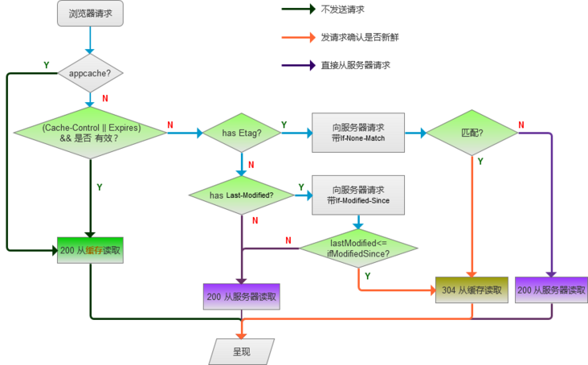

# 1. Http 请求简介

需要注意的地方：

1. http 的请求方法有哪些？
2. http 与 https 的区别是什么？
3. http 的 请求头内容有哪些？
4. http 请求头中 content-Type 有哪些? mimeType 有哪些？

## 1.1 http 请求头

参考资料：

https://segmentfault.com/a/1190000018234763

https://developer.mozilla.org/zh-CN/docs/Glossary/Request_header

https://developer.mozilla.org/zh-CN/docs/Web/HTTP/Headers

https://www.runoob.com/http/http-tutorial.html

主要可以分为以下四类：

- **通用头标**：即可用于请求，也可用于响应，是作为一个整体而不是特定资源与事务相关联。
- **请求头标**：允许客户端传递关于自身的信息和希望的响应形式。
- **响应头标**：服务器和于传递自身信息的响应。
- **实体头标**：定义被传送资源的信息。即可用于请求，也可用于响应

> 个人觉得需要重点记住的几类头标信息：
>
> Request:
>
> **accept:** text/html,application/xhtml+xml,application/xml;q=0.9,image/avif,image/webp,image/apng,*/*;q=0.8,application/signed-exchange;v=b3;q=0.9
>
> **accept-encoding:** gzip, deflate, br
>
> **accept-language:** zh-CN,zh;q=0.9
>
> **cache-control:** max-age=0
>
> **user-agent:** Mozilla/5.0 (Windows NT 10.0; Win64; x64) AppleWebKit/537.36 (KHTML, like Gecko) Chrome/109.0.0.0 Safari/537.36
>
> **cookie:**
>
> ------
>
> Response:
>
> **expires:** Sun, 12 Feb 2023 18:14:58 GMT
>
> **content-type:** text/html; charset=utf-8
>
> **content-encoding:** gzip
>
> **cache-control:** no-cache
>
> **date:** Sun, 12 Feb 2023 18:14:59 GMT


### 通用头标：

- Cache-Control——控制缓存的行为； [详情](https://link.segmentfault.com/?enc=d0T3ENLpP2LmDKAF3HZnxQ%3D%3D.D6f9NlO6R%2BwtgTj4AiIfwScds31mQDBnAtkP8pbhpvyzHixA6jokXptI245LYVJ5rioMcyq2OxhNjzBPqA5p76KW8VzpXw80%2BWAn4Y2jy6M%3D)
- Connection(禁止修改)——决定当前的事务完成后，是否会关闭网络连接； [详情](https://link.segmentfault.com/?enc=Wii6U%2FLF54T9RDI6ZzhSIQ%3D%3D.dIfh7JBKdD4JPQZzYgmeBwnhvapb3X72qFyOBPoBxpjzOh13mt%2B%2BnU1zqhOQjaRUjUyakA1jSdpnw1wM7XLraN%2FmfBYX6OWHwRpxP1IowpM%3D)
- Date——创建报文的日期时间； [详情](https://link.segmentfault.com/?enc=gDhG6WefRI5Ez%2BYTBDMBXg%3D%3D.0w2ANix9G8D67S6T1cU%2FiAvPlNjJoGxg8EwPDicABne53nY1VeopVGPUw2zGdg3LSEBB60ErlkiFSB%2FTw0GTTQ%3D%3D)
- Keep-Alive——用来设置超时时长和最大请求数；[详情](https://link.segmentfault.com/?enc=ZcXBR1DiCm3KMNVyKU83BQ%3D%3D.MXgF%2FdyObB4oOLtZB1A3gXUkKX1f5zhji%2BoGEZvXT08LdhcGQm3XdsdjxUDeqPMPpdgECty8tImykHTSMkU5ylsviB4tT7q3FZm0N9VCGtI%3D)
- Via(禁止修改)——这个消息首部可以用来追踪消息转发情况，防止循环请求，以及识别在请求或响应传递链中消息发送者对于协议的支持能力。；[详情](https://link.segmentfault.com/?enc=TmCtiixh1FSllX0GiM5iSw%3D%3D.I8Prk2dvCkUnmJtuGgkTe%2BBpLD23KYKw4sBWfFYAuyNpVQOXYINpMlD2HkbX10LNtOg8tDdXbf7tUpiAadOpiw%3D%3D)
- Warning——错误通知；[详情](https://link.segmentfault.com/?enc=I5IsElT1sakjFc8G4fUUmw%3D%3D.xL%2BXb514iB1hZ1fZpyxUYuqPVOBHSCblQt21mi5tQNEkSpmB1%2Ba0VRDsMdpT1RKjv4SUv9n85w4AtSmtdpaPCNXz56hiuFuUqYpI6NYqEFo%3D)
- Trailer——允许发送方在分块发送的消息后面添加额外的元信息； [详情](https://link.segmentfault.com/?enc=ON0JGYLc6HhhFf6gPE8mnQ%3D%3D.YPRuxyhDziqXAQwcFVbMCatieQsziIxjcEiPHF3jH%2B4m%2BBjwEGG6i0mEJqs6r5U1AkSywTe9LS99yx7KcGHqPC5Fp93vhuDjE0CUOrYHjPw%3D)
- Upgrade——升级为其他协议；

### 请求头标：

- Accept——客户端可以处理的内容类型；并使用 Content-Type 应答头通知客户端它的选择[详情](https://link.segmentfault.com/?enc=Tc%2Fo5CwyuMqbI331Bp93nA%3D%3D.QSrpuhMl5PNaR5aOaKgveIsYjFqEGsKrjsmgtSRt%2BjYgtHcuhHYO%2FmtNDa5j5KLuMFtTAWHJ62%2F8kpUhK70OqKPqkwu2m%2ByLz5QEaWq9LSc%3D)
- Accept-Encoding(禁止修改)——客户端能够理解的内容编码方式(gzip|br|deflate)；[详情](https://link.segmentfault.com/?enc=n%2Fw%2Fry%2BKtqadBYVbAJIx2w%3D%3D.jiqZxqkGcY9BCOUnvsrpiB2KHHfVAskVwdMeGmdxmYt%2BRerjGLGQtxksEENXJCvMMcztEXz5heWqZPTL4KuBUaB2mXY1qzj0dyAK1vUWLWY%3D)
- Accept-Language(禁止修改)——客户端可以理解的自然语言；[详情](https://link.segmentfault.com/?enc=aB8Yc7o7XjD2Ja278wJqnQ%3D%3D.ClThp%2FFANNN%2F4vBEUdOO%2FltU3CfesGSVA%2FvPWg588o696uidKF0a3akfF%2FcimAQs3YSxxGddmlswYEIDaBeH%2FBbDwrjdpnHG4evMV%2BtIxAA%3D)
- Authorization——含有服务器用于验证用户代理身份的凭证，通常会在服务器返回401 Unauthorized 状态码以及WWW-Authenticate 消息头之后在后续请求中发送此消息头；[详情](https://link.segmentfault.com/?enc=Y2j9sJZxwEKeWAfuK3zjlw%3D%3D.L13I58kh4QGo7k1g8YrahXOeklYwF5YMk56tAOnkUaT8BX1G4RPqVhMp1HvNRICEMK3nt%2F%2BmYLCCp10qI7EPIS7OzlqXnFwPc6ljxagIze8%3D)
- Cookie——通过Set-Cookie设置的值；[详情](https://link.segmentfault.com/?enc=KPRsl%2BdJNMhB6eXwot9crQ%3D%3D.4yWHyoCWGWCZzGEKEjJx5XFqHRVvz6CCDnrNw5EllpkvWSVbwlTNX4zQwLYSPwai6H8nLpyTm14EaDDEOoge5rIy%2FTpRZ8mzT%2Fap9IM%2FX5U%3D)
- DNT——表明用户对于网站追踪的偏好；[详情](https://link.segmentfault.com/?enc=wQXUNSMkF48CTpcAfUgToQ%3D%3D.jvChP2wLj9Pp6Ul4AcSvvfCdptkQ7rvxGMliacBCw3aAJGvNkaofjfnSxKx7MBDfseU0mIHwau0%2BFU28yd8w%2Fw%3D%3D)
- From——用户的电子邮箱地址；[详情](https://link.segmentfault.com/?enc=OvCkrJ1ab1HaBtq3rNaYYg%3D%3D.qWf%2F%2B0FtCjUR6abmoN4hI4YmWpKAAWWndPe1RoriNrIelsAXvpFKwFwno%2FQvEqZng1ltk2CS7dIPOd1JLWMi0w%3D%3D)
- Host(禁止修改)——请求资源所在服务器；[详情](https://link.segmentfault.com/?enc=zS7YzCpD08bv%2FDGtD7QwnQ%3D%3D.1R4xePuIDcri9Rx%2BH4daaw5KccW5QJnielipN7LOXYXr5DEMqfa4TzVwwJRQkVctAkJsLRXcBVfPODvKx%2FPY6g%3D%3D)
- If-Match——比较实体标记（ETag）；[详情](https://link.segmentfault.com/?enc=0VTiOgKMMb%2BGgzkqkOwhYw%3D%3D.c0iZBkhHWSaL53bzdssPHHSlfjJbPDGwEpJ9%2Fn8W%2BbvfUoT38EAfi6VV0CTu0Yr66km3sfPXMzF4iYOuDNckG8aevzvG3ZmzumH%2FyitAxrA%3D)
- If-Modified-Since——比较资源的更新时间；[详情](https://link.segmentfault.com/?enc=yz5WU2i3fb2Y83%2FUp9RjQQ%3D%3D.iPSJicv0Zad3k7TCznHws%2BSSnx%2BgB6aRUlI9XdINZYzrAYetwMEkU3V9lLHdGHBjrjgjXbKrsM5vQzycVVXAF3HzP5grQDyhTaF7iiLshpQ%3D)
- If-None-Match——比较实体标记（与 If-Match 相反）；[详情](https://link.segmentfault.com/?enc=aWbygmE83DnctGaGpianVQ%3D%3D.q%2Bx05GOhoTOoc3kAJuBBmqc6NzqhZu8BRmanLaukUrxhisX%2BkIjmLyKBvwADuzJA6T%2FvQNU8W4jImmX8%2F6phAgv3P8Ydz%2B1sLeTLHRvLYM4%3D)
- If-Range——资源未更新时发送实体 Byte 的范围请求；[详情](https://link.segmentfault.com/?enc=bVL9zn7ps3giYFsbF1LhyA%3D%3D.sTboBAX31OizR8wQP9gM%2B8gwMP%2FUWQ%2FZDHGPACoLs1E7aypeyo0CqTMgfazB3gHE9jRssRBtvZU7jRC3TE7R4XKhfar1x7qzhsGTshkNg3o%3D)
- If-Unmodified-Since——比较资源的更新时间（与 If-Modified-Since 相反）；[详情](https://link.segmentfault.com/?enc=EPqQnFqT7S6zjp0v36%2FjrQ%3D%3D.hGFg85MNwxK%2BWwpYPi1KELmXhZmtcY5aVCKUiPu%2F6QiXNUoFzFCj0yvD7JlNNYrNjUache%2BBkAtos4UCAAhGTW917dEDWQCieJGibjIMVpc%3D)
- Origin(禁止修改)——表明了请求来自于哪个站点；[详情](https://link.segmentfault.com/?enc=2R6QYhXtyISL5Pq2jiL%2Fnw%3D%3D.H5dJ8wHFHZ1rOuJWzk0If0soG%2BLb3PQkFawZruZBuhQcL5R0r%2BSyWLS0DiYOg93KSFKkGNdG6bWL71NpO0rfvZpzuZ58UvDrrQ2Su39spkg%3D)
- Proxy-Authorization——代理服务器要求客户端的认证信息；[详情](https://link.segmentfault.com/?enc=q%2BoyRUkmK5zWriNJyIPViA%3D%3D.KkG6%2BA%2F9VsjT7Wj0RxAuTIB%2BriqJ%2BIcH23wfUlPD9bl%2B%2B9XrMRQBNV%2F9SCs%2BVe0jCaHorP2HamIvVOJ2LlSZUnFCBmTQG7DEKeLAbHxtfcU%3D)
- Range——告知服务器返回文件的哪一部分。在一个 Range 首部中，可以一次性请求多个部分，服务器会以 multipart 文件的形式将其返回；[详情](https://link.segmentfault.com/?enc=YGtyOs%2BzIxMObVRmwzgkcg%3D%3D.UvqIqAs7JldfgqEIkNx4mmD1NLu7Eo31%2BnOvXooThCvgX5lwKg7XcBqPIejMpUwFmbVorn%2Fa6Ftwjl1frsHXqw%3D%3D)
- Referer(禁止修改)——包含了当前请求页面的来源页面的地址，即表示当前页面是通过此来源页面里的链接进入的；[详情](https://link.segmentfault.com/?enc=5v%2BVGkQy6%2B1tu8BV6QtzKw%3D%3D.VYDSHtqPakQ0hsCDCJyX8csPglQ04iTznntJAWYxpvuij3rsHCHvmpjdlnTQE%2F04yG601Q3zOYxKTGrKfSAXMFogLI2r%2Fkva1tSeX6dt7TM%3D)
- Sec-fetch-*(禁止修改) ——获取元数据标头指示请求的目的地，即如何使用获取的数据。
- Upgrade-Insecure-Requests——表示客户端优先选择加密及带有身份验证的响应；[详情](https://link.segmentfault.com/?enc=ySjFEd5UA36Uugj46wCiQA%3D%3D.xeuSAlG48hKpZH1iWIcdSRc2Oq7vXw94cTJSBISB35ZZU5tKIKkP3IQU9SPazCUge1V0NVDde9jzfwQk5as5ryV%2BfdSDwwDTA2jlqa4JJ9fFFyMiDzgznBdZNPlPIRpW)
- User-Agent——浏览器信息；[详情](https://link.segmentfault.com/?enc=dI1CB%2FxjpG%2BrxYbxvKKftw%3D%3D.zYr8S%2FW41BkLHPprWjSjvtup5%2BUEk%2F%2FR0W4WzBIaMDoSX%2FA3nS1cYjczsvGMl1GmIRE5cfL%2FapTTZxw03%2Bmngaip5olFg6DBmbzZDeAkaIk%3D)

### 响应头标：

- Access-Control-*——响应头用于在请求跨域时的处理。[详情](https://link.segmentfault.com/?enc=hlLJXNTK%2Ftma9LmzICUijQ%3D%3D.rbLiPuO%2B8Uzh0tXK2AEJKay2%2FnXb5SxuFusXMZeWgDhqDTIpmQSDEjsU8lafRN01h41mm%2FLsYZMzGbXjFmPz8E%2BchJdNvbuDFmn05cMqA3T6mZNkJLzFMYVa3UvVhk9y)
- Accept-Ranges——是否接受字节范围请求；[详情](https://link.segmentfault.com/?enc=mYjT43M%2B6MA%2BkOldHsfMew%3D%3D.rGUIvcaJf8%2FWG4CZrfPbKOXX%2Fs5Rq0OEXAD3R3RobzrwvTCao3TjXysOUk0COcGLPPDC91SRVc7%2FuSzlpxp1zogKKUpYJVIrx4iHmeuL4js%3D)
- Age——消息对象在缓存代理中存贮的时长，以秒为单位；[详情](https://link.segmentfault.com/?enc=01tTZLRlnrqqy7raA8dNQA%3D%3D.BqCyX8J4BGNxlFMKfbG77T0c8ef8fUZGxIsCD9jjxHdZ6A4yN6RjLTM8HGy5Qq12r0U%2Foo6gHUgYorgrPyLj0w%3D%3D)
- Content-Disposition——回复的内容该以何种形式展示，是以内联的形式（预览），还是以附件的形式下载并保存到本地。(inline|attachment)
- Content-Security-Policy——允许站点管理者在指定的页面控制用户代理的资源；[详情](https://link.segmentfault.com/?enc=rKohiKwsAK%2FYfI0o7kRrCw%3D%3D.k6JHB2kaS7MFHKN4kGdQSz4mYDwD2423rJPuz%2BSWnX%2BFrcqb%2B5k5YqVOZ8K%2Bm7gOUm%2B1%2Bj2bf7HTIHyXZOYMgUaMQOFkWDFikeduAVp%2FEn4IkJC0GyEb8pHLpZs9pwCm)
- ETag——缓存未更改的资源；[链接描述](https://link.segmentfault.com/?enc=z%2BfNQng4OFO3v4F1NHLLDw%3D%3D.WEdBHPLToZLwGnmUsi1pCrKIFAR1UHXiqV46gmK%2Fi49%2BJj%2FJQ3ttxyF7vuLdgdrK38mY2i0pF4CB4%2BkrQ9WOvQ%3D%3D)
- Expires——包含日期/时间， 即在此时候之后，响应过期；[详情](https://link.segmentfault.com/?enc=YNSwXuLiznCCA1KqkB8oug%3D%3D.nOVj0pWdtTfmqSOS8SuQV2R%2FGZwePjPflczxxK0T3jnRKkaY4fqwRBGwYxsRrOBn8DJws4juMxC5lIUAMKJINKLRT5C7ieJ3YjbJNFiQgpw%3D)
- Last-Modified——其中包含源头服务器认定的资源做出修改的日期及时间。 它通常被用作一个验证器来判断接收到的或者存储的资源是否彼此一致；[详情](https://link.segmentfault.com/?enc=k0lXd3%2BGKnk97UYBeNxw8Q%3D%3D.d6wDsm%2FRXYv5ypwrC07f5aWyzkkFh%2Bx4WAUVyORvRlyGeFan7okzDvyfE2KIxoFeCId6NBFkdVnpEtXcwP0Dk%2FzZ9oLYtrAb7AUZbb4KQpU%3D)
- Location——令客户端重定向至指定 URI；[详情](https://link.segmentfault.com/?enc=fqvfTWOKhPkAn9szTpbb1g%3D%3D.X5GD%2FMEEoFu8GMiAeLG6BD18bNClUAo7d%2FHWcbxJXWNltn9f1K2aaWe0oX4XknFgrlH7DiG763C1bNPLEvAAYx%2FeBfp%2B14Ghy%2BG2b1qTQKY%3D)
- Proxy-Authenticate——代理服务器对客户端的认证信息；[详情](https://link.segmentfault.com/?enc=XjQqnULwUPvdzHrIFgFZmA%3D%3D.Ux93a7yn9bnEgunaF48MXHSiiyZP8ySNkrh%2B1JqAP5aOifpDJm1kOnssJ%2BdrHjZ0XnK9mGnkur%2FkJf%2B0j5%2FT9WhAOn3bTpmcth%2FUZjzGPEg%3D)
- Public-Key-Pins——包含该Web 服务器用来进行加密的 public key （公钥）信息；[详情](https://link.segmentfault.com/?enc=5tP0VfsBFdgzJM2mieUfUg%3D%3D.WWlJSo6aH5PvS0R6gn%2FtTBat5IwT2Ir3h0iIRbRTf%2B253iQwcM0y1WDTnEifHXXV%2Bweu3QybLuavxOHve%2FQENeIFcCPny4M%2FiZ5oUD0Lp0U%3D)
- Public-Key-Pins-Report-Only——设置在公钥固定不匹配时，发送错误信息到report-uri；[详情](https://link.segmentfault.com/?enc=hsFJ%2FFHDyGU2URgZ2wt%2Baw%3D%3D.oLxECCUxu79xmDpjBdlODDU48egtWTi8EYr%2FAx9g%2BgSWz9S0ilbNnaOEwGaiYxn1s8FzRSFLm%2BoRrMGYa6a0EyqOe%2B1M9V%2FsHspdi2GFdn8IN9A%2BLz%2FwbHaxlJc6Lw%2F3)
- Referrer-Policy——用来监管哪些访问来源信息——会在 Referer 中发送；[详情](https://link.segmentfault.com/?enc=EMcJ3US46jTb4H5oM0dn%2FA%3D%3D.xVjqRX13I%2FKETvAVsfi0kLPXj1GjIm%2BehHkrzJucXLpHgwIZBQjZpFVH%2FWVFpMCifzU0%2FCjoWxGsOHyOlg9xT1y3ctMb1f%2BRqLmTqj0NopU%3D)
- Retry-After——表示用户代理需要等待多长时间之后才能继续发送请求
- Server——首部包含了处理请求的源头服务器所用到的软件相关信息。；[详情](https://link.segmentfault.com/?enc=aX22bswMR1ZHxqGjGW2U%2BQ%3D%3D.le194izL1%2BFMJu3zH6x5nTpxTFJMouybw4GqKLIwl0WLmIrq9mwoa5QMV5xGpcbJQ9nz%2F8yAxkeYHuL3Zd79xFTU95Men6xGpjinLErf9ro%3D)
- Set-Cookie——服务器端向客户端发送 cookie；[详情](https://link.segmentfault.com/?enc=nTUn2j1k9lZDo5cbj5M1QQ%3D%3D.u95fvqgOYB1iK0MX6G93uh%2BRwcCr%2FuYDfCDnY0y6Tq3POEdeI9XqPxQaQbdEsmN%2BYZse5OabRtR%2FwgiRkrnNQCrYm6AbakBTTLyZmyzfvHw%3D)
- SourceMap——HTTP 响应头链接生成的代码到一个 source map，使浏览器能够重建原始的资源然后显示在调试器里。
- Strict-Transport-Security——它告诉浏览器只能通过HTTPS访问当前资源；[详情](https://link.segmentfault.com/?enc=0lxmScC5R2JZct2pAUEtmA%3D%3D.Uu%2BJkqIP%2Few0H7ptxgsmRA8CANl480e9UPpDFbKh1qlDgdeCUXa0QIDsVwQQeq269KDtKqR1ATOMMD%2FNeL%2Btz6XWyHx48GxEYVcl7IefU%2FZKdEAr8tJkcYy0%2BVPGicaA)
- Timing-Allow-Origin——用于指定特定站点，以允许其访问Resource Timing API提供的相关信息；[详情](https://link.segmentfault.com/?enc=qc3Uz9dH0EJkLvk3iU8hoA%3D%3D.3RSiSYlCfO%2F1%2Fuxoncl3DxnOfGvFQtvJZUvLaYZUQbHC4lrOq8HvOaLxkGYrMFX2r3ihFAlTUQQ6trbLVewVJyWn4jFpMAgGGc9jj8yJTRQ%3D)
- Transfer-Encoding(禁止修改)——传递给用户所采用的编码形式（gzip|deflate）；[详情](https://link.segmentfault.com/?enc=CsdjGHDfEuUlQodCxTaVeA%3D%3D.oEyuX6P6Td7Rqs2Fd1L7Yy88cH9WN4EO7jsBBwMQK4JV7r95dZKbstPem3IFFocpf9Kn5mYP5GaBs7OlfOI8lXzQ5cyyeweYoHRvKrHpTw8%3D)
- Vary——它决定了对于未来的一个请求头，应该用一个缓存的回复 (response) 还是向源服务器请求一个新的回复；[详情](https://link.segmentfault.com/?enc=7N3U5jU55zmjoWmhx913aA%3D%3D.olVqd6cc%2F%2BxT5UzDk%2FjGJ5MwrNMTWXupEhxFM2rVCpwD5jC3NBR8WQ6RgP9qKJmyOfHKjw5faWHSYwnp%2FyIVEA%3D%3D)
- WWW-Authenticate——定义了使用何种验证方式去获取对资源的连接；[详情](https://link.segmentfault.com/?enc=9RhrtEW7bkjAe92AdXIgJA%3D%3D.zVEKeeTcH3x6BP%2F2FxTRqsUvLjDd%2Bln9Rd5Ll%2FEnOhEBc3Hi7TcSHEW517JZWzypqxfjEhK2CD1tXdLpsaatmw4YBeZb8HamhW30gaDhsMM%3D)
- X-XSS-Protection——当检测到跨站脚本攻击 (XSS)时，浏览器将停止加载页面；[详情](https://link.segmentfault.com/?enc=Mxqul5n2GOQG8X74ll2fzA%3D%3D.pETTNVo%2B8801Qv7ro8zTUl55EcJba1eVrTaXlR9K9VktHuNdZFoyXk402A55rvtlqNz%2FPkIt5LmjoCCmrOA0X8z1hK5ozleteHr08wG26vQ%3D)

### 实体头标：

- Allow——枚举资源所支持的 HTTP 方法的集合（GET, POST, HEAD）；[详情](https://link.segmentfault.com/?enc=PUEjn%2BWil7cOchty7u5dxw%3D%3D.4wDTna%2BGETPY2YvZZP%2F48TTbZWjT2ZNiUlb3%2F7mwWKtFrMf31MEJY9hOt9zbnLP4TEQuuidTyCGtTss8xLdvfQ%3D%3D)
- Content-Encoding——用于对特定媒体类型的数据进行压缩(gzip|br|deflate)；[详情](https://link.segmentfault.com/?enc=F%2BjfsBpsjl0FjIo0BuWuGw%3D%3D.37lsUE5cyfg5wiMxltwjmmBAXs6FfG1FyfDAKT6YbDVRvp%2FDLEzqPjFRLO1Ze0rL8Gt7D%2BIOBygBoriiJMl3ri9DKd%2FD%2Bl6ryuxXsukSlO0%3D)
- Content-Language——访问者希望采用的语言或语言组合（需配合html lang="de"）；[详情](https://link.segmentfault.com/?enc=9h0Fc8UMW0i0kSZloXblrA%3D%3D.jnordvyeh4udfEAYkljZ2Mlxx1Hgkw%2Flw2xQRDJyPqAyHhDGFZ9IkeXqZMks2IvrhgyBOkqZ1v0HoJBA97JHbiKncy64xCATrxfWIiVpuVA%3D)
- Content-Length(禁止修改)——发送给接收方的消息主体的大小；[详情](https://link.segmentfault.com/?enc=EvvKseYBQDyasjzHasqmHw%3D%3D.moLUuqmI6aCMApk8RjtACBazpbIoItToMMFgvwYLxG6n5IOEu%2FeZGD6cfUL5JMra3%2FzGlyr9S68OU0kUSlKPFN0MR9yyYYou0pMEtgqPJa4%3D)
- Content-Location——替代对应资源的 URI；[详情](https://link.segmentfault.com/?enc=hByf4JX0WvdbZIL%2F6oc%2B0A%3D%3D.K%2FeotsdUp2KXSe%2FW2DCjOXmYpX37%2BnsSiPv4U0us9sZRlLxKke0rU8ELol%2FzjAdpPgaMlJJAVc1ipsBV7nOdzqslnNtTzuACBx6Z6PyXsrU%3D)
- Content-Range——实体主体的位置范围；[详情](https://link.segmentfault.com/?enc=vNhFdvtoFYxVA1tInhYC%2Fw%3D%3D.RkYKQBSeEeNQNVP8ID%2Fd8POg9jU8paVpTOBjCpzM66%2BB8AuTx8lonjyemHPDkVulmxpq%2F6nekP2Kand2X1U6P0Jzhe8jO0NrzcYEcxkeu5I%3D)
- Content-Security-Policy——允许站点管理者控制用户代理能够为指定的页面加载哪些资源，这将帮助防止跨站脚本攻击
- Content-Type——客户端告诉服务器实际发送的数据类型,服务端告诉客户端返回的内容类型（text/html; charset=utf-8）；[详情](https://link.segmentfault.com/?enc=aqn84j5Mx8ERAQZR7YqV5Q%3D%3D.w29qw0vSZvrmKyxarbnxRqwwJv2r75GxEn8ii3JSL6%2B6cMYSaBKI136K4D90JCHccUehNy0fDSSukgCfxihacb3VwLBerKJU%2FYtSyC%2BsQzU%3D)

------

根据上面的分类我们可以把他们分为:**Request**和**Response**两部分。

> 应该是http请求头也可以划分成Request 和 Response两类
>
> 以下的字段不全，而且可能存在问题！
>
> 详情可以参考https://juejin.cn/post/6844903745004765198

#### HTTP Request Header 请求头

> **Accept：**指定客户端能够接收的内容类型。
>
> **Accept-Charset：**浏览器可以接受的字符编码集。
>
> **Accept-Encoding：**指定浏览器可以支持的web服务器返回内容压缩编码类型。
>
> **Accept-Language：**浏览器可接受的语言。
>
> **Accept-Ranges：**可以请求网页实体的一个或者多个子范围字段。
>
> **AuthorizationHTTP：**授权的授权证书。
>
> **Cache-Control：**指定请求和响应遵循的缓存机制。
>
> **Connection：**表示是否需要持久连接。（HTTP 1.1默认进行持久连接）
>
> **Cookie：**请求发送时，会把保存在该请求域名下的所有cookie值一起发送给web服务器。
>
> **Content-Length：**请求的内容长度。
>
> **Content-Type：**请求的与实体对应的MIME信息。
>
> **Date：**请求发送的日期和时间。
>
> **Expect：**请求的特定的服务器行为。
>
> **From：**发出请求的用户的Email。
>
> **Host：**指定请求的服务器的域名和端口号。
>
> **If-Match：**只有请求内容与实体相匹配才有效。
>
> **If-Modified-Since：**如果请求的部分在指定时间之后被修改则请求成功，未被修改则返回304代码。
>
> **If-None-Match：**如果内容未改变返回304代码，参数为服务器先前发送的Etag，与服务器回应的Etag比较判断是否改变。
>
> **If-Range：**如果实体未改变，服务器发送客户端丢失的部分，否则发送整个实体。
>
> **If-Unmodified-Since：**只在实体在指定时间之后未被修改才请求成功。
>
> **Max-Forwards：**限制信息通过代理和网关传送的时间。
>
> **Pragma：**用来包含实现特定的指令。
>
> **Proxy-Authorization：**连接到代理的授权证书。
>
> **Range：**只请求实体的一部分，指定范围。
>
> **Referer：**先前网页的地址，当前请求网页紧随其后,即来路。
>
> **Transfer-Encoding：**客户端愿意接受的传输编码，并通知服务器接受接受尾加头信息。
>
> **Upgrade：**向服务器指定某种传输协议以便服务器进行转换（如果支持。
>
> **User-Agent：**的内容包含发出请求的用户信息。
>
> **Via：**通知中间网关或代理服务器地址，通信协议。
>
> **Warning：**关于消息实体的警告信息

#### HTTP Responses Header 响应头

> **Accept-Ranges：**表明服务器是否支持指定范围请求及哪种类型的分段请求。
>
> **Age：**从原始服务器到代理缓存形成的估算时间（以秒计，非负）。
>
> **Allow：**对某网络资源的有效的请求行为，不允许则返回405。
>
> **Cache-Control：**告诉所有的缓存机制是否可以缓存及哪种类型。
>
> **Content-Encoding：**服务器支持的返回内容压缩编码类型。。
>
> **Content-Language：**响应体的语言。
>
> **Content-Length：**响应体的长度。
>
> **Content-Location：**请求资源可替代的备用的另一地址。
>
> **Content-MD5：**返回资源的MD5校验值。
>
> **Content-Range：**在整个返回体中本部分的字节位置。
>
> **Content-Type：**返回内容的MIME类型。
>
> **Date：**原始服务器消息发出的时间。
>
> **ETag：**请求变量的实体标签的当前值。
>
> **Expires：**响应过期的日期和时间。
>
> **Last-Modified：**请求资源的最后修改时间。
>
> **Location：**用来重定向接收方到非请求URL的位置来完成请求或标识新的资源。
>
> **Pragma：**包括实现特定的指令，它可应用到响应链上的任何接收方。
>
> **Proxy-Authenticate：**它指出认证方案和可应用到代理的该URL上的参数。
>
> **refresh：**应用于重定向或一个新的资源被创造，在5秒之后重定向（由网景提出，被大部分浏览器支持）
>
> **Retry-After：**如果实体暂时不可取，通知客户端在指定时间之后再次尝试。
>
> **Server：**服务器软件名称。
>
> **Set-Cookie：**设置Http Cookie。
>
> **Trailer：**指出头域在分块传输编码的尾部存在。
>
> **Transfer-Encoding：**文件传输编码。
>
> **Vary：**告诉下游代理是使用缓存响应还是从原始服务器请求。
>
> **Via：**告知代理客户端响应是通过哪里发送的。
>
> **Warning：**警告实体可能存在的问题。
>
> **WWW-Authenticate：**表明客户端请求实体应该使用的授权方案。

## 1.2 Cookie

### Cookie 的设置简介：

HTTP 协议是无状态的，主要是为了让 HTTP 协议尽可能简单，使得它能够处理大量事务。HTTP/1.1 引入 Cookie 来保存状态信息。

Cookie 是服务器发送到用户浏览器并保存在本地的一小块数据，它会在浏览器之后向同一服务器再次发起请求时**自动被携带**上，用于告知服务端两个请求是否来自同一浏览器。由于之后每次请求都会需要携带 Cookie 数据，因此会带来额外的性能开销（尤其是在移动环境下）。

Cookie 曾一度用于客户端数据的存储，因为当时并没有其它合适的存储办法而作为唯一的存储手段，但现在随着现代浏览器开始支持各种各样的存储方式，Cookie 渐渐被淘汰。新的浏览器 API 已经允许开发者直接将数据存储到本地，如使用 Web storage API（本地存储和会话存储）或 IndexedDB。

> Cookie 早期浏览器保存数据到本地的一种手段，目前组件被Web storage API取代

### Cookie 的设置过程：

服务器发送的响应报文包含Set-Cookie首部字段，客户端得到响应报文后把 Cookie 内容保存到浏览器中。

```html
HTTP/1.1 200 OK
Content-type: text/html
Set-Cookie: PHPSESSID=kq8v6iujarsgflkeq7shmai9c7
```

客户端之后对同一个服务器发送请求时，会从浏览器中取出 Cookie 信息并通过 Cookie 请求首部字段发送给服务器。

```
GET /sample_page.html HTTP/1.1
Host: www.example.org
Cookie: PHPSESSID=kq8v6iujarsgflkeq7shmai9c7
```

### Cookie 的分类：

- 会话期 Cookie：浏览器关闭之后它会被自动删除，也就是说它仅在会话期内有效。
- 持久性 Cookie：指定一个特定的过期时间（Expires）或有效期（max-age）之后就成为了持久性的 Cookie。
- 安全 Cookie：指定HttpOnly，这样cookie不能使用 JavaScript 经由 Document.cookie 属性，来防范跨站脚本攻击（XSS）。
- HTTPS Cookie: 指定Secure，只有在请求使用SSL和HTTPS协议的时候才会被发送到服务器。

```
Set-Cookie: id=a3fWa; Expires=Wed, 21 Oct 2015 07:28:00 GMT;
Set-Cookie: id=a3fWa; Expires=Wed, 21 Oct 2015 07:28:00 GMT;HttpOnly
Set-Cookie: id=a3fWa; Expires=Wed, 21 Oct 2015 07:28:00 GMT;Secure
```

## 1.3 缓存

降低客户端获取资源的延迟：缓存通常位于内存中，读取缓存的速度更快。并且缓存在地理位置上也有可能比源服务器来得近，例如浏览器缓存(但是只能缓存get，不能缓存其他类型请求)。

[cache FAQ MDN](https://link.segmentfault.com/?enc=%2BO3jjL6hQ%2BDGTP9O8kbH1g%3D%3D.W3k3FufQOHJ6CSYs5YCAySFuEb4Ljo8KIjz9wwSVRgCnHUqsEvMbGWdecf4D7c1xQTOc0guLoBtOSTAcc057dw%3D%3D)

流程图:



#### *a、判断cache-control或者expires是否有效*

1302266969-5cdbb4f69b685_fix732.png

max-age值为缓存的毫秒数。

可以看到response-headers中设置了cache-control，并大于0，则下次直接从缓存(from disk cache)中获取

#### *b、Etag判断*

当发现Cache-Control设置的毫秒数过期了，则直接发送请求:
——如果响应中包含Etag(服务器生成的值)，则浏览器再次向web服务器发送请求并带上头If-None-Match（Etag的值），web服务器收到请求后发现有头If-None-Match 则与被请求资源的相应校验串进行比对，决定返回200或304(浏览器会从缓存中获取)。
——如果响应中不包含Etag，则进行Last-Modified判断

#### *c、Last-Modified判断*

当发现response header中含有Last-Modified，则再次向web服务器请求时带上头 If-Modified-Since，web服务器收到请求后发现有头If-Modified-Since 则与被请求资源的最后修改时间进行比对，然后服务器决定返回200或者304(缓存)

**浏览器强制告诉服务器不缓存资源:**

```
//request headers
Cache-Control:max-age=0, no-cache
```


## 1.4 contentType / MimeType

主要分为两种类型，一种为独立类型，一种是[Multipart 类型](https://developer.mozilla.org/zh-CN/docs/Web/HTTP/Basics_of_HTTP/MIME_Types#multipart_类型)

常见的独立类型如下：

| 类型          | 描述                                                         | 典型示例                                                     |
| :------------ | :----------------------------------------------------------- | :----------------------------------------------------------- |
| `text`        | 表明文件是普通文本，理论上是人类可读                         | `text/plain`, `text/html`, `text/css, text/javascript`       |
| `image`       | 表明是某种图像。不包括视频，但是动态图（比如动态 gif）也使用 image 类型 | `image/gif`, `image/png`, `image/jpeg`, `image/bmp`, `image/webp`, `image/x-icon`, `image/vnd.microsoft.icon` |
| `audio`       | 表明是某种音频文件                                           | `audio/midi`, `audio/mpeg, audio/webm, audio/ogg, audio/wav` |
| `video`       | 表明是某种视频文件                                           | `video/webm`, `video/ogg`                                    |
| `application` | 表明是某种二进制数据                                         | `application/octet-stream`, `application/pkcs12`, `application/vnd.mspowerpoint`, `application/xhtml+xml`, `application/xml`, `application/pdf` |

举例说明multipart

### [multipart/form-data](https://developer.mozilla.org/zh-CN/docs/Web/HTTP/Basics_of_HTTP/MIME_Types#multipartform-data)

如下的表单：

```
<form action="http://localhost:8000/" method="post" enctype="multipart/form-data">
  <input type="text" name="myTextField">
  <input type="checkbox" name="myCheckBox">Check</input>
  <input type="file" name="myFile">
  <button>Send the file</button>
</form>
```

会发送这样的请求：

```
POST / HTTP/1.1
Host: localhost:8000
User-Agent: Mozilla/5.0 (Macintosh; Intel Mac OS X 10.9; rv:50.0) Gecko/20100101 Firefox/50.0
Accept: text/html,application/xhtml+xml,application/xml;q=0.9,*/*;q=0.8
Accept-Language: en-US,en;q=0.5
Accept-Encoding: gzip, deflate
Connection: keep-alive
Upgrade-Insecure-Requests: 1
Content-Type: multipart/form-data; boundary=---------------------------8721656041911415653955004498
Content-Length: 465

-----------------------------8721656041911415653955004498
Content-Disposition: form-data; name="myTextField"

Test
-----------------------------8721656041911415653955004498
Content-Disposition: form-data; name="myCheckBox"

on
-----------------------------8721656041911415653955004498
Content-Disposition: form-data; name="myFile"; filename="test.txt"
Content-Type: text/plain

Simple file.
-----------------------------8721656041911415653955004498--

```


## 1.6 java 发起 http 请求的三种方式

- `URL` / `HttpURLConnection`
- `httpClient`
- `OkHttpClient`

> `httpClient` 通过 `HttpClients.HttpClientBuilder.create().build()` 构架，设计模式是否是构建者模式

## 

# 2.  跨域问题

## 2.1 什么是跨域问题？

说到跨域，首先需要解释下为什么会出现这样的跨域问题。这其实都源于浏览器的同源策略。

同源策略是浏览器中的一个重要的安全策略，是Netscape公司在1995年引入。同源策略的作用就是为了限制不同源之间的交互，从而能够有效避免XSS、CSFR等浏览器层面的攻击。

同源指的是两个请求接口URL的协议(protocol)、域名(host)和端口(port)一致。


比如以下例子：


## 2.2 CSFR 攻击

## 2.3 跨域限制是浏览器行为，不是服务器行为

https://blog.csdn.net/qq_42893625/article/details/105003755

### **跨域的判断流程**

浏览器先根据同源策略对前端页面和后台交互地址做匹配，若同源，则直接发送数据请求；若不同源，则发送跨域请求。

服务器解析程序收到浏览器跨域请求后，根据自身配置返回对应文件头。若未配置过任何允许跨域，则文件头里不包含Access-Control-Allow-origin字段，若配置过域名，则返回Access-Control-Allow-origin+ 对应配置规则里的域名的方式。

浏览器根据接受到的http文件头里的`Access-Control-Allow-origin`字段做匹配，若无该字段，说明不允许跨域；若有该字段，则对字段内容和当前域名做比对，如果同源，则说明可以跨域，浏览器发送该请求；若不同源，则说明该域名不可跨域，不发送请求。
（但是不能仅仅根据服务器返回的文件头里是否包含Access-Control-Allow-origin来判断其是否允许跨域，因为服务器端配置多域名跨域的时候，也会出现不能跨域的域名返回包里没有Access-Control-Allow-origin字段的情况。）
一个支持CORS的web服务器，有如下的判定字段，他们会在响应的header中写明

- Access-Control-Allow-Origin：允许跨域的Origin列表
- Access-Control-Allow-Methods：允许跨域的方法列表
- Access-Control-Allow-Headers：允许跨域的Header列表
- Access-Control-Expose-Headers：允许暴露给JavaScript代码的Header列表
- Access-Control-Max-Age：最大的浏览器缓存时间，单位为s

​	其中Access-Control-Allow-Origin（访问控制之允许的源）,在响应的http header中必须有的，表示允许访问本服务器的源头Origin（域名），可以是特定的域名列表，用逗号分隔，也可以是通配符 *，表示支持任意域名的访问。
除了限定源头Origin，还会限制请求的方法Method，Header。
如，如果服务器设定`Access-Control-Allow-Methods:GET`，那么跨域的POST请求无法在这个服务器执行。

### **流程总结：**

1. 页面发送请求
2. 浏览器根据同源策略做出判定，如果是同源请求，直接发送出去；如果是跨域请求，在HTTP HEADER加上Origin字段，或是先发送一次预检请求(preflight)。
3. 服务器接收请求，根据自身跨域的配置（如允许哪些域名，什么样的Method访问），返回文件头。若未配置过任何允许跨域，则文件头里不包含Access-Control-Allow-origin字段，若配置过域名，则返回Access-Control-Allow-origin+ 对应配置规则里的域名的方式。
4. 浏览器接收到响应，根据响应头里的Access-Control-Allow-origin字段做匹配，如果没有这个字段，说明不匹配；如果有，将字段内容和当前域名做比对。如匹配，则可以发送请求。

### **简单请求**

简单请求；非简单请求。

简单请求，方法仅限于 HEAD,GET或POST，且Header的字段不超过以下字段：

- HeaderAccept：
- Accept-Language；
- Content-Language；
- Last-Event-ID；
- Content-Type：只限于三个值application/x-www-form-urlencoded、multipart/form-data、text/plain （没有application/json, 说明如果发送JSON格式的body请求数据是一个非简单请求)

  非简单请求就是其他请求。简单请求浏览器会直接在请求的Header加上Origin字段再发送；非简单请求浏览器则会先发送一次预检请求，根据预检请求的结果，决定是否正式发送请求。


## 2.4 跨域问题的解决方法

https://www.51cto.com/article/694411.html

https://developer.huawei.com/consumer/cn/forum/topic/0201543827686830172?fid=23


- JSONP跨域

  > JSONP的原理就是通过发送带有Callback参数的GET请求，服务端将接口返回数据拼凑到Callback函数中，返回给浏览器，浏览器解析执行，从而前端拿到Callback函数返回的数据。

- 跨域资源共享（CORS）

- `nginx`代理跨域

  > ```nginx
  > server { 
  >     listen       3000; 
  >     server_name  localhost; 
  >  
  >     location /api { 
  >         proxy_pass   http://localhost:3001;  #反向代理 
  >     } 
  > } 
  > ```
  >
  > 
  >
  > 

- `nodejs`中间件代理跨域

  > **Webpack Server代理**
  >
  > 在webpack中可以通过配置proxy来快速获得接口代理的能力，同时前端请求的URL不需要带域名，代理服务器会自动自动将请求映射为同域请求。
  >
  > ```javascript
  > module.exports = { 
  >   ... 
  >   output: {...}, 
  >   devServer: { 
  >     port: 3000, 
  >     proxy: { 
  >       "/api": { 
  >         target: "http://localhost:3001" 
  >       } 
  >     } 
  >   }, 
  >   plugins: [] 
  > }; 
  > 
  > ```
  >
  > 

- `document.domain` + `iframe`跨域

- `location.hash` + `iframe`跨域

- `window.name` + `iframe`跨域

- `postMessage`跨域

- `WebSocket`协议跨域

- 浏览器开启跨域

## 2.5 @CrossOrigin 注解

https://www.cnblogs.com/mmzs/p/9167743.html

https://cloud.tencent.com/developer/article/1756912

`@CrossOrigin` 使用方法简介：

```java
@RestController
@RequestMapping("/account")
// @CrossOrigin(origins = "http://domain2.com", maxAge = 3600)
public class AccountController {

    @CrossOrigin
    @GetMapping("/{id}")
    public Account retrieve(@PathVariable Long id) {
        // ...
    }

    @DeleteMapping("/{id}")
    public void remove(@PathVariable Long id) {
        // ...
    }
}
```

其中`@CrossOrigin`中的2个参数：

- **origins** ： 允许可访问的域列表
- **maxAge**：准备响应前的缓存持续的最大时间（以秒为单位）。

**全局CORS配置**

使整个应用程序的CORS简化为：

```java
@Configuration
@EnableWebMvc
public class WebConfig extends WebMvcConfigurerAdapter {

    @Override
    public void addCorsMappings(CorsRegistry registry) {
        registry.addMapping("/**");
    }
}
```

`SpringBoot`

```java
@Configuration
@EnableWebMvc
public class WebConfig extends WebMvcConfigurerAdapter {

    @Override
    public void addCorsMappings(CorsRegistry registry) {
        registry.addMapping("/**");
    }
}
```

