# Java基础的知识：

## 1.访问控制符

访问控制符简介：

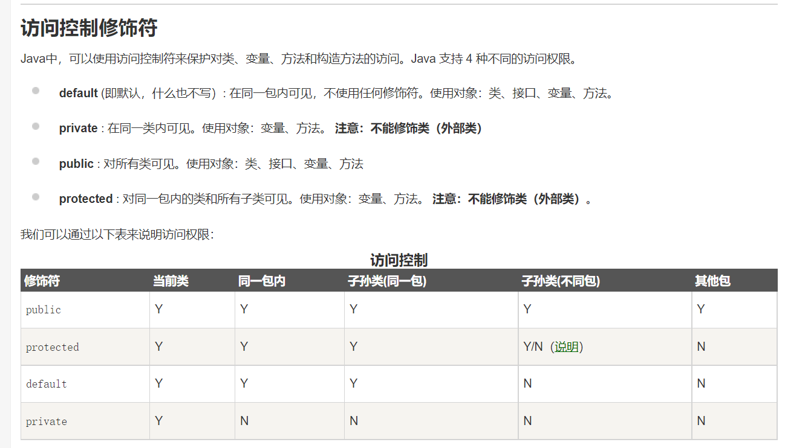

需要注意的内容：

### 受保护的访问修饰符-protected

protected 需要从以下两个点来分析说明：

- **子类与基类在同一包中**：被声明为 protected 的变量、方法和构造器能被同一个包中的任何其他类访问；
- **子类与基类不在同一包中**：那么在子类中，子类实例可以访问其从基类继承而来的 protected 方法，而不能访问基类实例的protected方法。

### protected 和 private 不能修饰外部类（相对于内部类）

## 2.非访问控制符

1. static 修饰符，用来修饰类方法和类变量。
2. final 修饰符，用来修饰类、方法和变量，final 修饰的类不能够被继承，修饰的方法不能被继承类重新定义，修饰的变量为常量，是不可修改的。
3. abstract 修饰符，用来创建抽象类和抽象方法。
4. synchronized 和 volatile 修饰符，主要用于线程的编程。

- static 关键字无论一个类实例化多少对象，它的静态变量只有一份拷贝。
- static 关键字用来声明独立于对象的静态方法。静态方法不能使用类的非静态变量。静态方法从参数列表得到数据，然后计算这些数据。

### 2.1 abstract 修饰符

需要注意的事情：

<u>一个类不能同时被 abstract 和 final 修饰。</u>

<u>如果一个类包含抽象方法，那么该类一定要声明为抽象类，否则将出现编译错误。</u>

<u>抽象类可以包含抽象方法和非抽象方法。</u>

#### 2.11 抽象方法

抽象方法不能被声明成 final 和 static。

任何继承抽象类的子类必须实现父类的所有抽象方法，除非该子类也是抽象类。即：抽象类继承必须实现。

### 2.2  synchronized 修饰符

synchronized 关键字声明的方法同一时间只能被一个线程访问。synchronized 修饰符可以应用于四个访问修饰符。

```java
public synchronized void showDetails(){
.......
}
```

### *2.3 transient  （瞬态，暂时的）修饰符*

*序列化的对象包含被 transient 修饰的实例变量时，java 虚拟机(JVM)跳过该特定的变量。该修饰符包含在定义变量的语句中，用来预处理类和变量的数据类型。*

```java
public transient int limit = 55;   // 不会持久化 
public int b; // 持久化
```

### 2.4 volatile  (易变的）修饰符

volatile 修饰的成员变量在每次被线程访问时，都强制从共享内存中重新读取该成员变量的值。而且，当成员变量发生变化时，会强制线程将变化值回写到共享内存。这样在任何时刻，两个不同的线程总是看到某个成员变量的同一个值。一个 volatile 对象引用可能是 null。

```Java
public class MyRunnable implements Runnable
{
    private volatile boolean active;
    public void run()
    {
        active = true;
        while (active) // 第一行
        {
            // 代码
        }
    }
    public void stop()
    {
        active = false; // 第二行
    }
}
```

通常情况下，在一个线程调用 run() 方法（在 Runnable 开启的线程），在另一个线程调用 stop() 方法。 如果 ***第一行\*** 中缓冲区的 active 值被使用，那么在 ***第二行\*** 的 active 值为 false 时循环不会停止。

但是以上代码中我们使用了 volatile 修饰 active，所以该循环会停止。

## 3. 运算符

### 3.1 关系运算符

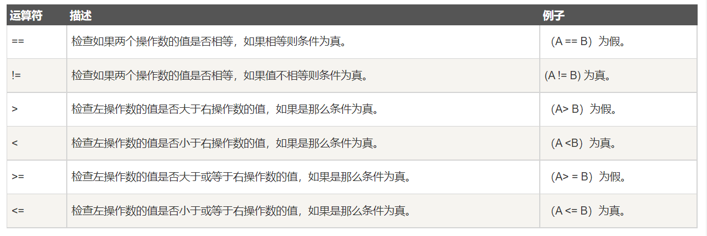

### 3.3 位运算符


### 3.4 逻辑运算符


### 3.5 赋值运算符

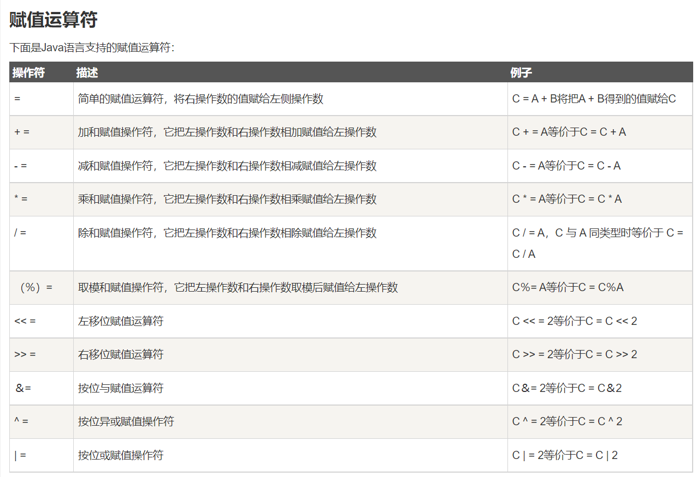

### 3.6 条件运算符

```Java
public class Test {
   public static void main(String[] args){
      int a , b;
      a = 10;
      // 如果 a 等于 1 成立，则设置 b 为 20，否则为 30
      b = (a == 1) ? 20 : 30;
      System.out.println( "Value of b is : " +  b );
 
      // 如果 a 等于 10 成立，则设置 b 为 20，否则为 30
      b = (a == 10) ? 20 : 30;
      System.out.println( "Value of b is : " + b );
   }
}
```

### 3.7 instanceof 运算符

该运算符用于操作对象实例，检查该对象是否是一个特定类型（类类型或接口类型）。instanceof运算符使用格式如下：

```Java
( Object reference variable ) instanceof  (class/interface type)
```

```java
String name = "James";
boolean result = name instanceof String; // 由于 name 是 String 类型，所以返回真
```

如果被比较的对象兼容于右侧类型,该运算符仍然返回true。看下面的例子：

```java
class Vehicle {}
 
public class Car extends Vehicle {
   public static void main(String[] args){
      Vehicle a = new Car();
      boolean result =  a instanceof Car;
      System.out.println( result);
   }
}
```

### 3.8 Java运算符优先级

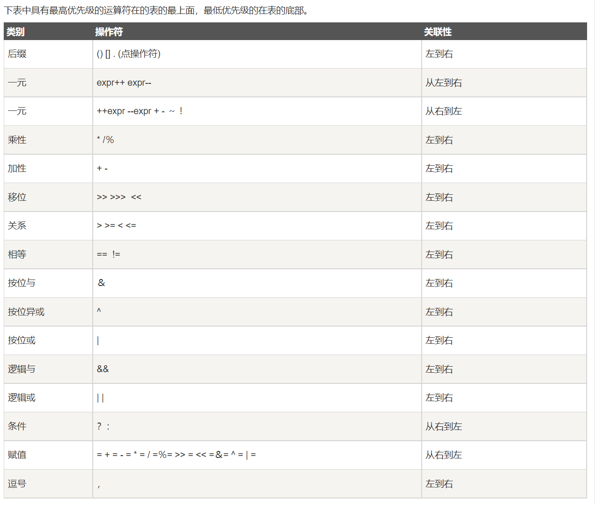

## 4. Java 循环

用三个例子来说明：

```Java
public class Test {
   public static void main(String args[]) {
      int x = 10;
      while( x < 20 ) {
         System.out.print("value of x : " + x );
         x++;
         System.out.print("\n");
      }
   }
}
```

```java
public class Test {
   public static void main(String args[]){
      int x = 10;
 
      do{
         System.out.print("value of x : " + x );
         x++;
         System.out.print("\n");
      }while( x < 20 );
   }
}
// do…while 循环和 while 循环相似，不同的是，do…while 循环至少会执行一次。
```

```Java
public class Test {
   public static void main(String args[]) {
 
      for(int x = 10; x < 20; x = x+1) {
         System.out.print("value of x : " + x );
         System.out.print("\n");
      }
   }
}

public class Test {
   public static void main(String args[]){
      int [] numbers = {10, 20, 30, 40, 50};
 
      for(int x : numbers ){
         System.out.print( x );
         System.out.print(",");
      }
      System.out.print("\n");
      String [] names ={"James", "Larry", "Tom", "Lacy"};
      for( String name : names ) {
         System.out.print( name );
         System.out.print(",");
      }
   }
}
```

## 5. Java 条件判定

### 5.1 if else 语句

这个很简单，唯一要注意的就是java的是else if 和 的 elif不同。

```java
public class Test {
   public static void main(String args[]){
      int x = 30;
 
      if( x == 10 ){
         System.out.print("Value of X is 10");
      }else if( x == 20 ){
         System.out.print("Value of X is 20");
      }else if( x == 30 ){
         System.out.print("Value of X is 30");
      }else{
         System.out.print("这是 else 语句");
      }
   }
}
```

###  5.2 Switch 语句

```java
public class Test {
   public static void main(String args[]){
      //char grade = args[0].charAt(0);
      char grade = 'C';
 
      switch(grade)
      {
         case 'A' :
            System.out.println("优秀"); 
            break;
         case 'B' :
         case 'C' :
            System.out.println("良好");
            break;
         case 'D' :
            System.out.println("及格");
            break;
         case 'F' :
            System.out.println("你需要再努力努力");
            break;
         default :
            System.out.println("未知等级");
      }
      System.out.println("你的等级是 " + grade);
   }
}
```

**<u>如果 case 语句块中没有 break 语句时，匹配成功后，从当前 case 开始，后续所有 case 的值都会输出。</u>**

```java
public class Test {
   public static void main(String args[]){
      int i = 1;
      switch(i){
         case 0:
            System.out.println("0");
         case 1:
            System.out.println("1");
         case 2:
            System.out.println("2");
         case 3:
            System.out.println("3"); break;
         default:
            System.out.println("default");
      }
   }
}
```

```java
// 上述代码的输出结果
1
2
3
```

## 6.数字处理相关的类

```java
double b = 3.14;// 这个可以
float b = 3.14; // 这个不行，后面要加f
```

### 6.1 基本数据类型

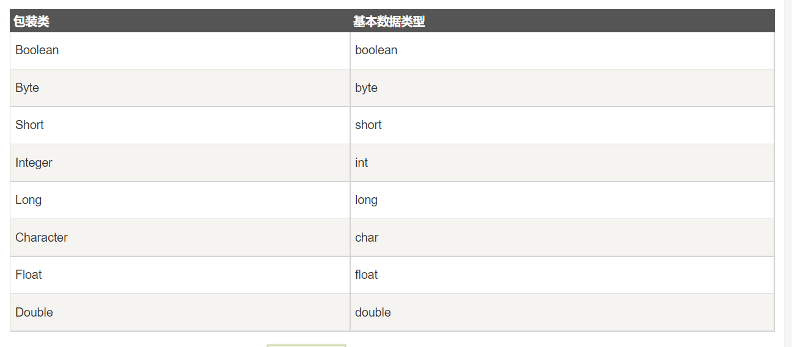

- **他们的继承关系如下：**

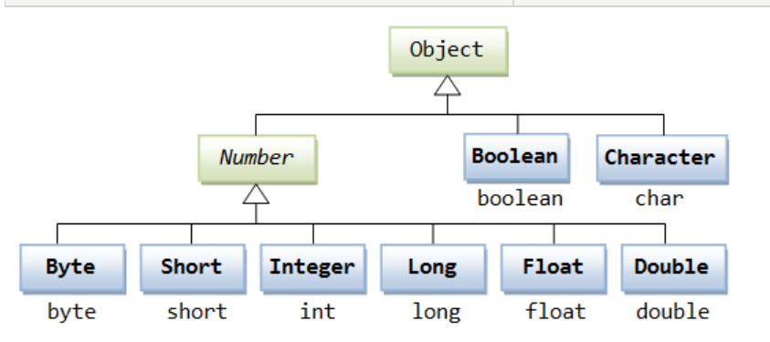

### 6.2 **比较重要的方法**

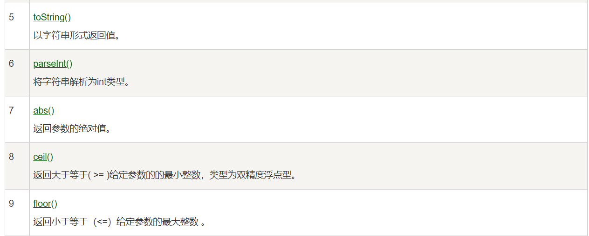

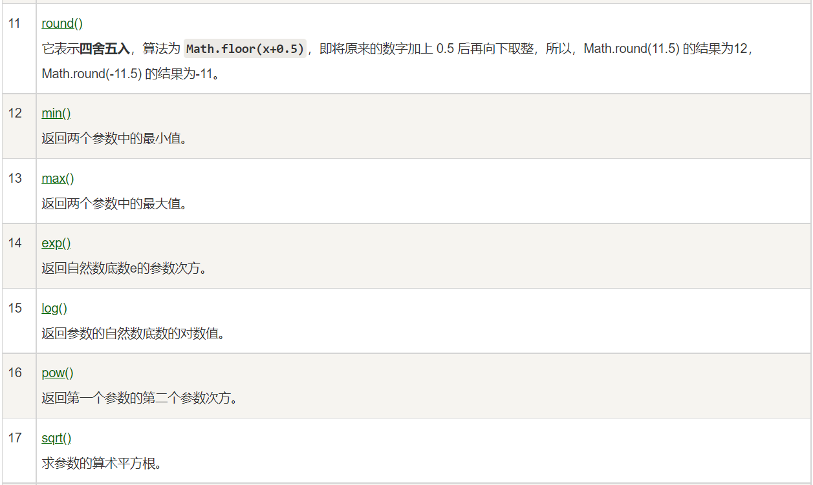

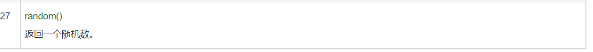

## 7. Java 字符串处理

### 7.1  Character 类（用于对单个字符进行操作）

```java
char ch = 'a';
 
// Unicode 字符表示形式
char uniChar = '\u039A'; 
 
// 字符数组
char[] charArray ={ 'a', 'b', 'c', 'd', 'e' };
```

- 转义序列

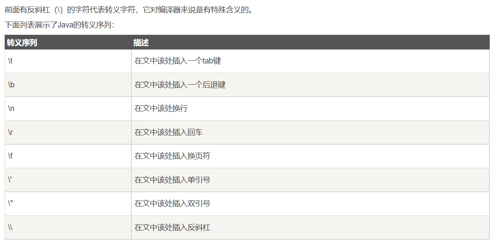

- 重要的额方法

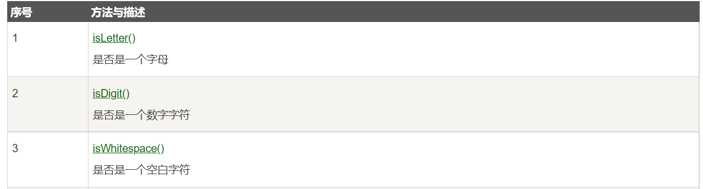

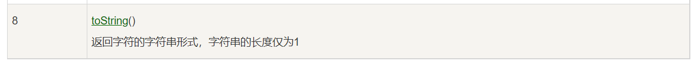

### 7.2 Java String 类

Java中String 类无法修改。

String 创建的字符串存储在公共池中，而 new 创建的字符串对象在堆上：

```java
String s1 = "Runoob";              // String 直接创建
String s2 = "Runoob";              // String 直接创建
String s3 = s1;                    // 相同引用
String s4 = new String("Runoob");   // String 对象创建
String s5 = new String("Runoob");   // String 对象创建
```


- 字符段长度

  `site.length();`

- 连接字符串

  ```java
  // 两种方法
  "我的名字是 ".concat("Runoob");
  "Hello," + " runoob" + "!"
  ```

- 格式化输出

  ```java
  System.out.printf("浮点型变量的值为 " +
                    "%f, 整型变量的值为 " +
                    " %d, 字符串变量的值为 " +
                    "is %s", floatVar, intVar, stringVar);
  ```

#### 7.21 String的方法

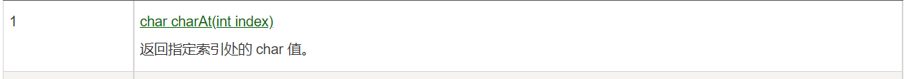

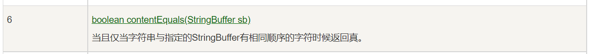

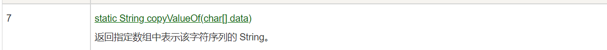

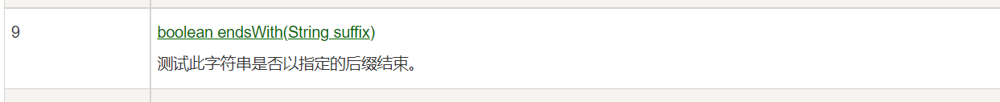

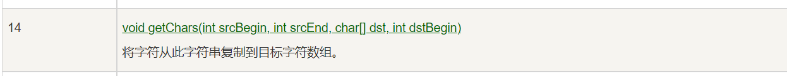

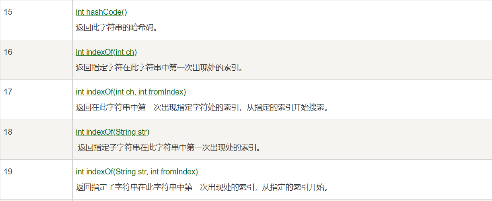

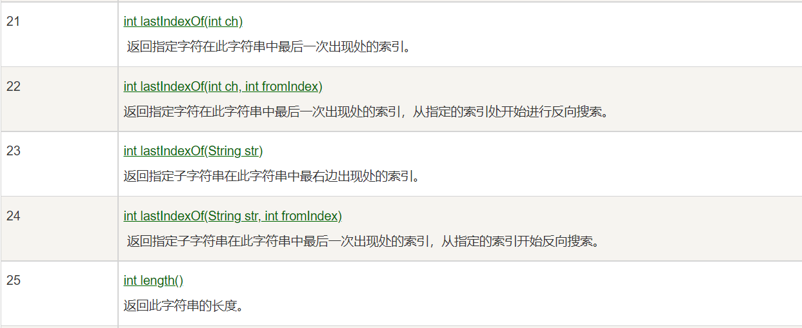

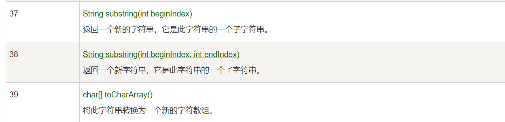


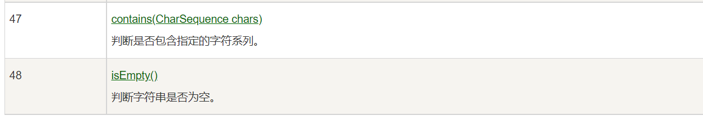

### 7.3 StringBuffer 和 StringBuilder 类

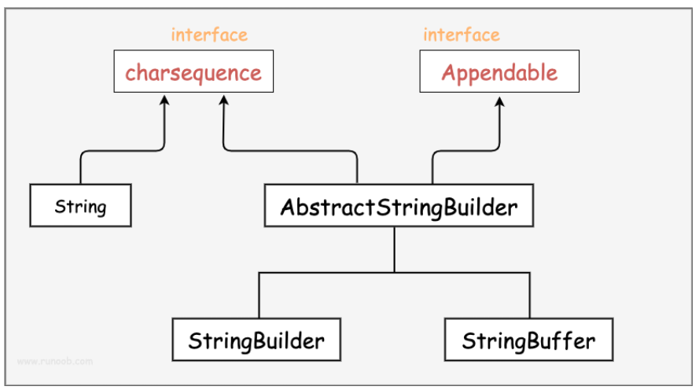

- <u>**StringBuilder 类和 StringBuffer 之间的最大不同在于 StringBuilder 的方法不是线程安全的（不能同步访问）。**</u>
- 由于 StringBuilder 相较于 StringBuffer 有速度优势，所以多数情况下建议使用 StringBuilder 类。

基本的方法：

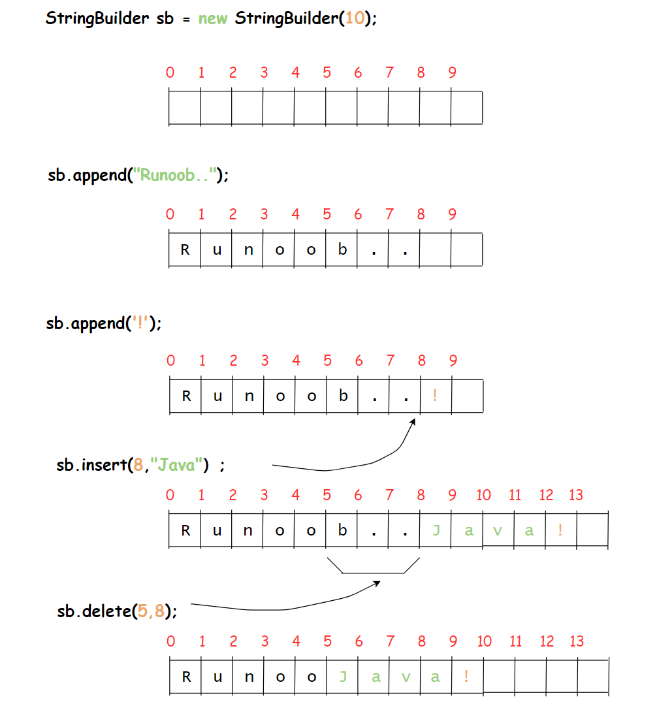

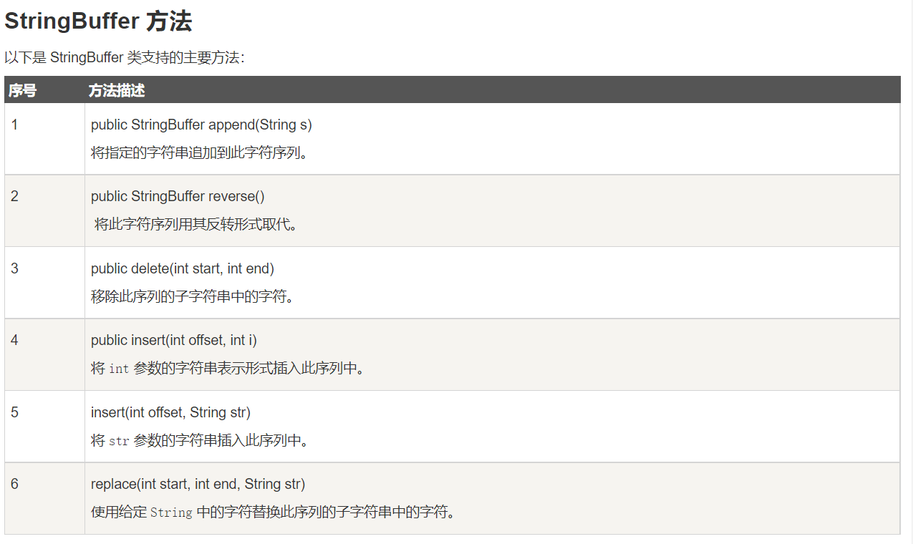

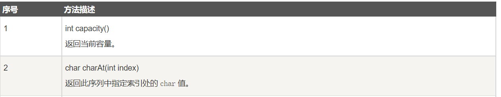

注意这里长度和容量不同

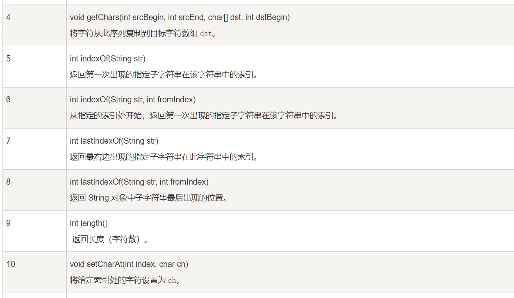

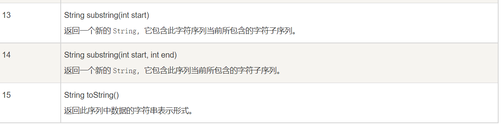

## 8. Java 数组

### 8.1 数组常用的操作

#### 8.11 Java返回数组长度

```java
array.length
```


#### 8.12 数组的创建方法：

```java
dataType[] arrayRefVar = new dataType[arraySize];
dataType[] arrayRefVar = {value0, value1, ..., valuek};
```

#### 8.13 数组转换为list和set：

```java
List<Integer> arrayList = new ArrayList<>();
Collections.addAll(arrayList, array);
arrayList.add(0);
System.out.println(arrayList);

// Set 不能实例化，
Set<Integer> set = new HashSet<>(arrayList);
System.out.println(set);
```

#### 8.14 <u>**重要：数组排序的方法**</u>

1. `Arrays.sort(int[] a) // 对一个数组的所有元素进行排序，并且是按从小到大的顺序`

2. `Arrays.sort(int[] a, int fromIndex, int toIndex)设置了范围，toIndex不参与`

3. 自己设置排序的方法，实现Comparator

   ```java
   public class ArraySort {
       public static void main(String[] args) {
           //注意，要想改变默认的排列顺序，不能使用基本类型（int,double, char）
           //而要使用它们对应的类
           Integer[] a = {9, 8, 7, 2, 3, 4, 1, 0, 6, 5};
           //定义一个自定义类MyComparator的对象
           Comparator cmp = new MyComparator();
           Arrays.sort(a, cmp);
           for(int i = 0; i < a.length; i ++) {
               System.out.print(a[i] + " ");
               }
       }
   
       //Comparator是一个接口，所以这里我们自己定义的类MyComparator要		implents该接口
       //而不是extends Comparator
       static class MyComparator implements Comparator<Integer> {
           @Override
           public int compare(Integer o1, Integer o2) {
               //如果n1小于n2，我们就返回正值，如果n1大于n2我们就返回负			值，
               //这样颠倒一下，就可以实现反向排序了
               if(o1 < o2) {
                   return 1;
               }
               else if(o1 > o2) {
                   return -1;
                   }
               else
                   {
                   return 0;
                       }
               }
           }
   }
   ```

   ```java
         	// 或者更骚的一种方法，使用匿名函数
   		// 这里是先最后的索引，然后再前面的索引
   		Arrays.sort(events,(i1,i2)->
           {
               if(i1[1]!=i2[1])return i1[1]-i2[1];
               return i1[0]-i2[0];
           });
   ```

   

#### 8.15 多维数组：

```java
//  直接为每一维分配空间
// type[][] typeName = new type[typeLength1][typeLength2];
int a[][] = new int[2][3]
    
// 从最高维开始，分别为每一维分配空间
String s[][] = new String[2][];
s[0] = new String[2];
s[1] = new String[3];
s[0][0] = new String("Good");
s[0][1] = new String("Luck");
s[1][0] = new String("to");
s[1][1] = new String("you");
s[1][2] = new String("!");

```

### 8.2  Arrays 类

java.util.Arrays 类能方便地操作数组，它提供的所有方法都是静态的。

- 几个常用的方法
- 貌似，数组的方法不给力。

```java
public class ArrayDemo {
    public static void main(String[] args) {
        Integer[] array = {0, 9, 4, 8, 7, 5};

        // 对数组进行排序,反向排序
        Arrays.sort(array, Comparator.reverseOrder());
        System.out.println(Arrays.toString(array));

        // 对数组进行排序,正向排序
        // 貌似不能直接多级排序
        Arrays.sort(array, Comparator.naturalOrder());
        System.out.println(array);
        System.out.println(Arrays.toString(array));
        //结果：[0, 4, 5, 7, 8, 9]

        // 搜索指定键的位置
        // 不能用来搜索数组
        System.out.println(Arrays.binarySearch(array, 5));

        String[][] strings = new String[2][];
        strings[0] = new String[2];
        strings[1] = new String[3];
        strings[0][0] = new String("Good");
        strings[0][1] = new String("Luck");
        strings[1][0] = new String("to");
        strings[1][1] = new String("you");
        strings[1][2] = new String("!");

        Integer[][] integers = new Integer[2][];
        integers[0] = new Integer[2];
        integers[1] = new Integer[3];
        integers[0][0] = new Integer(1);
        integers[0][1] = new Integer(2);
        integers[1][0] = new Integer(3);
        integers[1][1] = new Integer(4);
        integers[1][2] = new Integer(5);

    }
}
```

数组补充：

`array.length` 可以放回数组长度。

## 9. Java 方法

这部分大部分你都会，需要了解的：

- finalize() 方法

  Java 允许定义这样的方法，它在对象被垃圾收集器析构(回收)之前调用，这个方法叫做 finalize( )，它用来清除回收对象。

### 9.1 Java 匿名函数

`new Thread(() -> {System.out.println("hello");}).start();`

`() -> {System.out.println("hello");}`  就是传说中的lambda表达式，大体分为3部分：

>  1.最前面的部分是一对括号，里面是参数，这里无参数，就是一对空括号
>
>  2.中间的是 -> ，用来分割参数和body部分
>
>  3.是body部分，可以是一个表达式或者一个语句块。如果是一个表达式，表达式的值会被作为返回值返回；如果是语句块，需要用return语句指定返回值。

Lambda 表达式，也可称为闭包，它是推动 Java 8 发布的最重要新特性。Lambda 允许把函数作为一个方法的参数（函数作为参数传递进方法中）。使用 Lambda 表达式可以使代码变的更加简洁紧凑。

lambda 表达式的语法格式如下：

```java
(parameters) -> expression
或
(parameters) ->{ statements; }
```

以下是lambda表达式的重要特征:

- **可选类型声明：**不需要声明参数类型，编译器可以统一识别参数值。
- **可选的参数圆括号：**一个参数无需定义圆括号，但多个参数需要定义圆括号。
- **可选的大括号：**如果主体包含了一个语句，就不需要使用大括号。
- **可选的返回关键字：**如果主体只有一个表达式返回值则编译器会自动返回值，大括号需要指定表达式返回了一个数值。

## 10.Java IO

### 10.1 java 笔试中用到的读取方法

```java
public class ScannerDemo {
    public static void main(String[] args) {
        Scanner scan = new Scanner(System.in);
        String s1;

        while (scan.hasNextLine()){
            s1 = scan.nextLine();
            System.out.println(s1);

            if(s1.equals("") ){
                break;
            }
            scan = new Scanner(System.in);
        }
        
    }
}
```

其他很多方法进行IO，但是Scaner比较方便，这里不赘述了。

IO流：

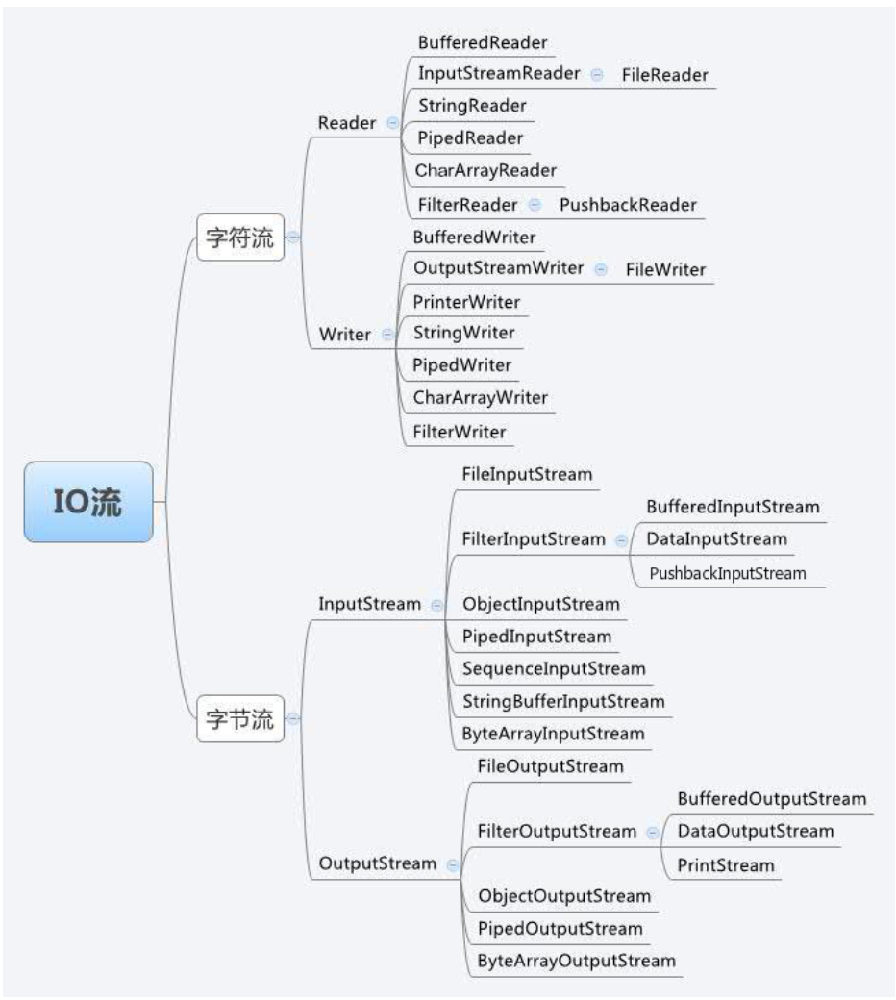

### 10.2 Java 文件读取

读取文件：

```java
File f = new File("C:/java/hello");
InputStream in = new FileInputStream(f);
```

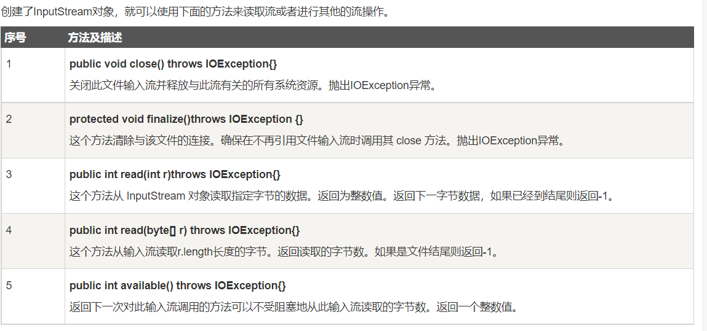

写入文件：

```java
File f = new File("C:/java/hello");
OutputStream fOut = new FileOutputStream(f);
```

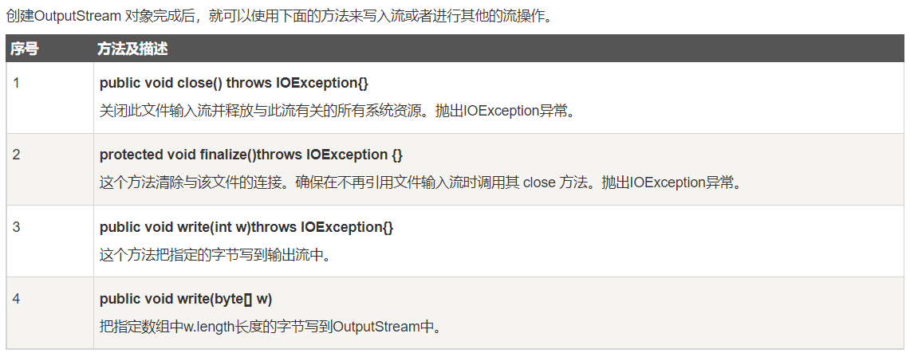

## 11. Java 异常处理

你需要掌握以下三种类型的异常：

- **检查性异常：**最具代表的检查性异常是用户错误或问题引起的异常，这是程序员无法预见的。例如要打开一个不存在文件时，一个异常就发生了，这些异常在编译时不能被简单地忽略。
- **运行时异常：** 运行时异常是可能被程序员避免的异常。与检查性异常相反，运行时异常可以在编译时被忽略。
- **错误：** 错误不是异常，而是脱离程序员控制的问题。错误在代码中通常被忽略。例如，当栈溢出时，一个错误就发生了，它们在编译也检查不到的。

Error 用来指示运行时环境发生的错误。例如，JVM 内存溢出。一般地，程序不会从错误中恢复。异常类有两个主要的子类：IOException 类和 RuntimeException 类。

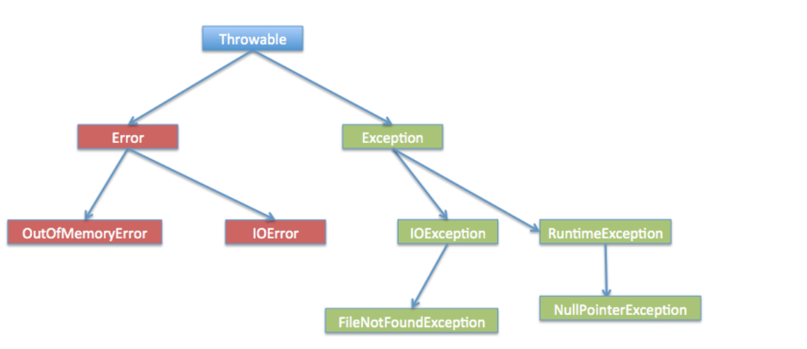

java 异常捕获的方法：

```java
try
{
   // 程序代码
}catch(ExceptionName e1)
{
   //Catch 块
}
```

throws关键字：

```java
import java.io.*;
public class className
{
  public void deposit(double amount) throws RemoteException
  {
    // Method implementation
    throw new RemoteException();
  }
  //Remainder of class definition
}
```


### 11.1 检查性异常类与非检查性异常类 （需要补充）

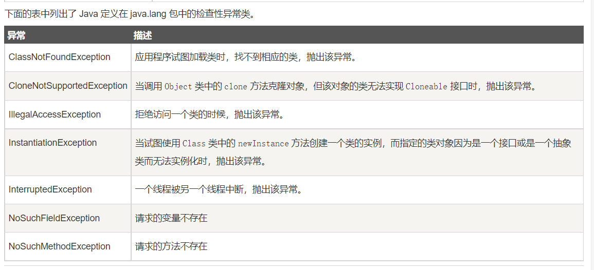

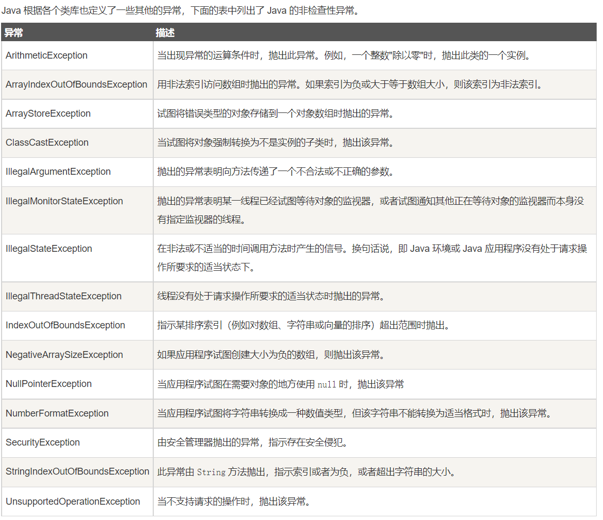

## 12. Java 数据结构

### 12.1 Enumeration

Enumeration接口中定义了一些方法，通过这些方法可以枚举（一次获得一个）对象集合中的元素。

这种传统接口已被迭代器取代，虽然Enumeration 还未被遗弃，但在现代代码中已经被很少使用了。

以下实例演示了Enumeration的使用：

```java
import java.util.Vector;
import java.util.Enumeration;
 
public class EnumerationTester {
 
   public static void main(String args[]) {
      Enumeration<String> days;
      Vector<String> dayNames = new Vector<String>();
      dayNames.add("Sunday");
      dayNames.add("Monday");
      dayNames.add("Tuesday");
      dayNames.add("Wednesday");
      dayNames.add("Thursday");
      dayNames.add("Friday");
      dayNames.add("Saturday");
      days = dayNames.elements();
      while (days.hasMoreElements()){
         System.out.println(days.nextElement()); 
      }
   }
}
```

### 12.2 Bitset类

一个Bitset类创建一种特殊类型的数组来保存位值。BitSet中数组大小会随需要增加。这和位向量（vector of bits）比较类似。

BitSet定义了两个构造方法。

第一个构造方法创建一个默认的对象：

```java
BitSet()
```

第二个方法允许用户指定初始大小。所有位初始化为0。

```java
BitSet(int size)
```

### 12.3 Vector

Vector 类实现了一个动态数组。和 ArrayList 很相似，但是两者是不同的：

- Vector 是同步访问的。
- Vector 包含了许多传统的方法，这些方法不属于集合框架。

构造方法：

```java
//	第一种构造方法创建一个默认的向量，默认大小为 10：
Vector()
//	第二种构造方法创建指定大小的向量。
Vector(int size)
//	第三种构造方法创建指定大小的向量，并且增量用 incr 指定。增量表示向量每次增加的元素数目。
Vector(int size,int incr)
// 第四种构造方法创建一个包含集合 c 元素的向量：
Vector(Collection c)
```

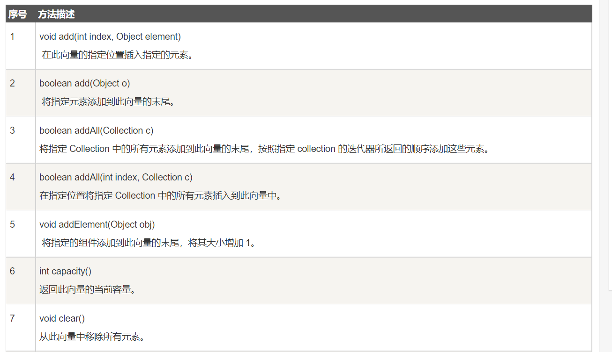

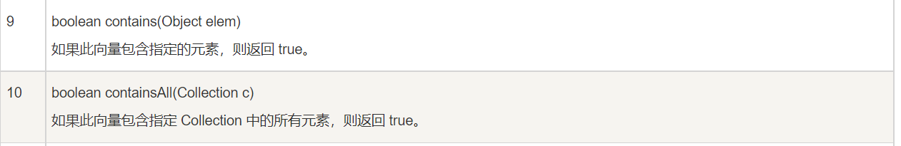

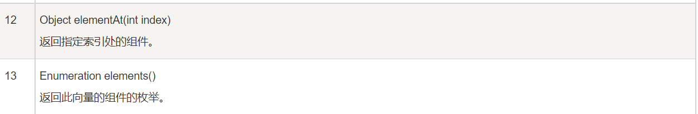

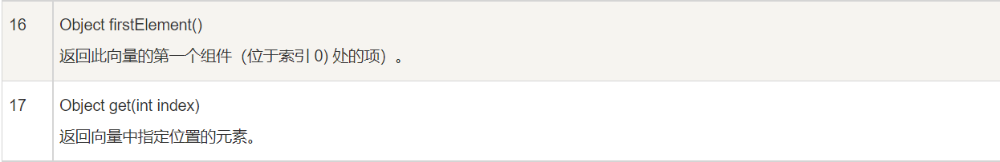

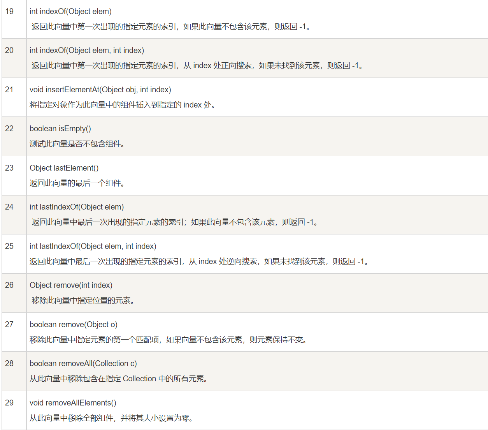

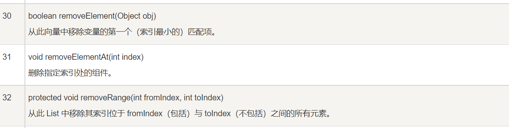

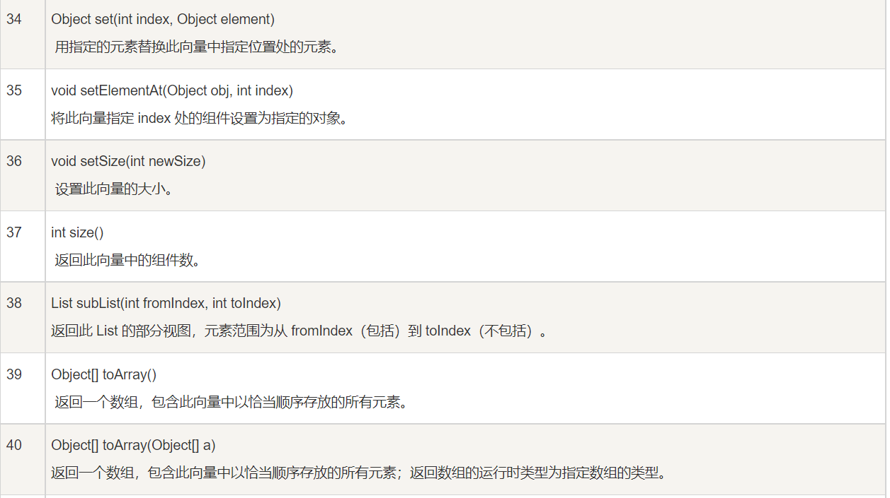

### 12.4 Stack

栈是Vector的一个子类，它实现了一个标准的后进先出的栈。

堆栈只定义了默认构造函数，用来创建一个空栈。 堆栈除了包括由Vector定义的所有方法，也定义了自己的一些方法。

```java
Stack()
```


下面的程序说明这个集合所支持的几种方法：

```java
import java.util.*;
 
public class StackDemo {
 
    static void showpush(Stack<Integer> st, int a) {
        st.push(new Integer(a));
        System.out.println("push(" + a + ")");
        System.out.println("stack: " + st);
    }
 
    static void showpop(Stack<Integer> st) {
        System.out.print("pop -> ");
        Integer a = (Integer) st.pop();
        System.out.println(a);
        System.out.println("stack: " + st);
    }
 
    public static void main(String args[]) {
        Stack<Integer> st = new Stack<Integer>();
        System.out.println("stack: " + st);
        showpush(st, 42);
        showpush(st, 66);
        showpush(st, 99);
        showpop(st);
        showpop(st);
        showpop(st);
        try {
            showpop(st);
        } catch (EmptyStackException e) {
            System.out.println("empty stack");
        }
    }
}
```

### 12.5 Dictionary 类

Dictionary 类是一个抽象类，用来存储键/值对，作用和Map类相似。

给出键和值，你就可以将值存储在Dictionary对象中。一旦该值被存储，就可以通过它的键来获取它。所以和Map一样， Dictionary 也可以作为一个键/值对列表。

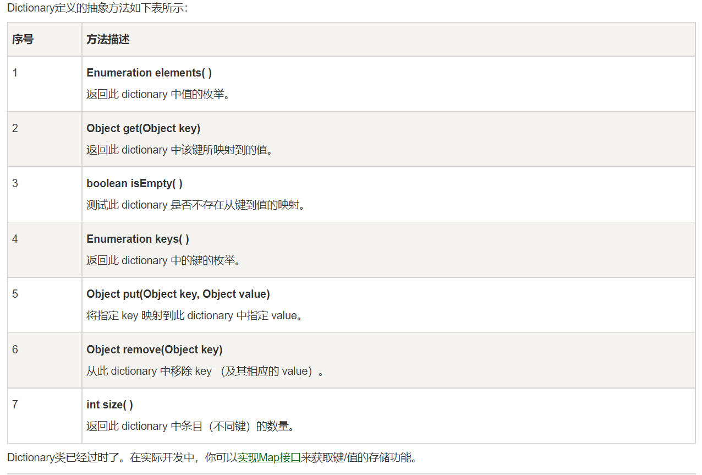

### 12.6 Hashtable 类

`Hashtable`是原始的`java.util`的一部分， 是一个Dictionary具体的实现 。

然而，Java 2 重构的`Hashtable`实现了Map接口，因此，`Hashtable`现在集成到了集合框架中。它和`HashMap`类很相似，但是它支持同步。

像`HashMap`一样，`Hashtable`在哈希表中存储键/值对。当使用一个哈希表，要指定用作键的对象，以及要链接到该键的值。

然后，该键经过哈希处理，所得到的散列码被用作存储在该表中值的索引。

`Hashtable`定义了四个构造方法。第一个是默认构造方法：

```java
// `Hashtable`定义了四个构造方法。第一个是默认构造方法：
Hashtable()
// 第二个构造函数创建指定大小的哈希表：
Hashtable(int size)
// 第三个构造方法创建了一个指定大小的哈希表，并且通过fillRatio指定填充比例。
// 填充比例必须介于0.0和1.0之间，它决定了哈希表在重新调整大小之前的充满程度：
Hashtable(int size,float fillRatio)
// 第四个构造方法创建了一个以M中元素为初始化元素的哈希表。
// 哈希表的容量被设置为M的两倍。
Hashtable(Map m)
```

Hashtable 中常用的方法：

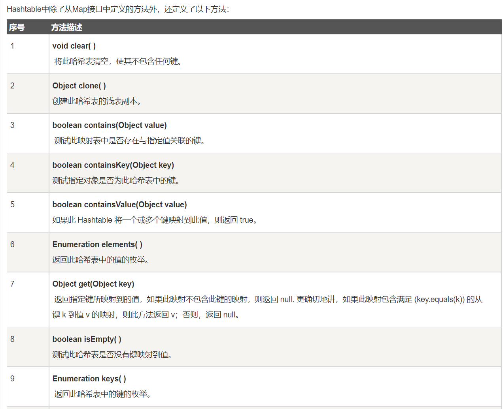

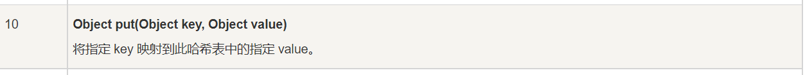

```java
import java.util.*;

public class HashTableDemo {

   public static void main(String args[]) {
      // Create a hash map
      Hashtable balance = new Hashtable();
      Enumeration names;
      String str;
      double bal;

      balance.put("Zara", new Double(3434.34));
      balance.put("Mahnaz", new Double(123.22));
      balance.put("Ayan", new Double(1378.00));
      balance.put("Daisy", new Double(99.22));
      balance.put("Qadir", new Double(-19.08));

      // Show all balances in hash table.
      names = balance.keys();
      while(names.hasMoreElements()) {
         str = (String) names.nextElement();
         System.out.println(str + ": " +
         balance.get(str));
      }
      System.out.println();
      // Deposit 1,000 into Zara's account
      bal = ((Double)balance.get("Zara")).doubleValue();
      balance.put("Zara", new Double(bal+1000));
      System.out.println("Zara's new balance: " +
      balance.get("Zara"));
   }
}

/**
Qadir: -19.08
Zara: 3434.34
Mahnaz: 123.22
Daisy: 99.22
Ayan: 1378.0

Zara's new balance: 4434.34
*/
```

### 12.7 Properties

Properties 继承于 Hashtable。表示一个持久的属性集.属性列表中每个键及其对应值都是一个字符串。

Properties 类被许多 Java 类使用。例如，在获取环境变量时它就作为 System.getProperties() 方法的返回值。

Properties 定义如下实例变量.这个变量持有一个 Properties 对象相关的默认属性列表。

```java
Properties defaults;
```

Properties类定义了两个构造方法. 第一个构造方法没有默认值。

```java
Properties()
```

第二个构造方法使用`propDefault` 作为默认值。两种情况下，属性列表都为空：

```java
Properties(Properties propDefault)
```

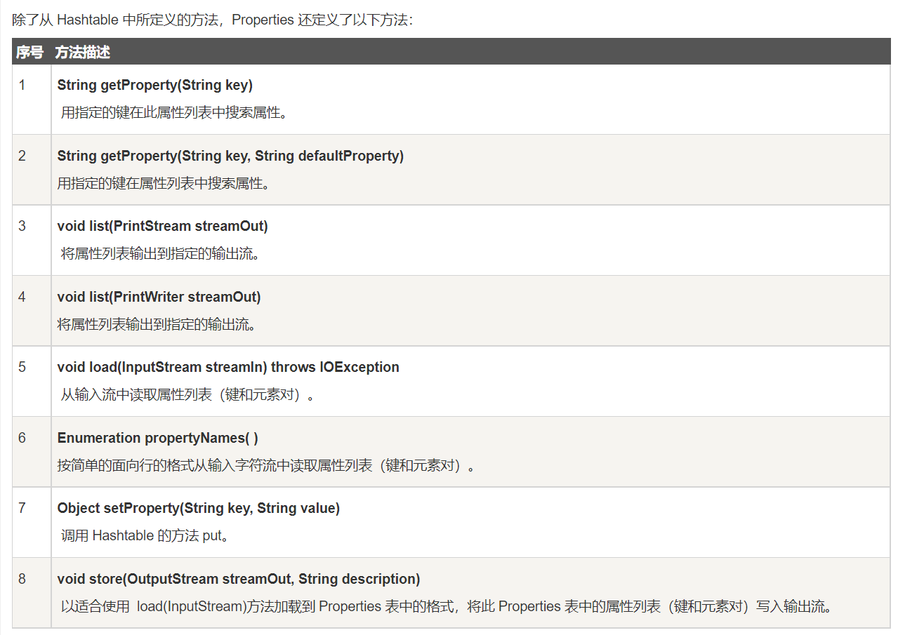

```java
import java.util.*;
 
public class PropDemo {
 
   public static void main(String args[]) {
      Properties capitals = new Properties();
      Set states;
      String str;
      
      capitals.put("Illinois", "Springfield");
      capitals.put("Missouri", "Jefferson City");
      capitals.put("Washington", "Olympia");
      capitals.put("California", "Sacramento");
      capitals.put("Indiana", "Indianapolis");
 
      // Show all states and capitals in hashtable.
      states = capitals.keySet(); // get set-view of keys
      Iterator itr = states.iterator();
      while(itr.hasNext()) {
         str = (String) itr.next();
         System.out.println("The capital of " +
            str + " is " + capitals.getProperty(str) + ".");
      }
      System.out.println();
 
      // look for state not in list -- specify default
      str = capitals.getProperty("Florida", "Not Found");
      System.out.println("The capital of Florida is "
          + str + ".");
   }
}

/**
The capital of Missouri is Jefferson City.
The capital of Illinois is Springfield.
The capital of Indiana is Indianapolis.
The capital of California is Sacramento.
The capital of Washington is Olympia.

The capital of Florida is Not Found.
*/
```

## 13. Java 集合

早在 Java 2 中之前，Java 就提供了特设类。比如：Dictionary, Vector, Stack, 和 Properties 这些类用来存储和操作对象组。

虽然这些类都非常有用，但是它们缺少一个核心的，统一的主题。由于这个原因，使用 Vector 类的方式和使用 Properties 类的方式有着很大不同。

集合框架被设计成要满足以下几个目标。

- 该框架必须是高性能的。基本集合（动态数组，链表，树，哈希表）的实现也必须是高效的。
- 该框架允许不同类型的集合，以类似的方式工作，具有高度的互操作性。
- 对一个集合的扩展和适应必须是简单的。

为此，整个集合框架就围绕一组标准接口而设计。你可以直接使用这些接口的标准实现，诸如： **`LinkedList`**, **`HashSet`**, 和 **`TreeSet`** 等,除此之外你也可以通过这些接口实现自己的集合。

### 13.1 集合框架示意图

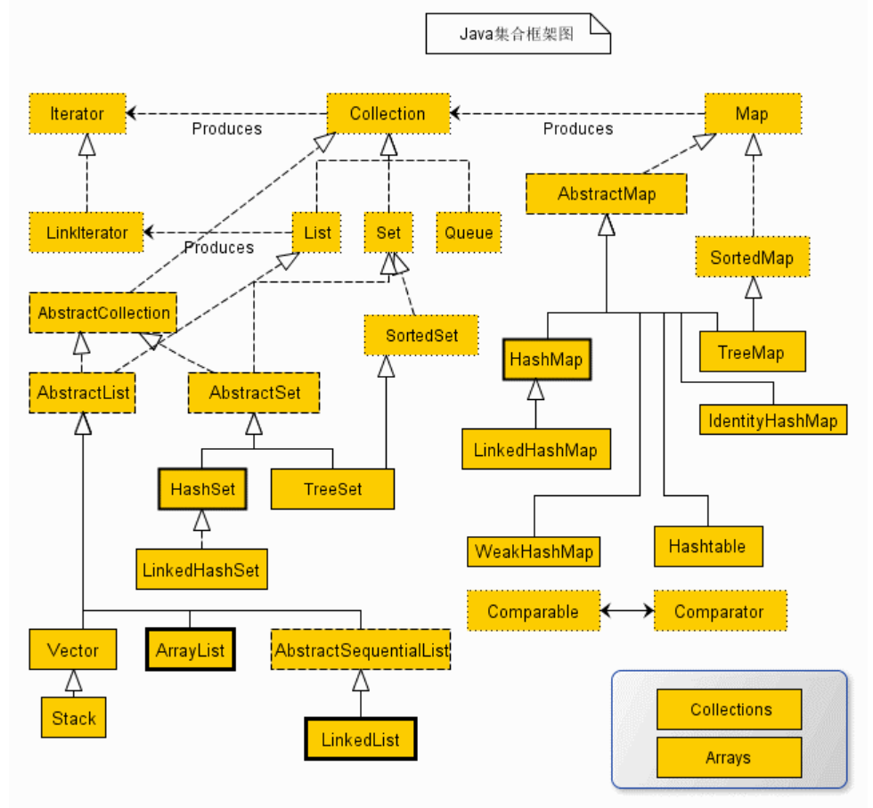

从上面的集合框架图可以看到，Java 集合框架主要包括两种类型的容器，一种是集合（Collection），存储一个元素集合，另一种是图（Map），存储键/值对映射。Collection 接口又有 3 种子类型，List、Set 和 Queue，再下面是一些抽象类，最后是具体实现类，常用的有 [ArrayList](https://www.runoob.com/java/java-arraylist.html)、[LinkedList](https://www.runoob.com/java/java-linkedlist.html)、[HashSet](https://www.runoob.com/java/java-hashset.html)、LinkedHashSet、[HashMap](https://www.runoob.com/java/java-hashmap.html)、LinkedHashMap 等等。

### 13.2 集合框架的统一体系

集合框架是一个用来代表和操纵集合的统一架构。所有的集合框架都包含如下内容：

- **接口：**是代表集合的抽象数据类型。例如 Collection、List、Set、Map 等。之所以定义多个接口，是为了以不同的方式操作集合对象
- **实现（类）：**是集合接口的具体实现。从本质上讲，它们是可重复使用的数据结构，例如：ArrayList、LinkedList、HashSet、HashMap。
- **算法：**是实现集合接口的对象里的方法执行的一些有用的计算，例如：搜索和排序。这些算法被称为多态，那是因为相同的方法可以在相似的接口上有着不同的实现。

除了集合，该框架也定义了几个 Map 接口和类。Map 里存储的是键/值对。尽管 Map 不是集合，但是它们完全整合在集合中。


### 13.3 集合接口

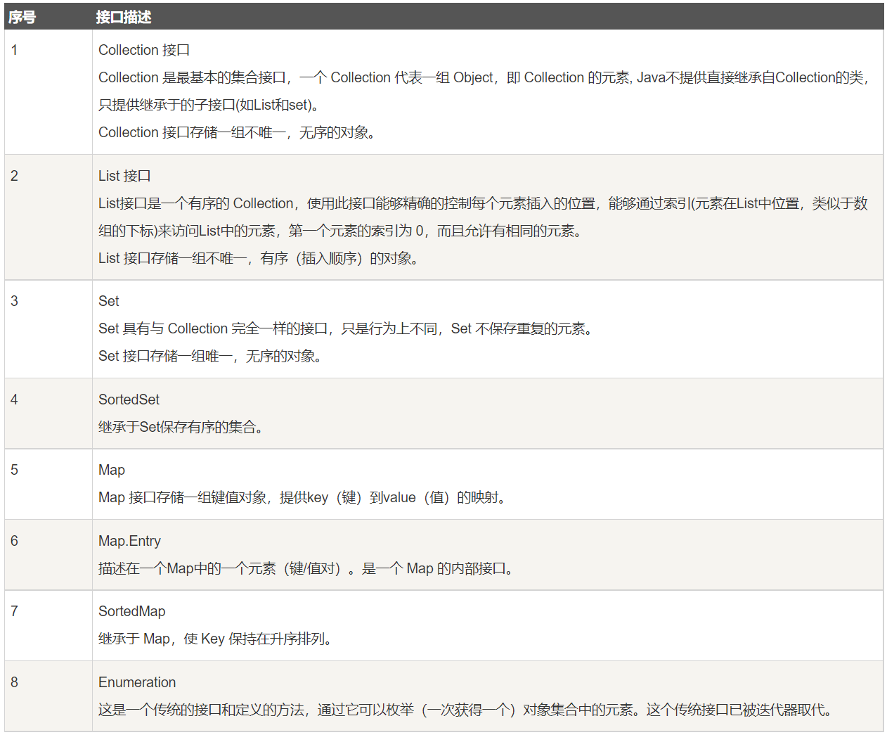

### 13.4 Set和List的区别

> 总感觉下面的话有点问题？

- Set 接口实例存储的是无序的，不重复的数据。List 接口实例存储的是有序的，可以重复的元素。
- Set检索效率低下，删除和插入效率高，插入和删除不会引起元素位置改变 **<实现类有`HashSet,TreeSet`>**。
- List和数组类似，可以动态增长，根据实际存储的数据的长度自动增长List的长度。查找元素效率高，插入删除效率低，因为会引起其他元素位置改变 **<实现类有`ArrayList,LinkedList,Vector`>** 。

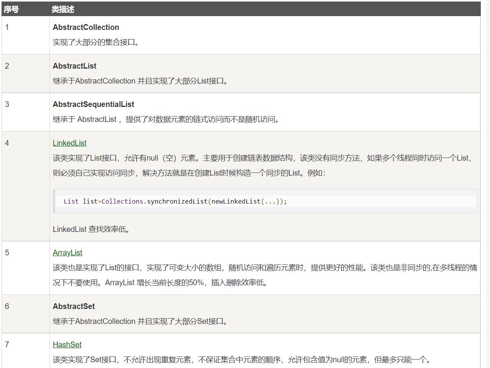

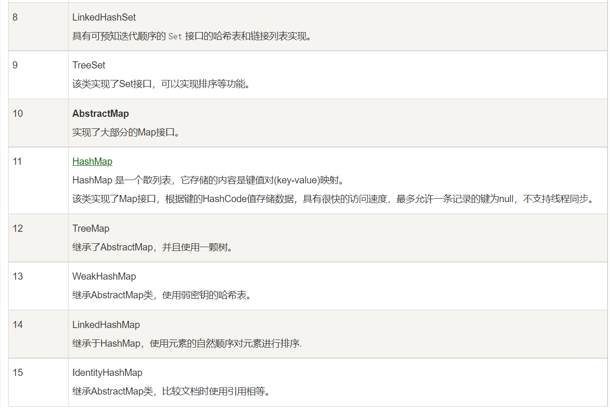

在前面的教程中已经讨论通过java.util包中定义的类，如下所示：

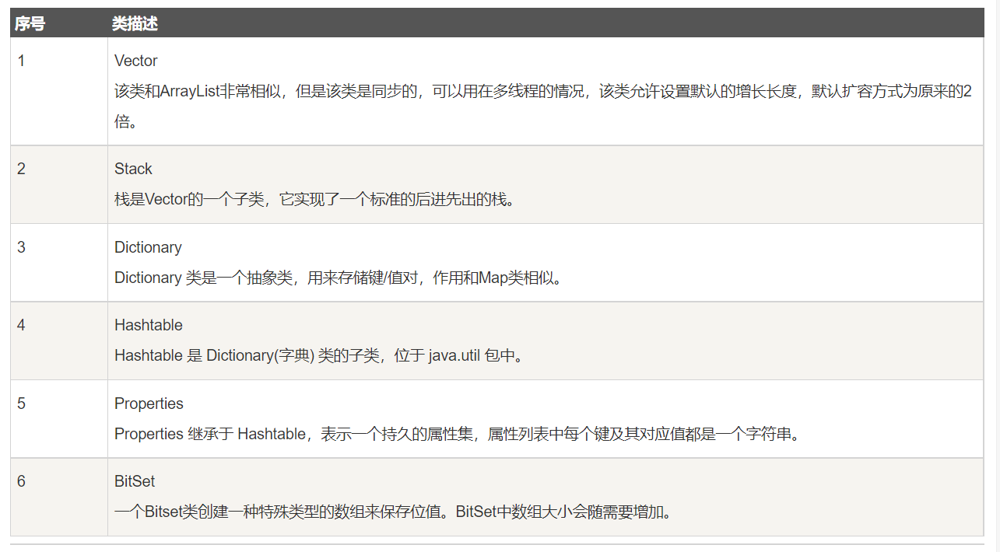

### 13.5 遍历集合的方法

```java
import java.util.*;
 
public class Test{
 public static void main(String[] args) {
     List<String> list=new ArrayList<String>();
     list.add("Hello");
     list.add("World");
     list.add("HAHAHAHA");
     //第一种遍历方法使用 For-Each 遍历 List
     for (String str : list) {            //也可以改写 for(int i=0;i<list.size();i++) 这种形式
        System.out.println(str);
     }
 
     //第二种遍历，把链表变为数组相关的内容进行遍历
     String[] strArray=new String[list.size()];
     list.toArray(strArray);
     for(int i=0;i<strArray.length;i++) //这里也可以改写为  for(String str:strArray) 这种形式
     {
        System.out.println(strArray[i]);
     }
     
    //第三种遍历 使用迭代器进行相关遍历
     
     Iterator<String> ite=list.iterator();
     while(ite.hasNext())//判断下一个元素之后有值
     {
         System.out.println(ite.next());
     }
 }
}
```

三种方法都是用来遍历`ArrayList`集合，第三种方法是采用迭代器的方法，该方法可以不用担心在遍历的过程中会超出集合的长度。

### 13.6 遍历Map

```java
import java.util.*;
 
public class Test{
     public static void main(String[] args) {
      Map<String, String> map = new HashMap<String, String>();
      map.put("1", "value1");
      map.put("2", "value2");
      map.put("3", "value3");
      
      //第一种：普遍使用，二次取值
      System.out.println("通过Map.keySet遍历key和value：");
      for (String key : map.keySet()) {
       System.out.println("key= "+ key + " and value= " + map.get(key));
      }
      
      //第二种
      System.out.println("通过Map.entrySet使用iterator遍历key和value：");
      Iterator<Map.Entry<String, String>> it = map.entrySet().iterator();
      while (it.hasNext()) {
       Map.Entry<String, String> entry = it.next();
       System.out.println("key= " + entry.getKey() + " and value= " + entry.getValue());
      }
      
      //第三种：推荐，尤其是容量大时
      System.out.println("通过Map.entrySet遍历key和value");
      for (Map.Entry<String, String> entry : map.entrySet()) {
       System.out.println("key= " + entry.getKey() + " and value= " + entry.getValue());
      }
    
      //第四种
      System.out.println("通过Map.values()遍历所有的value，但不能遍历key");
      for (String v : map.values()) {
       System.out.println("value= " + v);
      }
     }
}
```

## 14. ArrayList

ArrayList 类是一个可以动态修改的数组，与普通数组的区别就是它是没有固定大小的限制，我们可以添加或删除元素。


### 14.1 添加元素

ArrayList 类提供了很多有用的方法，添加元素到 ArrayList 可以使用 add() 方法:

```java
import java.util.ArrayList;

public class RunoobTest {
    public static void main(String[] args) {
        ArrayList<String> sites = new ArrayList<String>();
        sites.add("Google");
        sites.add("Runoob");
        sites.add("Taobao");
        sites.add("Weibo");
        System.out.println(sites);
    }
}
```

### 14.2 访问元素

访问 ArrayList 中的元素可以使用 get() 方法：

```java
import java.util.ArrayList;

public class RunoobTest {
    public static void main(String[] args) {
        ArrayList<String> sites = new ArrayList<String>();
        sites.add("Google");
        sites.add("Runoob");
        sites.add("Taobao");
        sites.add("Weibo");
        System.out.println(sites.get(1));  // 访问第二个元素
    }
}
```

### 14.3 修改元素

```java
import java.util.ArrayList;

public class RunoobTest {
    public static void main(String[] args) {
        ArrayList<String> sites = new ArrayList<String>();
        sites.add("Google");
        sites.add("Runoob");
        sites.add("Taobao");
        sites.add("Weibo");
        sites.set(2, "Wiki"); // 第一个参数为索引位置，第二个为要修改的值
        System.out.println(sites);
    }
}
```

### 14.4 删除元素

如果要删除 ArrayList 中的元素可以使用 remove() 方法：

```java
import java.util.ArrayList;

public class RunoobTest {
    public static void main(String[] args) {
        ArrayList<String> sites = new ArrayList<String>();
        sites.add("Google");
        sites.add("Runoob");
        sites.add("Taobao");
        sites.add("Weibo");
        sites.remove(3); // 删除第四个元素
        System.out.println(sites);
    }
}
```

### 14.5 计算大小

如果要计算 ArrayList 中的元素数量可以使用 size() 方法：

```java
import java.util.ArrayList;

public class RunoobTest {
    public static void main(String[] args) {
        ArrayList<String> sites = new ArrayList<String>();
        sites.add("Google");
        sites.add("Runoob");
        sites.add("Taobao");
        sites.add("Weibo");
        System.out.println(sites.size());
    }
}
```

### 14.6 迭代数组列表

```java
import java.util.ArrayList;

public class RunoobTest {
    public static void main(String[] args) {
        ArrayList<String> sites = new ArrayList<String>();
        sites.add("Google");
        sites.add("Runoob");
        sites.add("Taobao");
        sites.add("Weibo");
        for (int i = 0; i < sites.size(); i++) {
            System.out.println(sites.get(i));
        }
    }
}
```

也可以使用 for-each 来迭代元素：

```java
import java.util.ArrayList;

public class RunoobTest {
    public static void main(String[] args) {
        ArrayList<String> sites = new ArrayList<String>();
        sites.add("Google");
        sites.add("Runoob");
        sites.add("Taobao");
        sites.add("Weibo");
        for (String i : sites) {
            System.out.println(i);
        }
    }
}
```

### 14.7 ArrayList中元素的引用

`ArrayList` 中的元素实际上是对象，在以上实例中，数组列表元素都是字符串 String 类型。如果我们要存储其他类型，而 <E> 只能为引用数据类型，这时我们就需要使用到基本类型的包装类。基本类型对应的包装类表如下：

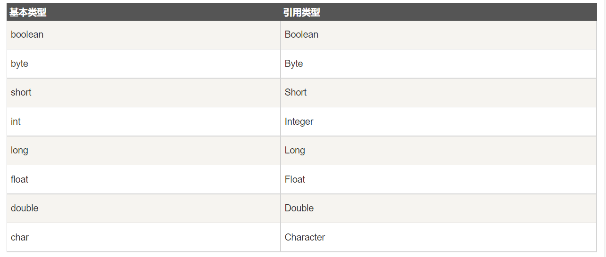

此外，BigInteger、BigDecimal 用于高精度的运算，BigInteger 支持任意精度的整数，也是引用类型，但它们没有相对应的基本类型。

```java
import java.util.ArrayList;

public class RunoobTest {
    public static void main(String[] args) {
        ArrayList<Integer> myNumbers = new ArrayList<Integer>();
        myNumbers.add(10);
        myNumbers.add(15);
        myNumbers.add(20);
        myNumbers.add(25);
        for (int i : myNumbers) {
            System.out.println(i);
        }
    }
}
```

### 14.8 ArrayList 排序

Collections 类也是一个非常有用的类，位于 java.util 包中，提供的 sort() 方法可以对字符或数字列表进行排序。

以下实例对字母进行排序：

```java
import java.util.ArrayList;
import java.util.Collections;  // 引入 Collections 类

public class RunoobTest {
    public static void main(String[] args) {
        ArrayList<String> sites = new ArrayList<String>();
        sites.add("Taobao");
        sites.add("Wiki");
        sites.add("Runoob");
        sites.add("Weibo");
        sites.add("Google");
        Collections.sort(sites);  // 字母排序
        for (String i : sites) {
            System.out.println(i);
        }
    }
}
```

以下实例对数字进行排序：

```java
import java.util.ArrayList;
import java.util.Collections;  // 引入 Collections 类

public class RunoobTest {
    public static void main(String[] args) {
        ArrayList<Integer> myNumbers = new ArrayList<Integer>();
        myNumbers.add(33);
        myNumbers.add(15);
        myNumbers.add(20);
        myNumbers.add(34);
        myNumbers.add(8);
        myNumbers.add(12);

        Collections.sort(myNumbers);  // 数字排序

        for (int i : myNumbers) {
            System.out.println(i);
        }
    }
}
```

### 14.9 ArrayList 方法

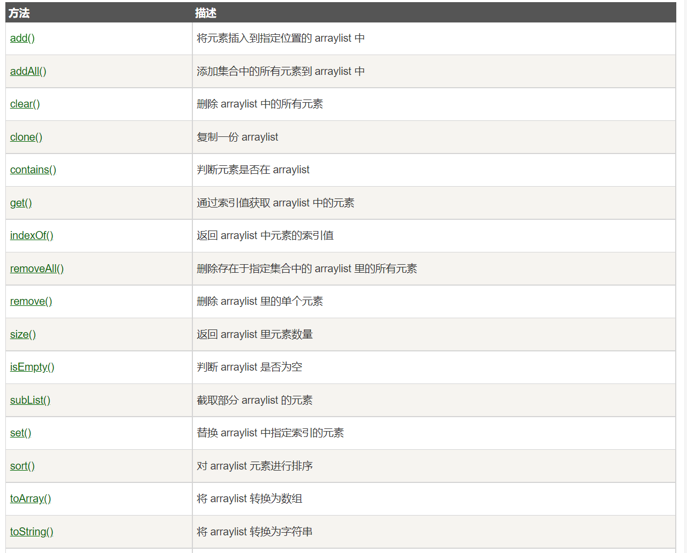

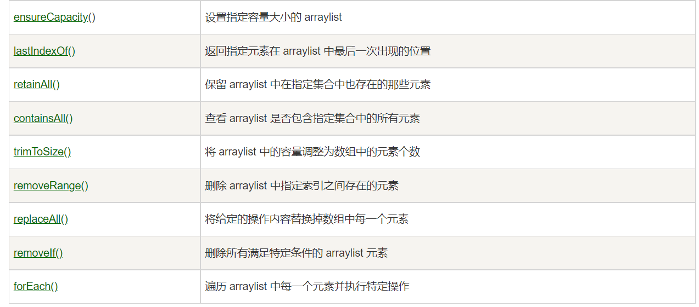

## 15.  LinkedList

链表（Linked list）是一种常见的基础数据结构，是一种线性表，但是并不会按线性的顺序存储数据，而是在每一个节点里存到下一个节点的地址。

链表可分为单向链表和双向链表。

与 ArrayList 相比，LinkedList 的增加和删除对操作效率更高，而查找和修改的操作效率较低。

**以下情况使用 ArrayList :**

- 频繁访问列表中的某一个元素。
- 只需要在列表末尾进行添加和删除元素操作。

**以下情况使用 LinkedList :**

- 你需要通过循环迭代来访问列表中的某些元素。
- 需要频繁的在列表开头、中间、末尾等位置进行添加和删除元素操作。

> - LinkedList 继承了 AbstractSequentialList 类。
> - LinkedList 实现了 Queue 接口，可作为队列使用。
> - LinkedList 实现了 List 接口，可进行列表的相关操作。
> - LinkedList 实现了 Deque 接口，可作为队列使用。
> - LinkedList 实现了 Cloneable 接口，可实现克隆。
> - LinkedList 实现了 java.io.Serializable 接口，即可支持序列化，能通过序列化去传输。


### 15.1 常用的方法

#### 15.11 添加元素与创建

```java
import java.util.LinkedList;

public class RunoobTest {
    public static void main(String[] args) {
        LinkedList<String> sites = new LinkedList<String>();
        sites.add("Google");
        sites.add("Runoob");
        sites.add("Taobao");
        sites.add("Weibo");
        System.out.println(sites);
        
        // 使用 addFirst() 在头部添加元素,默认是在尾部添加元素
        sites.addFirst("Wiki");
        // 使用 addLast() 在尾部添加元素
        sites.addLast("Wiki");
    }
}
```

#### 15.12 移除元素

```java
// 引入 LinkedList 类
import java.util.LinkedList;

public class RunoobTest {
    public static void main(String[] args) {
        LinkedList<String> sites = new LinkedList<String>();
        sites.add("Google");
        sites.add("Runoob");
        sites.add("Taobao");
        sites.add("Weibo");
        // 使用 removeLast() 移除尾部元素
        sites.removeLast();
        System.out.println(sites);
    }
}
```

#### 15.13 获取元素

```java
// 引入 LinkedList 类
import java.util.LinkedList;

public class RunoobTest {
    public static void main(String[] args) {
        LinkedList<String> sites = new LinkedList<String>();
        sites.add("Google");
        sites.add("Runoob");
        sites.add("Taobao");
        sites.add("Weibo");
        // 使用 getFirst() 获取头部元素
        System.out.println(sites.getFirst());
        // 使用 getLast() 获取尾部元素
        System.out.println(sites.getLast());
    }
}
```

#### 15.14 遍历所有的元素

```java
// 引入 LinkedList 类
import java.util.LinkedList;

public class RunoobTest {
    public static void main(String[] args) {
        LinkedList<String> sites = new LinkedList<String>();
        sites.add("Google");
        sites.add("Runoob");
        sites.add("Taobao");
        sites.add("Weibo");
        for (int size = sites.size(), i = 0; i < size; i++) {
            System.out.println(sites.get(i));
        }
    }
}

// 另一种方法
import java.util.LinkedList;

public class RunoobTest {
    public static void main(String[] args) {
        LinkedList<String> sites = new LinkedList<String>();
        sites.add("Google");
        sites.add("Runoob");
        sites.add("Taobao");
        sites.add("Weibo");
        for (String i : sites) {
            System.out.println(i);
        }
    }
}
```

### 15.2 其他的方法


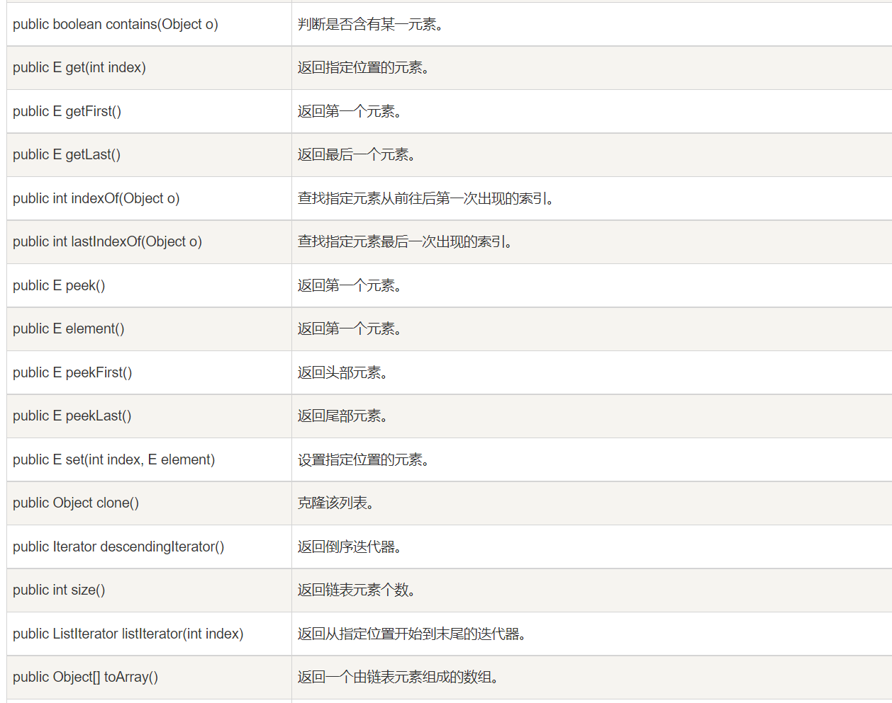

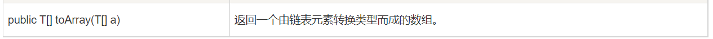

## 16.Java 排序

### 16.1 数组的排序

`int`数组无法实现`Comparator`方法，因此，数组如果需要排序，需要直接使用`Arrays.sort()`方法。
