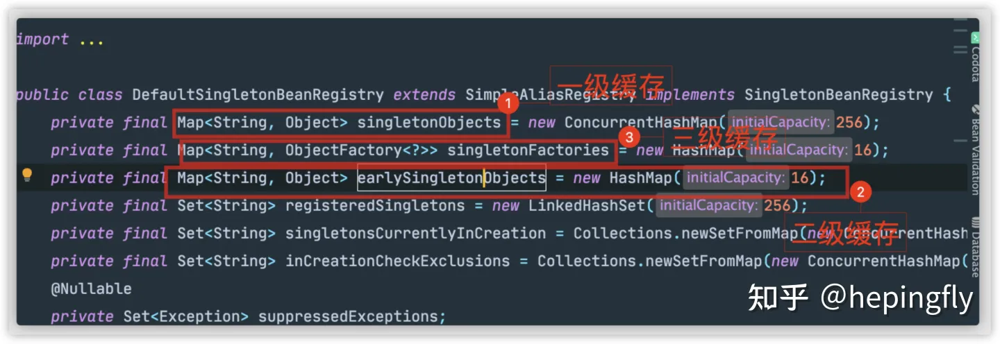
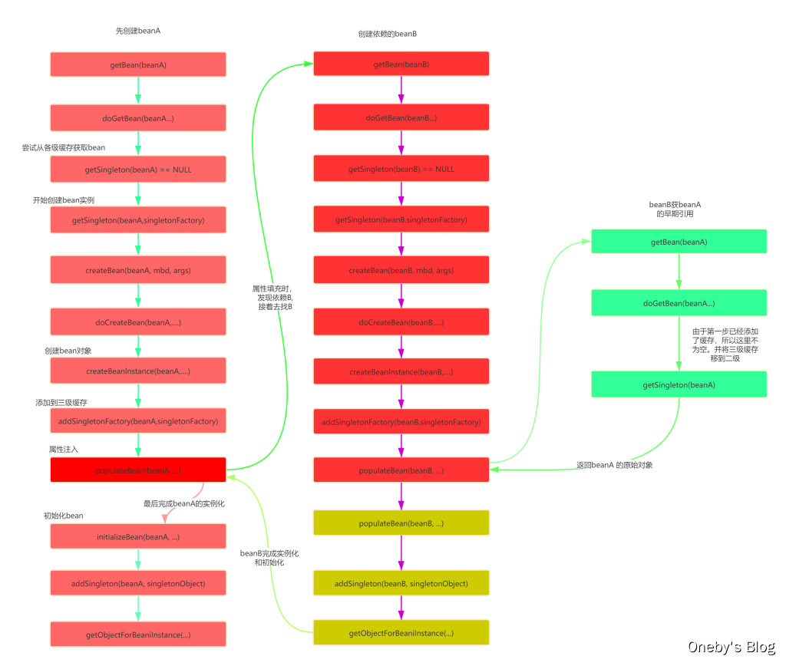

# 1. Spring IOC

## 1.1 Spring Bean生命周期

参考：https://www.cnblogs.com/zrtqsk/p/3735273.html

> 主要是，实例化，属性注入，Aware接口感知，Postprocessor，init-method，Disposable，destory-method

Bean 的生命周期概括起来就是 **4 个阶段**：

1. 实例化（Instantiation）
2. 属性赋值（Populate）
3. 初始化（Initialization）
4. 销毁（Destruction）

Bean的完整生命周期经历了各种方法调用，这些方法可以划分为以下几类：

- 1、Bean自身的方法 ：这个包括了`Bean`本身调用的方法和通过配置文件中<bean>的init-method和destroy-method指定的方法

- 2、Bean级生命周期接口方法 ：这个包括了`BeanNameAware`、`BeanFactoryAware`、`InitializingBean`和`DiposableBean`这些接口的方法

- 3、容器级生命周期接口方法 ：这个包括了`InstantiationAwareBeanPostProcessor` 和 `BeanPostProcessor` 这两个接口实现，一般称它们的实现类为“后处理器”。

  > InstantiationAwareBeanPostProcessor 在最新的Spring中已经被放弃使用

- 4、工厂后处理器接口方法：这个包括了`AspectJWeavingEnabler`, `ConfigurationClassPostProcessor`, `CustomAutowireConfigurer`等等非常有用的工厂后处理器接口的方法。工厂后处理器也是容器级的。在应用上下文装配配置文件之后立即调用。


## 1.3 Spring BeanFactory

## 1.4 Spring Bean注入的几种方式

- set方法注入
- 构造方法注入
- 有参
- p命名空间和C命名空间
- 自动装配@autowired

## 1.5 Spring 类加载过程（源码级别）

```java
new AbstractApplicationContext()
--->
refresh()
--->
prepareRefresh();
obtainFreshBeanFactory();
prepareBeanFactory(beanFactory);
postProcessBeanFactory(beanFactory);
invokeBeanFactoryPostProcessors(beanFactory);
registerBeanPostProcessors(beanFactory);
beanPostProcess.end();
initMessageSource()
initApplicationEventMulticaster();
onRefresh();
finishBeanFactoryInitialization(beanFactory); --> 			     
    beanFactory.preInstantiateSingletons();// 重点内容
finishRefresh();
--->
getBean(beanName);
doGetBean();-->
    getSingleton(beanName);
	// 只有在类不在创建的时候，createBean()方法才会执行
	createBean();--->
		doCreateBean();--->
        	createBeanInstance();
				instantiateBean(); // 无参构造的情况
					instantiate();
						instantiateClass(constructorToUse); // 对应bean的构造函数
							newInstance(); // 再底层就native了
			populateBean(); // 填充bean的属性
			initializeBean();
	// singletonFactory 为 createBean()的匿名函数
	getSingleton(String beanName, ObjectFactory<?> singletonFactory); -->
		addSingleton(beanName, singletonObject);
	


getSingleton(){
    // 先去一级缓存去拿，一级缓存没有，且bean不在创建，返回空
    // 一级缓存没有，且bean正在创建，从二级缓存拿，二级缓存没有，且允许早期暴露
    // 那么从三级缓存中拿
    // 存在一个双重校验锁的一个过程
}

// allowEarlyReference 一般为true
protected Object getSingleton(String beanName, boolean allowEarlyReference) {
		// Quick check for existing instance without full singleton lock
		Object singletonObject = this.singletonObjects.get(beanName);
		if (singletonObject == null && isSingletonCurrentlyInCreation(beanName)) {
			singletonObject = this.earlySingletonObjects.get(beanName);
			if (singletonObject == null && allowEarlyReference) {
				synchronized (this.singletonObjects) {
					// Consistent creation of early reference within full singleton lock
					singletonObject = this.singletonObjects.get(beanName);
					if (singletonObject == null) {
						singletonObject = this.earlySingletonObjects.get(beanName);
						if (singletonObject == null) {
							ObjectFactory<?> singletonFactory = this.singletonFactories.get(beanName);
							if (singletonFactory != null) {
								singletonObject = singletonFactory.getObject();
								this.earlySingletonObjects.put(beanName, singletonObject);
								this.singletonFactories.remove(beanName);
							}
						}
					}
				}
			}
		}
		return singletonObject;
	}
```

# 2. Spring AOP

 `Spring`的`AOP`实现原理其实很简单，就是通过**动态代理**实现的。如果我们为`Spring`的某个`bean`配置了切面，那么`Spring`在创建这个`bean`的时候，实际上创建的是这个`bean`的一个代理对象，我们后续对`bean`中方法的调用，实际上调用的是代理类重写的代理方法。而`Spring`的`AOP`使用了两种动态代理，分别是**JDK的动态代理**，以及**CGLib的动态代理**。

> https://www.cnblogs.com/tuyang1129/p/12878549.html

SpringAOP的重点学习内容

> AOP 基本术语
>
> AOP 实现原理
>
> AOP 执行顺序

## 2.1 AOP基本术语

| 术语              | 含义                                                         |
| ----------------- | ------------------------------------------------------------ |
| 目标(Target)      | 被通知的对象                                                 |
| 代理(Proxy)       | 向目标对象应用通知之后创建的代理对象                         |
| 连接点(JoinPoint) | 目标对象的所属类中，定义的所有方法均为连接点                 |
| 切入点(Pointcut)  | 被切面拦截 / 增强的连接点（切入点一定是连接点，连接点不一定是切入点） |
| 通知(Advice)      | 增强的逻辑 / 代码，也即拦截到目标对象的连接点之后要做的事情  |
| 切面(Aspect)      | 切入点(Pointcut)+通知(Advice)                                |
| Weaving(织入)     | 将通知应用到目标对象，进而生成代理对象的过程动作             |

## 2.2 AOP 实现方式

AOP是基于动态代理的，因此，主要有以下几种实现方式

- JDK Proxy (基于接口)

- CJlib （基于子类）

- AspectJ (默认采用CJlib，可以指定为JDK)

  > AspectJ 究竟默认使用CJlib 还是 JDK，具体还是要看版本

1. 假如目标对象(被代理对象)实现接口，则底层可以采用JDK动态代理机制为目标对象创建代理对象（目标类和代理类会实现共同接口）。
2. 假如目标对象(被代理对象)没有实现接口，则底层可以采用CGLIB代理机制为目标对象创建代理对象（默认创建的代理类会继承目标对象类型）。


## 2.3 AspcetJ 

> AspcetJ 好像既可以编译增强，也可以运行增强

https://ljd1996.github.io/2020/05/22/AspectJ%E5%9F%BA%E6%9C%AC%E7%94%A8%E6%B3%95/


###  2.3.1 AspcetJ 通知的类型有哪些？

- **Before**（前置通知）：目标对象的方法调用之前触发
- **After** （后置通知）：目标对象的方法调用之后触发
- **AfterReturning**（返回通知）：目标对象的方法调用完成，在返回结果值之后触发
- **AfterThrowing**（异常通知） ：目标对象的方法运行中抛出 / 触发异常后触发。AfterReturning 和 AfterThrowing 两者互斥。如果方法调用成功无异常，则会有返回值；如果方法抛出了异常，则不会有返回值。
- **Around**： （环绕通知）编程式控制目标对象的方法调用。环绕通知是所有通知类型中可操作范围最大的一种，因为它可以直接拿到目标对象，以及要执行的方法，所以环绕通知可以任意的在目标对象的方法调用前后搞事，甚至不调用目标对象的方法

### 2.3.2 Join Points （连接点）

Join Points可以看作是程序运行时的一个执行点，比如函数的调用，执行等。

| Join Points           | 说明                           | 示例                                 |
| --------------------- | ------------------------------ | ------------------------------------ |
| method call           | 函数调用                       | 比如调用Log.e()                      |
| method execution      | 函数执行                       | 比如Log.e()的执行内部                |
| constructor call      | 构造函数调用                   | 和method call类似                    |
| constructor execution | 构造函数执行                   | 和method execution类似               |
| field get             | 获取某个变量                   |                                      |
| field set             | 设置某个变量                   |                                      |
| pre-initialization    | Object在构造函数前做的一些工作 |                                      |
| initialization        | Object在构造函数中做的工作     |                                      |
| static initialization | 类初始化                       | 比如类的static{}                     |
| handler               | 异常处理                       | 比如try catch()中，对应catch内的执行 |

### 2.3.3 Pointcuts 切入点

一般情况下，使用@Pointcut注解的方法的方法体必须是空的，并且没有任何throws语句。如果切入点绑定了形式参数（使用args()、target()、this()、@args()、@target()、@this()、@annotation()），那么它们必须也是方法的形式参数。

> 修饰的方法body需要为空的

| **指示符**（感觉不全） | **作用**                                                     |
| ---------------------- | ------------------------------------------------------------ |
| bean                   | 用于匹配指定bean对象的所有方法                               |
| within                 | 用于匹配指定包下所有类内的所有方法                           |
| this()                 | 匹配可以向上转型为this指定的类型的代理对象中的所有方法       |
| target()               | 匹配可以向上转型为target指定的类型的目标对象中的所有方法     |
| args()                 | 用于匹配运行时传入的参数列表的类型为指定的参数列表类型的方法 |
| execution              | 用于按指定语法规则匹配到具体方法                             |
| @within()              | 用于匹配持有指定注解的类的所有方法                           |
| @target()              | 用于匹配的持有指定注解目标对象的所有方法                     |
| @args()                | 用于匹配运行时 传入的参数列表的类型持有 注解列表对应的注解的方法 |
| @annotation            | 用于匹配指定注解修饰的方法                                   |

> 可以参考切入点表达式的参考
>
> https://www.kancloud.cn/apachecn/howtodoinjava-zh/1952644
>
> https://www.jianshu.com/p/dadc7d730489
>
> https://www.jianshu.com/p/d99e3d0edc32

**通配符**

| 通配符 | 说明                                                         |
| ------ | ------------------------------------------------------------ |
| *      | 匹配任何数量字符                                             |
| ..     | 匹配任何数量字符的重复，如在类型模式中匹配任何数量子包；而在方法参数模式中匹配任何数量参数 |
| +      | 匹配指定类型的子类型；仅能作为后缀放在类型模式后边           |

**重点方法**

```java
/**
execution 方法比较全面，可以替代上述的多种类型
execution 是面粒度最小是达到方法级别，而execution表达式可以用于明确指定方法返回类型，类名，方法名和参数名等与方法相关的部件，并且在Spring中，大部分需要使用AOP的业务场景也只需要达到方法级别即可，因而execution表达式的使用是最为广泛的
*/
execution ([方法的可见性] 返回类型 [方法所在类的全路径名] 方法名(参数类型列表) [方法抛出的异常类型])
```

1. 匹配所有目标类的public方法，第一个*为返回类型，第二个*为方法名

2. 匹配所有目标类以xxx开头的方法，第一个*代表返回任意类型

3. 匹配目标类所有以xxx结尾的方法，并且其方法的参数表第一个参数可为任意类型，第二个参数必须为String

   ```java
   execution(public * * (..))
   execution(* save* (..))
   ```
   
   ```java
   execution(* xxx* (..))
   ```
   
   ```java
   execution(**xxx(*,String))
   ```


参数表达式：

举个例子

```java
@Pointcut("call(* *.*(..))")
void anyCall(){}

// 当要绑定参数的时候，只需要将参数作为被注解的方法的参数即可
@Pointcut("call(* *.*(int)) && args(i) && target(callee)")
void anyCall(int i, Fool callee){}
```

- call：处理Join Point的类型，例如call、execution

- 第一个`*`表示返回值，*表示返回值为任意类型

- 第二个`*.*`是匹配方法，`*`是进行通配，几个`*`没区别

- `android.app.Activity.on**`表示on开头的方法

- 可以通过`&&`、`||`、`!`来进行条件组合

- `()`代表方法参数，可以指定类型，例如android.os.Bundle，或者`(..)`这样来代表任意类型、任意个数的参数

  > 第一个参数，返回值， 第二个参数，切入方法，可以加Public等权限修饰符来修饰

### 2.3.4 Advice

Before、After、AfterReturning、AfterThrowing或者Around（等效于Before和After）等。

- @Before

- - 前置通知：目标方法之前执行

- @After

- - 后置通知：目标方法之后执行（始终执行）

- @AfterReturning

- - 返回通知：执行方法结束前执行（异常不执行）

- @AfterThrowing

- - 异常通知：出现异常的时候执行

- @Around

- - 环绕通知：环绕目标方法执行

### 2.3.5 Spring AOP 执行顺序

说明：Spring 4 和 Spring 5 AOP的执行顺序是不同的

Spring 4:

1. @Around
2. @Before
3. 执行
4. @Around(发生错误时，没有这一步)
5. @After
6. @AfterReturning/@AfterThrowing

Spring 5:

1. @Around
2. @Before
3. 执行
4. @AfterReturning/@AfterThrowing
5. @After
6. @Around(发生错误时，没有这一步)

## 2.3 AspectJ 注解加载流程


## 2.4 过滤器和拦截器的区别

# 3. Spring循环依赖

*Spring 内部通过 3 级缓存来解决循环依赖。*

`DefaultSingletonBeanRegistry` 类

- 第一级缓存：`singletonObjects` ，存放已经经历完整生命周期的 Bean 对象
- 第二级缓存：`earlySingletonObjects` ，存放早期暴露出来的 Bean 对象，Bean 的生命周期未结束（属性还未填充完成），说人话就是 bean 已经创建了，但是属性还没有初始化。类似于房子买好了，但是家具还没有搬进来。
- 第三级缓存：`singletonFactories` 存放可以生成 Bean 的工厂。



## 3.1 **Sping 解决循环依赖的过程**

1. A 创建过程需要 B ，于是 A 将自己放到**<u>三级缓存</u>**中，去实例化 B
2. B 实例化的时候发现需要A，于是 B 先查一级缓存，没有，再查二级缓存，还是没有，再查三级缓存，找到了A，然后把三级缓存里面的A放到**<u>二级缓存</u>**里面，并删除三级缓存里面的A
3. B顺利初始化完毕，将自己放到**<u>一级缓存</u>**里面（此时 B 中的 A 依然是创建中状态），然后回来接着创建A，此时B已经创建结束，直接冲一级缓存中拿到B，然后完成创建，并将 A 自己放到一级缓存里面。

## 3.2 **循环依赖 Debug 的具体步骤**

1. 调用`doGetBean()`方法，想要获取beanA，于是调用`getSingleton()`方法从缓存中查找beanA
2. 在`getSingleton()`方法中，从一级缓存中查找，没有，返回`null`
3. `doGetBean()`方法中获取到的beanA为`null`，于是走对应的处理逻辑，调用`getSingleton()`的重载方法（参数为`ObjectFactory`的)
4. 在`getSingleton()`方法中，先将`beanA_name`添加到一个集合中，用于标记该bean正在创建中。然后回调匿名内部类的`creatBean()`方法
5. 进入AbstractAutowireCapableBeanFactory#doCreateBean()，先反射调用构造器创建出beanA的实例，然后判断。是否为单例、是否允许提前暴露引用(对于单例一般为true)、是否正在创建中〈即是否在第四步的集合中)。判断为true则将beanA添加到【三级缓存】中
6. 对beanA进行属性填充，此时检测到beanA依赖于beanB，于是开始查找beanB
7. 调用`doGetBean()`方法，和上面beanA的过程一样，到缓存中查找beanB，没有则创建，然后给beanB填充属性
8. 此时beanB依赖于beanA，调用getsingleton()获取beanA，依次从一级、二级、三级缓存中找，此时从三级缓存中获取到beanA的创建工厂，通过创建工厂获取到singletonObject，此时这个singletonObject指向的就是上面在doCreateBean()方法中实例化的beanA
9. 这样beanB就获取到了beanA的依赖，于是beanB顺利完成实例化，并将beanA从三级缓存移动到二级缓存中
10. 随后beanA继续他的属性填充工作，此时也获取到了beanB，beanA也随之完成了创建，回到`getsingleton()`方法中继续向下执行，将beanA从二级缓存移动到一级缓存中




**Q：为什么是三级缓存，而不是二级缓存？**

A : https://zhuanlan.zhihu.com/p/496273636

> 之前认为是没有三级缓存，没办法解决循环依赖，然后认为是为了延迟创建代理类的原因，但是这也不是核心原因，最主要的是不想破坏Spring 的设计模式
>

Views：Spring 在两个类循环依赖的时候，好像有时候会不知道先创建哪一个？

```yaml
// 可以通过下面的方式，开启解决循环依赖的方法
spring:
    main:
      allow-circular-references: true
```

# 6. SpringSecurity

