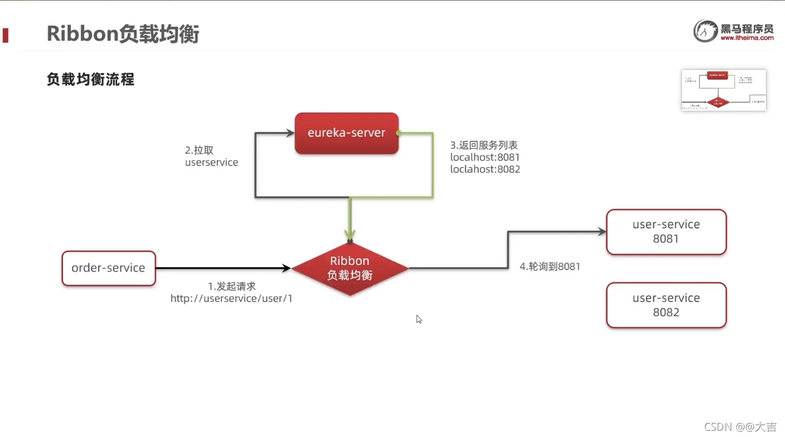
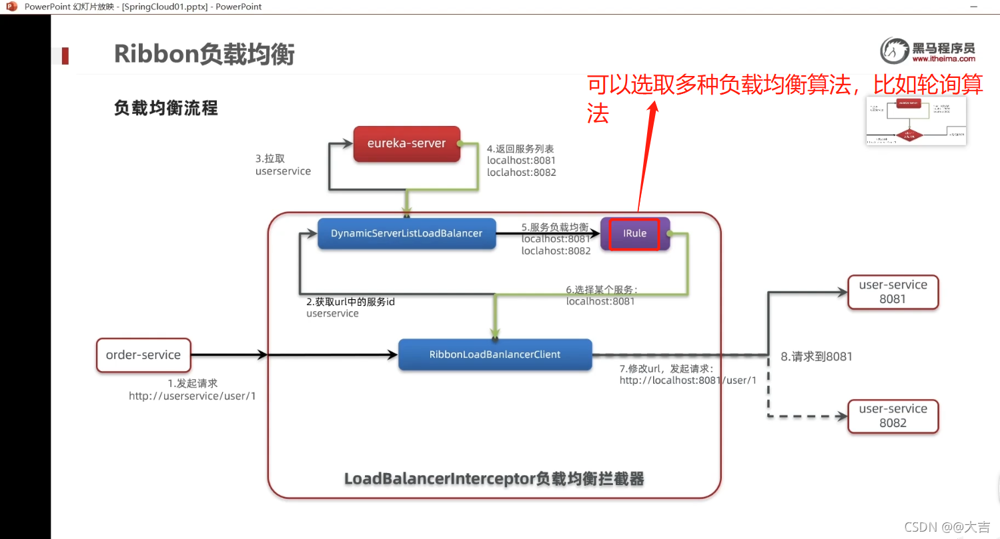
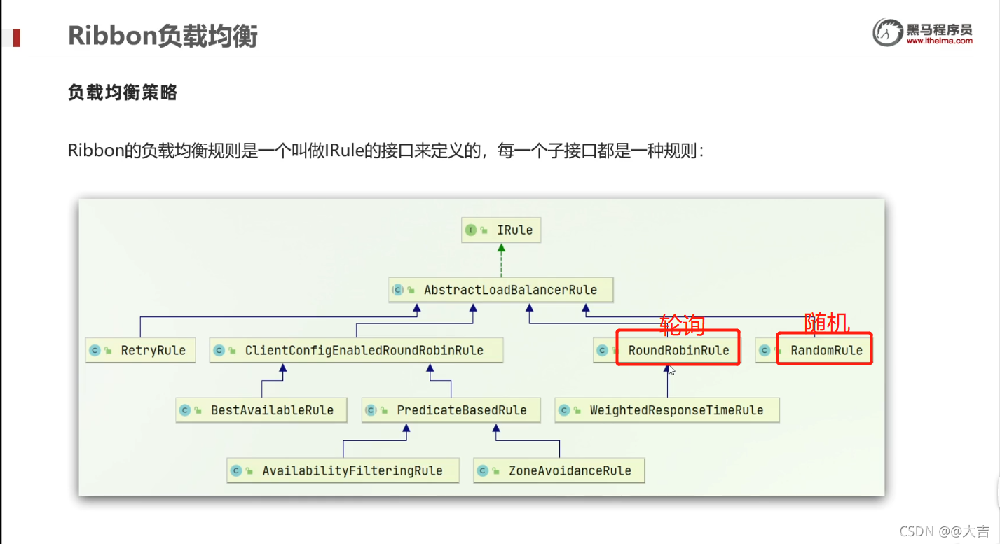
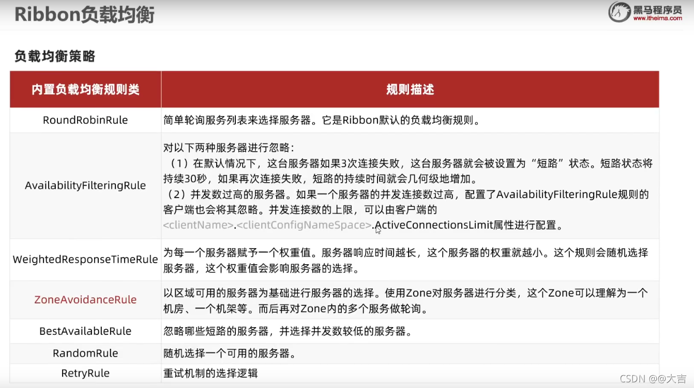
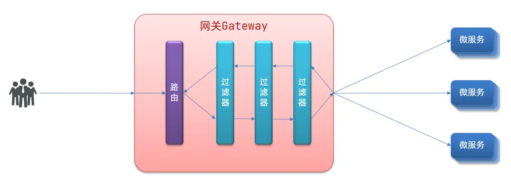

# 1. 基本知识

**本文主要参考：**

B站黑马程序员 笔记  https://www.xn2001.com/archives/663.html

> 简单记录了一下，没有完全记录上去

## 1.1 SpringCloud有哪些组件？

> - Nacos / Consoul 服务注册与发现
> - Ribbon 负债均衡
> - Feign 远程调用 / RestTemplate
> - GateWay 网关

## 1.2 服务注册

> 注册中心的作用是什么呢？
>
> 在分布式系统上注册各个实例的信息，便于远程调用。
>
> 健康检测，维护各个实例信息的状态。
>
> 负载均衡，负责确定哪个服务器去完成

### 1.2.1 **Eureka**

> 目前，Eureka 1.X版本还在维护，但是2.X版本已经停止更新

**Eureka的作用：**

消费者该如何获取服务提供者具体信息?

- 服务提供者启动时向eureka注册自己的信息
- eureka保存这些信息
- 消费者根据服务名称向eureka拉取提供者信息

如果有多个服务提供者,消费者该如何选择?

- 服务消费者利用负载均衡算法，从服务列表中挑选一个

消费者如何感知服务提供者健康状态?

- 服务提供者会每隔30秒向EurekaServer发送心跳请求，报告健康状态
- eureka会更新记录服务列表信息，心跳不正常会被剔除
- 消费者就可以拉取到最新的信息


**注意点：**

Eureka自己也是一个微服务，Eureka启动时，要把自己也注册进去。这是因为如果后续搭建Eureka集群时做数据交流：

```yaml
server:
  port: 10086 # 服务端口
spring:
  application:
    name: eurekaserver # eureka的服务名称
eureka:
  client:
    service-url:  # eureka的地址信息
      defaultZone: http://127.0.0.1:10086/eureka
```

### 1.2.2 基本操作 - 搭建eureka

**引入eureka依赖**

```xml
<dependency>
    <groupId>org.springframework.cloud</groupId>
    <artifactId>spring-cloud-starter-netflix-eureka-server</artifactId>
</dependency>
```

**编写启动类**

给eureka-server服务编写一个启动类，一定要添加一个@EnableEurekaServer注解，开启eureka的注册中心功能：

**编写配置文件**

eureka 本身自己也需要注册进注册中心去

```
server:
  port: 10086
spring:
  application:
    name: eureka-server
eureka:
  client:
    service-url: #eureka的地址信息
      defaultZone: http://127.0.0.1:10086/eureka
```

### 1.2.3 服务注册 - 服务注册

**引入eureka依赖**

```xml
<dependency>
    <groupId>org.springframework.cloud</groupId>
    <artifactId>spring-cloud-starter-netflix-eureka-client</artifactId>
</dependency>

```

**修改配置文件**

```yaml
spring:
  application:
    name: user-service
eureka:
  client:
    service-url:
      defaultZone: http://127.0.0.1:10086/eureka
```


## 1.3 负载均衡

### 1.3.1 Ribbon 负载均衡

为什么需要负债均衡呢?

- 如果有多个服务提供者，服务调用者如何知道究竟调用哪个服务呢？
- 而且服务调用者为何不用写死服务提供者的链接（ip和端口），只需要写服务名称即可？为什么我们只输入了服务名称就可以访问了呢？String url = "http://userservice/user/" + order.getUserId(); //由于已经在Eureka里面配置了服务，这里只需要写配置的服务名即可）

> 如何实现 服务寻址 以及 负载均衡呢？
>
> 1.   `@LoadBalanced` 注解 使得 restTemplate 的 rest 请求被拦截（不在这个注解 restTemplate 会报错 `UnknownHostException`）
>
> 2. 其中有 `intercept()` 方法，
>
>    `request.getURI()`：获取请求uri
>
>    `originalUri.getHost()`：获取uri路径的主机名，其实就是服务id
>
>    `this.loadBalancer.execute()`：处理服务id，和用户请求
>
> 3. `LoadBalancerClient.execute()` 方法
>
>    `getLoadBalancer(serviceId)`：根据服务id获取 `ILoadBalancer`，而 `ILoadBalancer` 会拿着服务 id 去 eureka 中获取服务列表
>
>    `getServer(loadBalancer)`：利用内置的负载均衡算法，从服务列表中选择一个。
>
>    `getServer()` 中有个 `chooseServer()` 方法，里面有个 `rule.choose(key)` 负责选择服务器，这个 rule 是 `IRule` 接口，是 负责选择服务器的核心算法。


这都是Ribbon的负载均衡做到的，

- **针对问题一**，通过跟断点得知，Ribbon是通过几种不同的负载均衡算法实现的这一个机制（比如[轮询算法](https://blog.csdn.net/jasonliuvip/article/details/25725541)）；
- **针对问题二**，Ribbon会根据服务名称去Eureka注册中心拉取服务，如下两个图所示：

> Ribbon 应该是在客户端实现的负载均衡





### 1.3.2 Ribbon 负载均衡策略





可以使用如下代码配置对某个服务的负载均衡策略(在 application.yml里配置)

```yaml
userservice: # 给某个微服务配置负载均衡规则，这里是userservice服务为例
  ribbon:
    NFLoadBalancerRuleClassName: com.netflix.loadbalancer.RandomRule # 负载均衡规则
```

Ribbon默认是采用懒加载，即第一次访问时才会去创建LoadBalanceClient，请求时间会很长。

而饥饿加载则会在项目启动时创建，降低第一次访问的耗时，通过下面配置开启饥饿加载：

```yaml
ribbon:
  eager-load:
    enabled: true # 开启饥饿加载
    clients:
      - userservice # 指定饥饿加载的服务名称
      - xxxxservice # 如果需要指定多个，需要这么写
```

## 1.4 Nacos

> 使用nacos 时，需要注释掉Eureka相关的内容

### 1.4.1 Nacos 集群配置

默认的`ZoneAvoidanceRule`并不能实现根据同集群优先来实现负载均衡。

Nacos中提供了一个`NacosRule`的实现，可以优先从同集群中挑选实例。

1）给order-service配置集群信息

修改order-service的application.yml文件，添加集群配置：

```yaml
spring:
  cloud:
    nacos:
      server-addr: localhost:8848
      discovery:
        cluster-name: HZ # 集群名称
```

2）修改负载均衡规则

修改order-service的application.yml文件，修改负载均衡规则

```yaml
userservice:
  ribbon:
    NFLoadBalancerRuleClassName: com.alibaba.cloud.nacos.ribbon.NacosRule # 负载均衡规则 
```

配置完成之后，就可以实现同集群优先的 负载均衡了

## 1.5 fegin

### 1.5.1 fegin 的自定义配置

| 类型                | 作用             | 说明                                                   |
| :------------------ | :--------------- | :----------------------------------------------------- |
| feign.Logger.Level  | 修改日志级别     | 包含四种不同的级别：NONE、BASIC、HEADERS、FULL         |
| feign.codec.Decoder | 响应结果的解析器 | http远程调用的结果做解析，例如解析json字符串为java对象 |
| feign.codec.Encoder | 请求参数编码     | 将请求参数编码，便于通过http请求发送                   |
| feign.Contract      | 支持的注解格式   | 默认是SpringMVC的注解                                  |
| feign.Retryer       | 失败重试机制     | 请求失败的重试机制，默认是没有，不过会使用Ribbon的重试 |

### 1.5.2  底层 http 请求方式

- **URLConnection**：默认实现，不支持连接池
- **Apache HttpClient** ：支持连接池
- **OKHttp**：支持连接池

**使用 Apache 的HttpClient来演示连接池。**

 引入依赖：

```xml
<!--httpClient的依赖 -->
<dependency>
    <groupId>io.github.openfeign</groupId>
    <artifactId>feign-httpclient</artifactId>
</dependency>
```

**配置连接池**

```yaml
feign:
  client:
    config:
      default: # default全局的配置
        loggerLevel: BASIC # 日志级别，BASIC就是基本的请求和响应信息
  httpclient:
    enabled: true # 开启feign对HttpClient的支持
    max-connections: 200 # 最大的连接数
    max-connections-per-route: 50 # 每个路径的最大连接数
```

### 1.5.3 序列化与反序列化

## 1.6 SpringCloud

### 1.6.1 基本说明

**核心功能特性**：

- 请求路由
- 权限控制
- 限流

**基本配置：**

```yaml
server:
  port: 10010 # 网关端口
spring:
  application:
    name: gateway # 服务名称
  cloud:
    nacos:
      server-addr: localhost:8848 # nacos地址
    gateway:
      routes: # 网关路由配置
        - id: user-service # 路由id，自定义，只要唯一即可
          # uri: http://127.0.0.1:8081 # 路由的目标地址 http就是固定地址
          uri: lb://userservice # 路由的目标地址 lb就是负载均衡，后面跟服务名称
          predicates: # 路由断言，也就是判断请求是否符合路由规则的条件
            - Path=/user/** # 这个是按照路径匹配，只要以/user/开头就符合要求
```

### 1.6.2 过滤器工厂

GatewayFilter 是网关中提供的一种过滤器，可以对进入网关的请求和微服务返回的响应做处理。



Spring提供了31种不同的路由过滤器工厂。

https://docs.spring.io/spring-cloud-gateway/docs/current/reference/html/#gatewayfilter-factories

| **名称**             | **说明**                     |
| :------------------- | :--------------------------- |
| AddRequestHeader     | 给当前请求添加一个请求头     |
| RemoveRequestHeader  | 移除请求中的一个请求头       |
| AddResponseHeader    | 给响应结果中添加一个响应头   |
| RemoveResponseHeader | 从响应结果中移除有一个响应头 |
| RequestRateLimiter   | 限制请求的流量               |

**具体yaml配置：**

```yaml
spring:
  cloud:
    gateway:
      routes: # 网关路由配置
        - id: user-service # 路由id，自定义，只要唯一即可
          # uri: http://127.0.0.1:8081 # 路由的目标地址 http就是固定地址
          uri: lb://userservice # 路由的目标地址 lb就是负载均衡，后面跟服务名称
          predicates: # 路由断言，也就是判断请求是否符合路由规则的条件
            - Path=/user/** # 这个是按照路径匹配，只要以/user/开头就符合要求
          filters:
            - AddRequestHeader=sign, xn2001.com is eternal # 添加请求头
```

> 这样，路由到 /user/ 下的所有请求，都会加上请求头。sign：xn2001.com is eternal

除了 【网关过滤器】外，还有【全局过滤器】，【默认过滤器】等，假设有以下请求：

定义全局过滤器，拦截请求，判断请求的参数是否满足下面条件：

- 参数中是否有 authorization
- authorization 参数值是否为 admin

如果同时满足则放行，否则拦截

> 全局过滤器 `GlobalFilter` 是否和 `GatewayFilter` 不在同一个包下， `GlobalFilter` 是否不是 gateway 的组成部分？

```java
@Component
public class AuthorizeFilter implements GlobalFilter, Ordered {

    // 测试：http://localhost:10010/order/101?authorization=admin
    @Override
    public Mono<Void> filter(ServerWebExchange exchange, GatewayFilterChain chain) {
        // 获取第一个 authorization 参数
        String authorization = exchange.getRequest().getQueryParams().getFirst("authorization");
        if ("admin".equals(authorization)){
            // 放行
            return chain.filter(exchange);
        }
        // 设置拦截状态码信息
        exchange.getResponse().setStatusCode(HttpStatus.UNAUTHORIZED);
        // 设置拦截
        return exchange.getResponse().setComplete();
    }

    // 设置过滤器优先级，值越低优先级越高
    // 也可以使用 @Order 注解
    @Override
    public int getOrder() {
        return 0;
    }
}
```


排序的规则是什么呢？

- 每一个过滤器都必须指定一个 int 类型的 order 值，**order 值越小，优先级越高，执行顺序越靠前**。
- GlobalFilter 通过实现 Ordered 接口，或者使用 @Order 注解来指定 order 值，由我们自己指定。
- 路由过滤器和 defaultFilter 的 order 由 Spring 指定，默认是按照声明顺序从1递增。
- 当过滤器的 order 值一样时，**会按照 defaultFilter > 路由过滤器 > GlobalFilter 的顺序执行。**

**过滤器解决跨域问题：**

```yaml
spring:
  cloud:
    gateway:
      globalcors: # 全局的跨域处理
        add-to-simple-url-handler-mapping: true # 解决options请求被拦截问题
        corsConfigurations:
          '[/**]':
            allowedOrigins: # 允许哪些网站的跨域请求 allowedOrigins: “*” 允许所有网站
              - "http://localhost:8090"
            allowedMethods: # 允许的跨域ajax的请求方式
              - "GET"
              - "POST"
              - "DELETE"
              - "PUT"
              - "OPTIONS"
            allowedHeaders: "*" # 允许在请求中携带的头信息
            allowCredentials: true # 是否允许携带cookie
            maxAge: 360000 # 这次跨域检测的有效期
```

