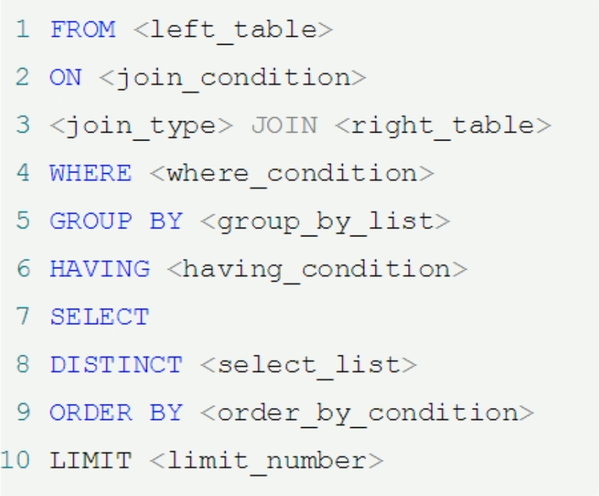
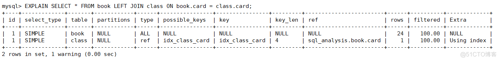

# 一： 基础知识点

## 1.1 MySQL的基础架构有哪些？

- 连接器

- （查询缓存）

  > MySQL 8.0 去除

- 分析器

- 优化器

- 执行器

- 存储引擎


从上图可以看出， MySQL 主要由下面几部分构成：

- **连接器：** 身份认证和权限相关(登录 MySQL 的时候)。
- **查询缓存：** 执行查询语句的时候，会先查询缓存（MySQL 8.0 版本后移除，因为这个功能不太实用）。
- **分析器：** 没有命中缓存的话，SQL 语句就会经过分析器，分析器说白了就是要先看你的 SQL 语句要干嘛，再检查你的 SQL 语句语法是否正确。
- **优化器：** 按照 MySQL 认为最优的方案去执行。
- **执行器：** 执行语句，然后从存储引擎返回数据。 执行语句之前会先判断是否有权限，如果没有权限的话，就会报错。
- **插件式存储引擎** ： 主要负责数据的存储和读取，采用的是插件式架构，支持 InnoDB、MyISAM、Memory 等多种存储引擎。

## 1.2 MySQL 存储引擎

MySQL的处处引擎主要有这些：


MySQL 5.5.5 之前，MyISAM 是 MySQL 的默认存储引擎。5.5.5 版本之后，InnoDB 是 MySQL 的默认存储引擎

可以通过 `show variables like '%storage_engine%'` 命令直接查看 MySQL 当前默认的存储引擎。


### 1.2.1 MyISAM 与 InnoDB的区别？


- **是否支持行级锁**

  MyISAM 只有表级锁(table-level locking)，而 InnoDB 支持行级锁(row-level locking)和表级锁,默认为行级锁。

- **是否支持事务**

  MyISAM 不提供事务支持，InnoDB支持

- **是否支持外键**

  MyISAM 不支持，而 InnoDB 支持

- **是否支持数据库异常崩溃后的安全恢复**

  MyISAM 不支持，而 InnoDB 支持。

- **是否支持 MVCC**

  MyISAM 不支持，而 InnoDB 支持

- **索引实现不一样**

  > Myisam引擎(非聚集索引--叶子节点存储数据地址的指针)
  >
  > Innodb引擎(聚集索引---叶子节点的data直接包含数据)


## 1.3 Mysql 连接池

> 每个数据库连接都需要一个线程来完成，为了便于管理，也为了减小开销，使用数据库连接池来对数据库连接进行管理


## 1.4 三大日志 binlog undolog redolog

> redo 日志文件是 InnoDB 特有的，他是存储引擎级别的，不是 MySQL 级别的

redo 记录的是数据修改之后的值，不管事务是否提交都会记录下来，例如，此时将要做的是`update students set stuName='小强' where id=1;` 那么这条操作就会被记录到 redo log buffer 中，MySQL 为了提高效率，所以将这些操作都先放在内存中去完成，然后会在某个时机将其持久化到磁盘中。


## 1.4 Mysql 优化方法

### 1.4.1 SQL性能下降的原因

- 查询语句写的差
- 索引失效：索引建了，但是没有用上
- 关联 查询太多join（设计缺陷或者不得已的需求）
- 服务器调优以及各个参数的设置（缓冲、线程数等）

### 1.4.2 SQL 执行顺序




### 1.4.3 为什么用小表驱动大表？

> 例如 A表200条，B表20万条
>
> 如果小的循环在外层，对于表连接来说就只连接 200 次 ; A left join B
>
> 如果大的循环在外层，则需要进行 20 万次表连接，从而浪费资源，增加消耗 ; B left join A

## 1.5 7大Join理论


## 1.6 MySQL 索引

### 1.6.1 索引的优势和劣势

优势：

- 查找：类似大学图书馆的书目索引，提高数据检索的效率，降低数据库的IO成本。
- 排序：通过索引対数据进行排序，降低数据排序的成本，降低了CPU的消耗。

劣势：

- 实际上索引也是一张表，该表保存了主键与索引字段，并指向实体表的记录，所以索引列也是要占用空间的。
- 虽然索引大大提高了查询速度，但是同时会降低表的更新速度，例如对表频繁的进行INSERT、UPDATE和DELETE。因为更新表的时候，MySQL不仅要保存数据，还要保存一下索引文件每次更新添加的索引列的字段，都会调整因为更新所带来的键值变化后的索引信息。
- 索引只是提高效率的一个因素，如果MySQL有大数据量的表，就需要花时间研究建立最优秀的索引。

### 1.6.2 索引的分类

索引分类：

- 单值索引：一个索引只包含单个列，一个表可以有多个单列索引。
- 唯一索引：索引列的值必须唯一，但是允许空值。
- 复合索引：一个索引包含多个字段。

建议：一张表建的索引最好不要超过5个！

## 1.7 EXPLAIN简介

EXPLAIN：SQL的执行计划，使用EXPLAIN关键字可以模拟优化器执行SQL查询语句，从而知道MySQL是如何处理SQL语句的。

```sql
# explain 查询出的结果
mysql> explain select * from pms_category \G;
*************************** 1. row ***************************
           id: 1
  select_type: SIMPLE
        table: pms_category
   partitions: NULL
         type: ALL
possible_keys: NULL
          key: NULL
      key_len: NULL
          ref: NULL
         rows: 1425
     filtered: 100.00
        Extra: NULL
1 row in set, 1 warning (0.00 sec)
```

主要有以下信息：

- id：表的读取顺序。
- select_type：数据读取操作的操作类型。
- possible_keys：哪些索引可以使用。
- key：哪些索引被实际使用。
- ref：表之间的引用。
- rows：每张表有多少行被优化器查询。

### 1.7.1 字段详解

`id`：表的读取和加载顺序。

- id相同，执行顺序由上至下。
- id不同，如果是子查询，id的序号会递增，id值越大优先级越高，越先被执行。
- id相同不同，同时存在。永远是id大的优先级最高，id相等的时候顺序执行。

`select_type`

- select_type：数据查询的类型，主要是用于区别，普通查询、联合查询、子查询等的复杂查询。


- SIMPLE：简单的SELECT查询，查询中不包含子查询或者UNION 。
- PRIMARY：查询中如果包含任何复杂的子部分，最外层查询则被标记为PRIMARY。
- SUBQUERY：在SELECT或者WHERE子句中包含了子查询。
- DERIVED：在FROM子句中包含的子查询被标记为DERIVED(衍生)，MySQL会递归执行这些子查询，把结果放在临时表中。
- UNION：如果第二个SELECT出现在UNION之后，则被标记为UNION；若UNION包含在FROM子句的子查询中，外层SELECT将被标记为DERIVED。

- UNION RESULT：从UNION表获取结果的SELECT。

`type`: 访问类型排列

从最好到最差依次是：`system>const>eq_ref>ref>range>index>ALL`。除了ALL没有用到索引，其他级别都用到索引了。

一般来说，得保证查询至少达到range级别，最好达到ref。

- system：表只有一行记录（等于系统表），这是const类型的特例，平时不会出现，这个也可以忽略不计。

- const：表示通过索引一次就找到了，const用于比较primary key或者unique索引。因为只匹配一行数据，所以很快。如将主键置于where列表中，MySQL就能将该查询转化为一个常量。
- eq_ref：唯一性索引扫描，读取本表中和关联表表中的每行组合成的一行，查出来只有一条记录。除 了system 和 const 类型之外, 这是最好的联接类型。
- ref：非唯一性索引扫描，返回本表和关联表某个值匹配的所有行，查出来有多条记录。
- range：只检索给定范围的行，一般就是在WHERE语句中出现了BETWEEN、< >、in等的查询。这种范围扫描索引比全表扫描要好，因为它只需要开始于索引树的某一点，而结束于另一点，不用扫描全部索引。
- index：Full Index Scan，全索引扫描，index和ALL的区别为index类型只遍历索引树。也就是说虽然ALL和index都是读全表，但是index是从索引中读的，ALL是从磁盘中读取的。
- ALL：Full Table Scan，没有用到索引，全表扫描。

`possible_keys` 和 `key`

`possible_keys` 显示可能应用在这张表中的索引，一个或者多个。查询涉及到的字段上若存在索引，则该索引将被列出，但不一定被查询实际使用。

`key`：实际使用的索引。如果为NULL，则没有使用索引。查询中如果使用了覆盖索引，则该索引仅仅出现在key列表中。

`key_len`：表示索引中使用的字节数，可通过该列计算查询中使用的索引的长度。`key_len`显示的值为索引字段的最大可能长度，并非实际使用长度，即`key_len`是根据表定义计算而得，不是通过表内检索出的。在不损失精度的情况下，长度越短越好。

`ref`：显示索引的哪一列被使用了，如果可能的话，是一个常数。哪些列或常量被用于查找索引列上的值。

`rows`：根据表统计信息及索引选用情况，大致估算出找到所需的记录需要读取的行数

`Extra`：包含不适合在其他列中显示但十分重要的额外信息。

`Using filesort`：说明MySQL会对数据使用一个外部的索引排序，而不是按照表内的索引顺序进行读取。MySQL中无法利用索引完成的排序操作成为"文件内排序"。

```sql
# 排序没有使用索引
mysql> explain select name from pms_category where name='Tangs' order by cat_level \G
*************************** 1. row ***************************
           id: 1
  select_type: SIMPLE
        table: pms_category
   partitions: NULL
         type: ref
possible_keys: idx_name_parentCid_catLevel
          key: idx_name_parentCid_catLevel
      key_len: 201
          ref: const
         rows: 1
     filtered: 100.00
        Extra: Using where; Using index; Using filesort
1 row in set, 1 warning (0.00 sec)

#~ ~ ~ ~ ~ ~ ~ ~ ~ ~ ~ ~ ~ ~ ~ ~ ~ ~ ~ ~ ~ ~ ~ ~ ~ ~ ~ ~ ~ ~ ~ ~ ~ ~ ~ ~ ~ ~ ~ ~ ~
# 排序使用到了索引

mysql> explain select name from pms_category where name='Tangs' order by parent_cid,cat_level\G
*************************** 1. row ***************************
           id: 1
  select_type: SIMPLE
        table: pms_category
   partitions: NULL
         type: ref
possible_keys: idx_name_parentCid_catLevel
          key: idx_name_parentCid_catLevel
      key_len: 201
          ref: const
         rows: 1
     filtered: 100.00
        Extra: Using where; Using index
1 row in set, 1 warning (0.00 sec)
```


`Using temporary`：使用了临时表保存中间结果，MySQL在対查询结果排序时使用了临时表。常见于排序order by和分组查询group by。临时表対系统性能损耗很大

`Using index`：表示相应的SELECT操作中使用了覆盖索引，避免访问了表的数据行，效率不错！如果同时出现Using where，表示索引被用来执行索引键值的查找；如果没有同时出现Using where，表明索引用来读取数据而非执行查找动作。

```sql
# 覆盖索引
# 就是select的数据列只用从索引中就能够取得，不必从数据表中读取，换句话说查询列要被所使用的索引覆盖。
# 注意：如果要使用覆盖索引，一定不能写SELECT *，要写出具体的字段。
mysql> explain select cat_id from pms_category \G;
*************************** 1. row ***************************
           id: 1
  select_type: SIMPLE
        table: pms_category
   partitions: NULL
         type: index
possible_keys: NULL       
          key: PRIMARY
      key_len: 8
          ref: NULL
         rows: 1425
     filtered: 100.00
        Extra: Using index   # select的数据列只用从索引中就能够取得，不必从数据表中读取   
1 row in set, 1 warning (0.00 sec)
```

- `Using where`：表明使用了WHERE过滤。
- `Using join buffer`：使用了连接缓存。
- `impossible where`：WHERE子句的值总是false，不能用来获取任何元组。

```sql
mysql> explain select name from pms_category where name = 'zs' and name = 'ls'\G
*************************** 1. row ***************************
           id: 1
  select_type: SIMPLE
        table: NULL
   partitions: NULL
         type: NULL
possible_keys: NULL
          key: NULL
      key_len: NULL
          ref: NULL
         rows: NULL
     filtered: NULL
        Extra: Impossible WHERE   # 不可能字段同时查到两个名字
1 row in set, 1 warning (0.00 sec)
```

### 1.7.2 案例分析

#### 1.7.2.1 两张表的索引分析

```sql
DROP TABLE IF EXISTS `article`;

CREATE TABLE IF NOT EXISTS `article`(
`id` INT(10) UNSIGNED NOT NULL PRIMARY KEY AUTO_INCREMENT COMMENT '主键',
`author_id` INT(10) UNSIGNED NOT NULL COMMENT '作者id',
`category_id` INT(10) UNSIGNED NOT NULL COMMENT '分类id',
`views` INT(10) UNSIGNED NOT NULL COMMENT '被查看的次数',
`comments` INT(10) UNSIGNED NOT NULL COMMENT '回帖的备注',
`title` VARCHAR(255) NOT NULL COMMENT '标题',
`content` VARCHAR(255) NOT NULL COMMENT '正文内容'
) COMMENT '文章';

INSERT INTO `article`(`author_id`, `category_id`, `views`, `comments`, `title`, `content`) VALUES(1,1,1,1,'1','1');
INSERT INTO `article`(`author_id`, `category_id`, `views`, `comments`, `title`, `content`) VALUES(2,2,2,2,'2','2');
INSERT INTO `article`(`author_id`, `category_id`, `views`, `comments`, `title`, `content`) VALUES(3,3,3,3,'3','3');
INSERT INTO `article`(`author_id`, `category_id`, `views`, `comments`, `title`, `content`) VALUES(1,1,3,3,'3','3');
INSERT INTO `article`(`author_id`, `category_id`, `views`, `comments`, `title`, `content`) VALUES(1,1,4,4,'4','4');
```

案例：查询category_id为1且comments大于1的情况下，views最多的article_id。

1、编写SQL语句并查看SQL执行计划。

```sql
# 1、sql语句
SELECT id,author_id FROM article WHERE category_id = 1 AND comments > 1 ORDER BY views DESC LIMIT 1;

# 2、sql执行计划
mysql> EXPLAIN SELECT id,author_id FROM article WHERE category_id = 1 AND comments > 1 ORDER BY views DESC LIMIT 1\G
*************************** 1. row ***************************
           id: 1
  select_type: SIMPLE
        table: article
   partitions: NULL
         type: ALL
possible_keys: NULL
          key: NULL
      key_len: NULL
          ref: NULL
         rows: 5
     filtered: 20.00
        Extra: Using where; Using filesort  # 产生了文件内排序，需要优化SQL
1 row in set, 1 warning (0.00 sec)
```

2、创建索引idx_article_ccv

```sql
CREATE INDEX idx_article_ccv ON article(category_id,comments,views);
```

3、查看当前索引


4、查看现在SQL语句的执行计划


我们发现，创建符合索引`idx_article_ccv`之后，虽然解决了全表扫描的问题，但是在`order by`排序的时候没有用到索引，MySQL居然还是用的`Using filesort`，为什么？

5、我们试试把SQL修改为`SELECT id,author_id FROM article WHERE category_id = 1 AND comments = 1 ORDER BY views DESC LIMIT 1;`看看SQL的执行计划


推论：当`comments > 1`的时候order by排序views字段索引就用不上，但是当`comments = 1`的时候`order by`排序`views`字段索引就可以用上！！！所以，范围之后的索引会失效。

6、我们现在知道范围之后的索引会失效，原来的索引`idx_article_ccv`最后一个字段`views`会失效，那么我们如果删除这个索引，创建`idx_article_cv`索引呢？？？？

```sql
/* 创建索引 idx_article_cv */
CREATE INDEX idx_article_cv ON article(category_id,views);
```

查看当前的索引


7、当前索引是`idx_article_cv`，来看一下SQL执行计划


#### 1.7.2.2 两张表的索引分析

数据准备

```sql
DROP TABLE IF EXISTS `class`;
DROP TABLE IF EXISTS `book`;

CREATE TABLE IF NOT EXISTS `class`(
`id` INT(10) UNSIGNED NOT NULL PRIMARY KEY AUTO_INCREMENT COMMENT '主键',
`card` INT(10) UNSIGNED NOT NULL COMMENT '分类' 
) COMMENT '商品类别';

CREATE TABLE IF NOT EXISTS `book`(
`bookid` INT(10) UNSIGNED NOT NULL PRIMARY KEY AUTO_INCREMENT COMMENT '主键',
`card` INT(10) UNSIGNED NOT NULL COMMENT '分类'
) COMMENT '书籍';
```

两表连接查询的SQL执行计划

1、不创建索引的情况下，SQL的执行计划。


`book`和`class`两张表都是没有使用索引，全表扫描，那么如果进行优化，索引是创建在`book`表还是创建在`class`表呢？下面进行大胆的尝试！

2、左表(book表)创建索引

```sql
/* 在book表创建索引 */
CREATE INDEX idx_book_card ON book(card);
```

在book表中有`idx_book_card`索引的情况下，查看SQL执行计划


3、删除book表的索引，右表(class表)创建索引

创建索引`idx_class_card`

```sql
/* 在class表创建索引 */
CREATE INDEX idx_class_card ON class(card);
```

在class表中有`idx_class_card`索引的情况下，查看SQL执行计划



**<u>由此可见，左连接将索引创建在右表上更合适，右连接将索引创建在左表上更合适</u>**

#### 1.7.2.3 三张表索引分析

数据准备

```sql
DROP TABLE IF EXISTS `phone`;

CREATE TABLE IF NOT EXISTS `phone`(
`phone_id` INT(10) UNSIGNED NOT NULL PRIMARY KEY AUTO_INCREMENT COMMENT '主键',
`card` INT(10) UNSIGNED NOT NULL COMMENT '分类' 
) COMMENT '手机';
```

三表连接查询SQL优化

1、不加任何索引，查看SQL执行计划。


2、根据两表查询优化的经验，左连接需要在右表上添加索引，所以尝试在book表和phone表上添加索引。

```sql
/* 在book表创建索引 */
CREATE INDEX idx_book_card ON book(card);

/* 在phone表上创建索引 */
CREATE INDEX idx_phone_card ON phone(card);
```

再次执行SQL的执行计划


结论

`JOIN`语句的优化：

- 尽可能减少JOIN语句中的NestedLoop（嵌套循环）的总次数：永远都是小的结果集驱动大的结果集。
- 优先优化NestedLoop的内层循环。
- 保证JOIN语句中被驱动表上JOIN条件字段已经被索引。
- 当无法保证被驱动表的JOIN条件字段被索引且内存资源充足的前提下，不要太吝惜Join Buffer 的设置。

## 1.8 索引失效

数据准备

```sql
CREATE TABLE `staffs`(
`id` INT(10) PRIMARY KEY AUTO_INCREMENT,
`name` VARCHAR(24) NOT NULL DEFAULT '' COMMENT '姓名',
`age` INT(10) NOT NULL DEFAULT 0 COMMENT '年龄',
`pos` VARCHAR(20) NOT NULL DEFAULT '' COMMENT '职位',
`add_time` TIMESTAMP NOT NULL DEFAULT CURRENT_TIMESTAMP COMMENT '入职时间'
)COMMENT '员工记录表';

INSERT INTO `staffs`(`name`,`age`,`pos`) VALUES('Ringo', 18, 'manager');
INSERT INTO `staffs`(`name`,`age`,`pos`) VALUES('张三', 20, 'dev');
INSERT INTO `staffs`(`name`,`age`,`pos`) VALUES('李四', 21, 'dev');

/* 创建索引 */
CREATE INDEX idx_staffs_name_age_pos ON `staffs`(`name`,`age`,`pos`);
```

索引失效的情况

- 全值匹配我最爱。
- 最佳左前缀法则。
- 不在索引列上做任何操作（计算、函数、(自动or手动)类型转换），会导致索引失效而转向全表扫描。
- 索引中范围条件右边的字段会全部失效。
- 尽量使用覆盖索引（只访问索引的查询，索引列和查询列一致），减少SELECT *。
- MySQL在使用!=或者<>的时候无法使用索引会导致全表扫描。
- is null、is not null也无法使用索引。
- like以通配符开头%abc索引失效会变成全表扫描（使用覆盖索引就不会全表扫描了）。
- 字符串不加单引号索引失效。
- 少用or，用它来连接时会索引失效。

> 失效的情况：
>
> 索引列上有计算 concat(col) + "aaa"
>
> 隐私转换 a = 100  / a = '100'
>
> or的使用
>
> like % 加到了最左边
>
> 联合索引，range 范围右边的会失效

### 1.8.1 最佳左前缀法则

```sql
/* 用到了idx_staffs_name_age_pos索引中的name字段 */
EXPLAIN SELECT * FROM `staffs` WHERE `name` = 'Ringo';

/* 用到了idx_staffs_name_age_pos索引中的name, age字段 */
EXPLAIN SELECT * FROM `staffs` WHERE `name` = 'Ringo' AND `age` = 18;

/* 用到了idx_staffs_name_age_pos索引中的name，age，pos字段 这是属于全值匹配的情况！！！*/
EXPLAIN SELECT * FROM `staffs` WHERE `name` = 'Ringo' AND `age` = 18 AND `pos` = 'manager';

/* 索引没用上，ALL全表扫描 */
EXPLAIN SELECT * FROM `staffs` WHERE `age` = 18 AND `pos` = 'manager';

/* 索引没用上，ALL全表扫描 */
EXPLAIN SELECT * FROM `staffs` WHERE `pos` = 'manager';

/* 用到了idx_staffs_name_age_pos索引中的name字段，pos字段索引失效 */
EXPLAIN SELECT * FROM `staffs` WHERE `name` = 'Ringo' AND `pos` = 'manager';
```

最佳左前缀法则：如果索引是多字段的复合索引，要遵守最佳左前缀法则。指的是查询从索引的最左前列开始并且不跳过索引中的字段。

口诀：带头大哥不能死，中间兄弟不能断。

### 1.8.2 索引列上不计算

```sql
# 现在要查询`name` = 'Ringo'的记录下面有两种方式来查询！

# 1、直接使用 字段 = 值的方式来计算
mysql> SELECT * FROM `staffs` WHERE `name` = 'Ringo';
+----+-------+-----+---------+---------------------+
| id | name  | age | pos     | add_time            |
+----+-------+-----+---------+---------------------+
|  1 | Ringo |  18 | manager | 2020-08-03 08:30:39 |
+----+-------+-----+---------+---------------------+
1 row in set (0.00 sec)

# 2、使用MySQL内置的函数
mysql> SELECT * FROM `staffs` WHERE LEFT(`name`, 5) = 'Ringo';
+----+-------+-----+---------+---------------------+
| id | name  | age | pos     | add_time            |
+----+-------+-----+---------+---------------------+
|  1 | Ringo |  18 | manager | 2020-08-03 08:30:39 |
+----+-------+-----+---------+---------------------+
1 row in set (0.00 sec)
```

通过分析两条SQL的执行计划来分析性能。


### 1.8.3 范围之后全失效

```sql
/* 用到了idx_staffs_name_age_pos索引中的name，age，pos字段 这是属于全值匹配的情况！！！*/
EXPLAIN SELECT * FROM `staffs` WHERE `name` = 'Ringo' AND `age` = 18 AND `pos` = 'manager';


/* 用到了idx_staffs_name_age_pos索引中的name，age字段，pos字段索引失效 */
EXPLAIN SELECT * FROM `staffs` WHERE `name` = '张三' AND `age` > 18 AND `pos` = 'dev';
```

查看上述SQL的执行计划


由此可知，查询范围的字段使用到了索引，但是范围之后的索引字段会失效。

口诀：范围之后全失效。

### 1.8.4 覆盖索引尽量用

在写SQL的不要使用SELECT *，用什么字段就查询什么字段。

```sql
/* 没有用到覆盖索引 */
EXPLAIN SELECT * FROM `staffs` WHERE `name` = 'Ringo' AND `age` = 18 AND `pos` = 'manager';

/* 用到了覆盖索引 */
EXPLAIN SELECT `name`, `age`, `pos` FROM `staffs` WHERE `name` = 'Ringo' AND `age` = 18 AND `pos` = 'manager';
```


口诀：查询一定不用*。

### 1.8.5 不等有时会失效

```sql
/* 会使用到覆盖索引 */
EXPLAIN SELECT `name`, `age`, `pos` FROM `staffs` WHERE `name` != 'Ringo';

/* 索引失效 全表扫描 */
EXPLAIN SELECT * FROM `staffs` WHERE `name` != 'Ringo';
```

### 1.8.6 like百分加右边

```sql
/* 索引失效 全表扫描 */
EXPLAIN SELECT * FROM `staffs` WHERE `name` LIKE '%ing%';

/* 索引失效 全表扫描 */
EXPLAIN SELECT * FROM `staffs` WHERE `name` LIKE '%ing';

/* 使用索引范围查询 */
EXPLAIN SELECT * FROM `staffs` WHERE `name` LIKE 'Rin%';
```

口诀：like百分加右边。

如果一定要使用%like，而且还要保证索引不失效，那么使用覆盖索引来编写SQL。

```sql
/* 使用到了覆盖索引 */
EXPLAIN SELECT `id` FROM `staffs` WHERE `name` LIKE '%in%';

/* 使用到了覆盖索引 */
EXPLAIN SELECT `name` FROM `staffs` WHERE `name` LIKE '%in%';

/* 使用到了覆盖索引 */
EXPLAIN SELECT `age` FROM `staffs` WHERE `name` LIKE '%in%';

/* 使用到了覆盖索引 */
EXPLAIN SELECT `pos` FROM `staffs` WHERE `name` LIKE '%in%';

/* 使用到了覆盖索引 */
EXPLAIN SELECT `id`, `name` FROM `staffs` WHERE `name` LIKE '%in%';

/* 使用到了覆盖索引 */
EXPLAIN SELECT `id`, `age` FROM `staffs` WHERE `name` LIKE '%in%';

/* 使用到了覆盖索引 */
EXPLAIN SELECT `id`,`name`, `age`, `pos` FROM `staffs` WHERE `name` LIKE '%in';

/* 使用到了覆盖索引 */
EXPLAIN SELECT `id`, `name` FROM `staffs` WHERE `pos` LIKE '%na';

/* 索引失效 全表扫描 */
EXPLAIN SELECT `name`, `age`, `pos`, `add_time` FROM `staffs` WHERE `name` LIKE '%in';
```


口诀：覆盖索引保两边。

### 1.8.7 字符要加单引号

```sql
/* 使用到了覆盖索引 */
EXPLAIN SELECT `id`, `name` FROM `staffs` WHERE `name` = 'Ringo';

/* 使用到了覆盖索引 */
EXPLAIN SELECT `id`, `name` FROM `staffs` WHERE `name` = 2000;

/* 索引失效 全表扫描 */
EXPLAIN SELECT * FROM `staffs` WHERE `name` = 2000;
```

### 1.8.8 索引相关题目

假设index(a,b,c)

> 这里的应该是select *

| Where语句                                               | 索引是否被使用                             |
| ------------------------------------------------------- | ------------------------------------------ |
| where a = 3                                             | Y，使用到a                                 |
| where a = 3 and b = 5                                   | Y，使用到a，b                              |
| where a = 3 and b = 5 and c = 8                         | Y，使用到a，b，c                           |
| where b = 3 或者 where b = 3 and c = 4 或者 where c = 4 | N，没有用到a字段                           |
| where a = 3 and c = 5                                   | 使用到a，但是没有用到c，因为b断了          |
| where a = 3 and b > 4 and c = 5                         | 使用到a，b，但是没有用到c，因为c在范围之后 |
| where a = 3 and b like 'kk%' and c = 4                  | Y，a，b，c都用到                           |
| where a = 3 and b like '%kk' and c = 4                  | 只用到a                                    |
| where a = 3 and b like '%kk%' and c = 4                 | 只用到a                                    |
| where a = 3 and b like 'k%kk%' and c = 4                | Y，a，b，c都用到                           |

### 1.8.9 面试题分析

数据准备

```sql
/* 创建表 */
CREATE TABLE `test03`(
`id` INT PRIMARY KEY NOT NULL AUTO_INCREMENT,
`c1` CHAR(10),
`c2` CHAR(10),
`c3` CHAR(10),
`c4` CHAR(10),
`c5` CHAR(10)
);

/* 插入数据 */
INSERT INTO `test03`(`c1`,`c2`,`c3`,`c4`,`c5`) VALUES('a1','a2','a3','a4','a5');
INSERT INTO `test03`(`c1`,`c2`,`c3`,`c4`,`c5`) VALUES('b1','b22','b3','b4','b5');
INSERT INTO `test03`(`c1`,`c2`,`c3`,`c4`,`c5`) VALUES('c1','c2','c3','c4','c5');
INSERT INTO `test03`(`c1`,`c2`,`c3`,`c4`,`c5`) VALUES('d1','d2','d3','d4','d5');
INSERT INTO `test03`(`c1`,`c2`,`c3`,`c4`,`c5`) VALUES('e1','e2','e3','e4','e5');

/* 创建复合索引 */
CREATE INDEX idx_test03_c1234 ON `test03`(`c1`,`c2`,`c3`,`c4`);
```

题目

```sql
/* 最好索引怎么创建的，就怎么用，按照顺序使用，避免让MySQL再自己去翻译一次 */

/* 1.全值匹配 用到索引c1 c2 c3 c4全字段 */
EXPLAIN SELECT * FROM `test03` WHERE `c1` = 'a1' AND `c2` = 'a2' AND `c3` = 'a3' AND `c4` = 'a4';

/* 2.用到索引c1 c2 c3 c4全字段 MySQL的查询优化器会优化SQL语句的顺序*/
EXPLAIN SELECT * FROM `test03` WHERE `c1` = 'a1' AND `c2` = 'a2' AND `c4` = 'a4' AND `c3` = 'a3';

/* 3.用到索引c1 c2 c3 c4全字段 MySQL的查询优化器会优化SQL语句的顺序*/
EXPLAIN SELECT * FROM `test03` WHERE `c4` = 'a4' AND `c3` = 'a3' AND `c2` = 'a2' AND `c1` = 'a1';

/* 4.用到索引c1 c2 c3字段，c4字段失效，范围之后全失效 */
EXPLAIN SELECT * FROM `test03` WHERE `c1` = 'a1' AND `c2` = 'a2' AND `c3` > 'a3' AND `c4` = 'a4';

/* 5.用到索引c1 c2 c3 c4全字段 MySQL的查询优化器会优化SQL语句的顺序*/
EXPLAIN SELECT * FROM `test03` WHERE `c1` = 'a1' AND `c2` = 'a2' AND `c4` > 'a4' AND `c3` = 'a3';

/* 
   6.用到了索引c1 c2 c3三个字段, c1和c2两个字段用于查找,  c3字段用于排序了但是没有统计到key_len中，c4字段失效
*/
EXPLAIN SELECT * FROM `test03` WHERE `c1` = 'a1' AND `c2` = 'a2' AND `c4` = 'a4' ORDER BY `c3`;

/* 7.用到了索引c1 c2 c3三个字段，c1和c2两个字段用于查找, c3字段用于排序了但是没有统计到key_len中*/
EXPLAIN SELECT * FROM `test03` WHERE `c1` = 'a1' AND `c2` = 'a2' ORDER BY `c3`;

/* 
   8.用到了索引c1 c2两个字段，c4失效，c1和c2两个字段用于查找，c4字段排序产生了Using filesort说明排序没有用到c4字段 
*/
EXPLAIN SELECT * FROM `test03` WHERE `c1` = 'a1' AND `c2` = 'a2' ORDER BY `c4`;

/* 9.用到了索引c1 c2 c3三个字段，c1用于查找，c2和c3用于排序 */
EXPLAIN SELECT * FROM `test03` WHERE `c1` = 'a1' AND `c5` = 'a5' ORDER BY `c2`, `c3`;

/* 10.用到了c1一个字段，c1用于查找，c3和c2两个字段索引失效，产生了Using filesort */
EXPLAIN SELECT * FROM `test03` WHERE `c1` = 'a1' AND `c5` = 'a5' ORDER BY `c3`, `c2`;

/* 11.用到了c1 c2 c3三个字段，c1 c2用于查找，c2 c3用于排序 */
EXPLAIN SELECT * FROM `test03` WHERE `c1` = 'a1' AND  `c2` = 'a2' ORDER BY c2, c3;

/* 12.用到了c1 c2 c3三个字段，c1 c2用于查找，c2 c3用于排序 */
EXPLAIN SELECT * FROM `test03` WHERE `c1` = 'a1' AND  `c2` = 'a2' AND `c5` = 'a5' ORDER BY c2, c3;

/* 
   13.用到了c1 c2 c3三个字段，c1 c2用于查找，c2 c3用于排序 没有产生Using filesort 
      因为之前c2这个字段已经确定了是'a2'了，这是一个常量，再去ORDER BY c3,c2 这时候c2已经不用排序了！
      所以没有产生Using filesort 和(10)进行对比学习！
*/
EXPLAIN SELECT * FROM `test03` WHERE `c1` = 'a1' AND `c2` = 'a2' AND `c5` = 'a5' ORDER BY c3, c2;


/* GROUP BY 表面上是叫做分组，但是分组之前必定排序。 */

/* 14.用到c1 c2 c3三个字段，c1用于查找，c2 c3用于排序，c4失效 */
EXPLAIN SELECT * FROM `test03` WHERE `c1` = 'a1' AND `c4` = 'a4' GROUP BY `c2`,`c3`;

/* 15.用到c1这一个字段，c4失效，c2和c3排序失效产生了Using filesort */
EXPLAIN SELECT * FROM `test03` WHERE `c1` = 'a1' AND `c4` = 'a4' GROUP BY `c3`,`c2`;
```

`GROUP BY`基本上都需要进行排序，索引优化几乎和ORDER BY一致，但是GROUP BY会有临时表的产生。

### 1.8.10 总结

索引优化的一般性建议：

1. 对于单值索引，尽量选择针对当前query过滤性更好的索引。

2. 在选择复合索引的时候，当前query中过滤性最好的字段在索引字段顺序中，位置越靠前越好。
3. 在选择复合索引的时候，尽量选择可以能够包含当前query中的where子句中更多字段的索引。
4. 尽可能通过分析统计信息和调整query的写法来达到选择合适索引的目的。

口诀：

- 带头大哥不能死。
- 中间兄弟不能断。
- 索引列上不计算。
- 范围之后全失效。
- 覆盖索引尽量用。
- 不等有时会失效。
- like百分加右边。
- 字符要加单引号。
- 一般SQL少用or。

# 二： 问题记录

## 1. 索引不命中的情况

## 2. 慢查询原因

1. 索引字段字符集不一致导致索引失效

## 3. 一条SQL是如何执行的？

> From -> cross on -> join -> where -> group - having -> order -> limit 

## 4. binlog relog undolog

## 5. left join 小表驱动大表

## 6. union all 查询

