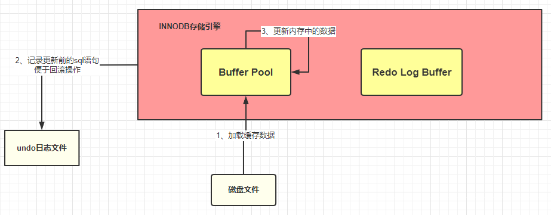

# 一： 基础知识点

## 1.1 MySQL的基础架构有哪些？

- 连接器

- （查询缓存）

  > MySQL 8.0 去除

- 分析器

- 优化器

- 执行器

- 存储引擎

从上图可以看出， MySQL 主要由下面几部分构成：

- **连接器：** 身份认证和权限相关(登录 MySQL 的时候)。
- **查询缓存：** 执行查询语句的时候，会先查询缓存（MySQL 8.0 版本后移除，因为这个功能不太实用）。
- **分析器：** 没有命中缓存的话，SQL 语句就会经过分析器，分析器说白了就是要先看你的 SQL 语句要干嘛，再检查你的 SQL 语句语法是否正确。
- **优化器：** 按照 MySQL 认为最优的方案去执行。
- **执行器：** 执行语句，然后从存储引擎返回数据。 执行语句之前会先判断是否有权限，如果没有权限的话，就会报错。
- **插件式存储引擎** ： 主要负责数据的存储和读取，采用的是插件式架构，支持 InnoDB、MyISAM、Memory 等多种存储引擎。

## 1.2 MySQL 存储引擎

MySQL的处处引擎主要有这些：

MySQL 5.5.5 之前，MyISAM 是 MySQL 的默认存储引擎。5.5.5 版本之后，InnoDB 是 MySQL 的默认存储引擎

可以通过 `show variables like '%storage_engine%'` 命令直接查看 MySQL 当前默认的存储引擎。

### 1.2.1 MyISAM 与 InnoDB的区别？

- **是否支持行级锁**

  MyISAM 只有表级锁(table-level locking)，而 InnoDB 支持行级锁(row-level locking)和表级锁,默认为行级锁。

- **是否支持事务**

  MyISAM 不提供事务支持，InnoDB支持

- **是否支持外键**

  MyISAM 不支持，而 InnoDB 支持

- **是否支持数据库异常崩溃后的安全恢复**

  MyISAM 不支持，而 InnoDB 支持。

- **是否支持 MVCC**

  MyISAM 不支持，而 InnoDB 支持

- **索引实现不一样**

  > Myisam引擎(非聚集索引--叶子节点存储数据地址的指针)
  >
  > Innodb引擎(聚集索引---叶子节点的data直接包含数据)

## 1.3 Mysql 连接池

> 每个数据库连接都需要一个线程来完成，为了便于管理，也为了减小开销，使用数据库连接池来对数据库连接进行管理

## 1.4 三大日志 binlog undolog redolog

> redo 日志文件是 InnoDB 特有的，他是存储引擎级别的，不是 MySQL 级别的

redo 记录的是数据修改之后的值，不管事务是否提交都会记录下来，例如，此时将要做的是`update students set stuName='小强' where id=1;` 那么这条操作就会被记录到 redo log buffer 中，MySQL 为了提高效率，所以将这些操作都先放在内存中去完成，然后会在某个时机将其持久化到磁盘中。

## 1.4 Mysql 优化方法

### 1.4.1 SQL性能下降的原因

- 查询语句写的差
- 索引失效：索引建了，但是没有用上
- 关联 查询太多join（设计缺陷或者不得已的需求）
- 服务器调优以及各个参数的设置（缓冲、线程数等）

### 1.4.2 SQL 执行顺序

### 1.4.3 为什么用小表驱动大表？

> 例如 A表200条，B表20万条
>
> 如果小的循环在外层，对于表连接来说就只连接 200 次 ; A left join B
>
> 如果大的循环在外层，则需要进行 20 万次表连接，从而浪费资源，增加消耗 ; B left join A

## 1.5 7大Join理论

## 1.6 MySQL 索引

### 1.6.1 索引的优势和劣势

优势：

- 查找：类似大学图书馆的书目索引，提高数据检索的效率，降低数据库的IO成本。
- 排序：通过索引対数据进行排序，降低数据排序的成本，降低了CPU的消耗。

劣势：

- 实际上索引也是一张表，该表保存了主键与索引字段，并指向实体表的记录，所以索引列也是要占用空间的。
- 虽然索引大大提高了查询速度，但是同时会降低表的更新速度，例如对表频繁的进行INSERT、UPDATE和DELETE。因为更新表的时候，MySQL不仅要保存数据，还要保存一下索引文件每次更新添加的索引列的字段，都会调整因为更新所带来的键值变化后的索引信息。
- 索引只是提高效率的一个因素，如果MySQL有大数据量的表，就需要花时间研究建立最优秀的索引。

### 1.6.2 索引的分类

索引分类：

- 单值索引：一个索引只包含单个列，一个表可以有多个单列索引。
- 唯一索引：索引列的值必须唯一，但是允许空值。
- 复合索引：一个索引包含多个字段。

建议：一张表建的索引最好不要超过5个！

# 二： 问题记录

## 1. 索引不命中的情况

## 2. 慢查询原因

## 3. 一条SQL是如何执行的？

> From -> cross on -> join -> where -> group - having -> order -> limit 

## 4. binlog relog undolog

## 5. left join 小表驱动大表

## 6. union all 查询

