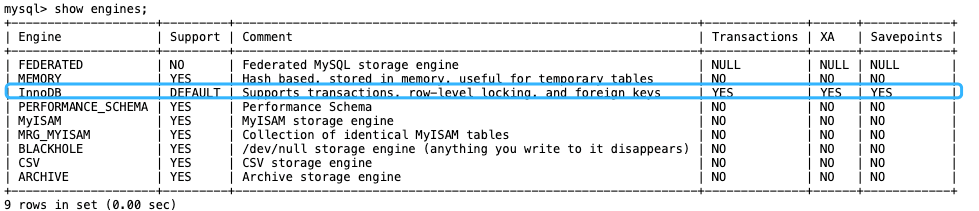

# 一： 基础知识点

## 1.1 MySQL的基础架构有哪些？

- 连接器

- （查询缓存）

  > MySQL 8.0 去除

- 分析器

- 优化器

- 执行器

- 存储引擎

从上图可以看出， MySQL 主要由下面几部分构成：

- **连接器：** 身份认证和权限相关(登录 MySQL 的时候)。
- **查询缓存：** 执行查询语句的时候，会先查询缓存（MySQL 8.0 版本后移除，因为这个功能不太实用）。
- **分析器：** 没有命中缓存的话，SQL 语句就会经过分析器，分析器说白了就是要先看你的 SQL 语句要干嘛，再检查你的 SQL 语句语法是否正确。
- **优化器：** 按照 MySQL 认为最优的方案去执行。
- **执行器：** 执行语句，然后从存储引擎返回数据。 执行语句之前会先判断是否有权限，如果没有权限的话，就会报错。
- **插件式存储引擎** ： 主要负责数据的存储和读取，采用的是插件式架构，支持 InnoDB、MyISAM、Memory 等多种存储引擎。

## 1.2 MySQL 存储引擎

MySQL的处处引擎主要有这些：

MySQL 5.5.5 之前，MyISAM 是 MySQL 的默认存储引擎。5.5.5 版本之后，InnoDB 是 MySQL 的默认存储引擎

可以通过 `show variables like '%storage_engine%'` 命令直接查看 MySQL 当前默认的存储引擎。

### 1.2.1 MyISAM 与 InnoDB的区别？

- **是否支持行级锁**

  MyISAM 只有表级锁(table-level locking)，而 InnoDB 支持行级锁(row-level locking)和表级锁,默认为行级锁。

- **是否支持事务**

  MyISAM 不提供事务支持，InnoDB支持

- **是否支持外键**

  MyISAM 不支持，而 InnoDB 支持

- **是否支持数据库异常崩溃后的安全恢复**

  MyISAM 不支持，而 InnoDB 支持。

- **是否支持 MVCC**

  MyISAM 不支持，而 InnoDB 支持

- **索引实现不一样**

  > Myisam引擎(非聚集索引--叶子节点存储数据地址的指针)
  >
  > Innodb引擎(聚集索引---叶子节点的data直接包含数据)

  

  

## 1.4 Mysql 优化方法

### 1.4.3 为什么用小表驱动大表？

> 例如 A表200条，B表20万条
>
> 如果小的循环在外层，对于表连接来说就只连接 200 次 ; A left join B
>
> 如果大的循环在外层，则需要进行 20 万次表连接，从而浪费资源，增加消耗 ; B left join A

# 二： 问题记录

## 1. 索引不命中的情况

## 2. 慢查询原因

## 3. 一条SQL是如何执行的？

> From -> cross on -> join -> where -> group - having -> order -> limit 

## 4. binlog relog undolog

## 5. left join 小表驱动大表

