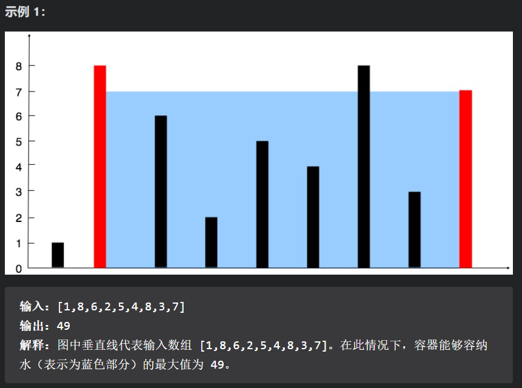

# 1. 常用算法

## 1.1 双指针 (快慢指针)

- #### [剑指 Offer 22. 链表中倒数第k个节点](https://leetcode-cn.com/problems/lian-biao-zhong-dao-shu-di-kge-jie-dian-lcof/)

## 1.2 动态规划

## 1.3 贪心算法

## 1.4 并查集

## 1.5 DFS 与 BFS

## 1.6 前缀和

## 1.7 回溯法

# 2.常用技巧

## 2.1 集合数组等

### 2.11 数组转换为list和set：

#### 2.111 Integer[ ]

Integer[] 可以直接添加，因为他是包装类。

```java
List<Integer> arrayList = new ArrayList<>();
Collections.addAll(arrayList, array);
arrayList.add(0);
System.out.println(arrayList);

// Set 不能实例化，
Set<Integer> set = new HashSet<>(arrayList);
System.out.println(set);
```

#### 2.112	int[ ]

```java
// 在一维的情况的下，可以通过Stream转换
int[] arr = new int[]{1,3,2,7,4};
List<Integer> list = Arrays.stream(arr).boxed().collect(Collectors.toList());
System.out.println(list);
```

#### 2.113 int二维数组

```java
// 在二维的情况的下，可以通过Stream转换为List<int[]>
int[][] arr2 = new int[2][5];
arr2[0] = new int[]{1,3,8,7,4};
arr2[1] = new int[]{2,4,2,7,5};
List<int[]> list2 = Arrays.stream(arr2).collect(Collectors.toList());
Collections.sort(list2, (i,j)->{
    return i[2] -j[2];
});
System.out.println(list2);
```

### 2.12 list和set如何转换成数组呢


### 2.13 list和set如何深浅拷贝呢？

- 浅拷贝可以直接clone等，重新构造等方法
- 深拷贝必须要自己重写，或者序列化等操作

## 2.2 排序方法

<u>**重要：数组排序的方法**</u>

1. `Arrays.sort(int[] a) // 对一个数组的所有元素进行排序，并且是按从小到大的顺序`

2. `Arrays.sort(int[] a, int fromIndex, int toIndex)设置了范围，toIndex不参与`

3. 自己设置排序的方法，实现Comparator

   ```java
   public class ArraySort {
       public static void main(String[] args) {
           //注意，要想改变默认的排列顺序，不能使用基本类型（int,double, char）
           //而要使用它们对应的类
           Integer[] a = {9, 8, 7, 2, 3, 4, 1, 0, 6, 5};
           //定义一个自定义类MyComparator的对象
           Comparator cmp = new MyComparator();
           Arrays.sort(a, cmp);
           for(int i = 0; i < a.length; i ++) {
               System.out.print(a[i] + " ");
               }
       }
   
       //Comparator是一个接口，所以这里我们自己定义的类MyComparator要		implents该接口
       //而不是extends Comparator
       static class MyComparator implements Comparator<Integer> {
           @Override
           public int compare(Integer o1, Integer o2) {
               //如果n1小于n2，我们就返回正值，如果n1大于n2我们就返回负			值，
               //这样颠倒一下，就可以实现反向排序了
               if(o1 < o2) {
                   return 1;
               }
               else if(o1 > o2) {
                   return -1;
                   }
               else
                   {
                   return 0;
                       }
               }
           }
   }
   ```

   ```java
         	// 或者更骚的一种方法，使用匿名函数
   		// 这里是先最后的索引，然后再前面的索引
   		Arrays.sort(events,(i1,i2)->
           {
               if(i1[1]!=i2[1])return i1[1]-i2[1];
               return i1[0]-i2[0];
           });
   ```

## 2.3 包装类的方法

### 2.31  Int 最大值

```java
int ans = Integer.MAX_VALUE;
```


# 3.笔试题目

## Leetcode - 445 无重叠区间

给定一个区间的集合，找到需要移除区间的最小数量，使剩余区间互不重叠。

- 可以认为区间的终点总是大于它的起点。
- 区间 [1,2] 和 [2,3] 的边界相互“接触”，但没有相互重叠。

示例 1:

> 输入: [ [1,2], [2,3], [3,4], [1,3] ]
>
> 输出: 1
>
> 解释: 移除 [1,3] 后，剩下的区间没有重叠。

示例 2:

> 输入: [ [1,2], [1,2], [1,2] ]
>
> 输出: 2
>
> 解释: 你需要移除两个 [1,2] 来使剩下的区间没有重叠。

示例 3:

> 输入: [ [1,2], [2,3] ]
>
> 输出: 0
>
> 解释: 你不需要移除任何区间，因为它们已经是无重叠的了。
>

```java
/**
1.首先进行排序，多级排序
2.之后再根据结束时间，从高到低，贪心搜索
3.需要注意的是，需要不断更新开始的值，舍弃掉开始时间较早的值，因为它们占用范围更大。
*/

class Solution {
    public int eraseOverlapIntervals(int[][] intervals) {
        Arrays.sort(intervals, (i,j)->{
            if(i[1]!=j[1])
                return j[1] - i[1];
            else 
                return j[0] - i[0];
            });
        for(int[] item:intervals){
            System.out.print(item[0]);
            System.out.println(item[1]);
        }

        int[] prio = intervals[0];
        int num = 0;

        for(int index = 1; index < intervals.length; index++){
            if(intervals[index][1] > prio[0]){
                if(prio[0] < intervals[index][0]){
                    prio = intervals[index];
                }
                num++;
                }
            else{
                prio = intervals[index];
            }
        }

        return num;

    }   

}
```

还有另一种贪心的解法：

```java
class Solution {
    public int eraseOverlapIntervals(int[][] intervals) {
        if (intervals.length == 0) {
            return 0;
        }
        
        // 这里针对的是每个字段的结束时间进行排序
        Arrays.sort(intervals, new Comparator<int[]>() {
            public int compare(int[] interval1, int[] interval2) {
                return interval1[1] - interval2[1];
            }
        });
		
        // 以结束时间为升序，进行贪心遍历
        int n = intervals.length;
        int right = intervals[0][1];
        int ans = 1;
        for (int i = 1; i < n; ++i) {
            if (intervals[i][0] >= right) {
                ++ans;
                right = intervals[i][1];
            }
        }
        return n - ans;
    }
}
```

这题也可以用动态规划求解：

```java
// 离谱的是，官方的题解竟然超时了
class Solution {
    public int eraseOverlapIntervals(int[][] intervals) {
        if (intervals.length == 0) {
            return 0;
        }
        
        // 排序，但并不是多级排序的操作
        Arrays.sort(intervals, new Comparator<int[]>() {
            public int compare(int[] interval1, int[] interval2) {
                return interval1[0] - interval2[0];
            }
        });

        int n = intervals.length;
        int[] f = new int[n];
        Arrays.fill(f, 1);
        for (int i = 1; i < n; ++i) {
            for (int j = 0; j < i; ++j) {
                if (intervals[j][1] <= intervals[i][0]) {
                    // 这里把max去掉直接用f[j]+1貌似也能跑，但是超时了
                    // 不知道对不对
                    f[i] = Math.max(f[i], f[j] + 1);
                }
            }
        }
        return n - Arrays.stream(f).max().getAsInt();
    }
}

```

## Leetcode - 15  三数之和

这是官方的解法，解法是固定i与j，i与j在一侧，然后k在另一侧，遍历，中途需要优化操作。

```java
class Solution {
    public List<List<Integer>> threeSum(int[] nums) {
        int n = nums.length;
        Arrays.sort(nums);
        List<List<Integer>> ans = new ArrayList<List<Integer>>();
        // 枚举 a
        for (int first = 0; first < n; ++first) {
            // 需要和上一次枚举的数不相同
            if (first > 0 && nums[first] == nums[first - 1]) {
                continue;
            }
            // c 对应的指针初始指向数组的最右端
            int third = n - 1;
            int target = -nums[first];
            // 枚举 b
            for (int second = first + 1; second < n; ++second) {
                // 需要和上一次枚举的数不相同
                if (second > first + 1 && nums[second] == nums[second - 1]) {
                    continue;
                }
                // 需要保证 b 的指针在 c 的指针的左侧
                while (second < third && nums[second] + nums[third] > target) {
                    --third;
                }
                // 如果指针重合，随着 b 后续的增加
                // 就不会有满足 a+b+c=0 并且 b<c 的 c 了，可以退出循环
                if (second == third) {
                    break;
                }
                if (nums[second] + nums[third] == target) {
                    List<Integer> list = new ArrayList<Integer>();
                    list.add(nums[first]);
                    list.add(nums[second]);
                    list.add(nums[third]);
                    ans.add(list);
                }
            }
        }
        return ans;
    }
}

```

## Leetcode - 986  区间列表的交集


主要需要注意的：

取A和B中开始最大的，A和B中结束最早的，然后进行排序筛选。

```java
class Solution {
  public int[][] intervalIntersection(int[][] A, int[][] B) {
    List<int[]> ans = new ArrayList<>();
    int i = 0, j = 0;

    while (i < A.length && j < B.length) {
        // 核心的代码
        int left = Math.max(A[i][0], B[j][0]);
        int right = Math.min(A[i][1], B[j][1]);

        if(left <= right){
            // 需要注意的，可以直接添加新的数组
            ans.add(new int[]{left, right});
        }
		//这里谁的结束小，移动谁。
        if(A[i][1]< B[j][1]){
            i++;
        }
        else{
            j++;
        }        
    }
    // 需要注意的，如何ArrayList生成新的数组
    return ans.toArray(new int[ans.size()][]);

  }
}
```

## Leetcode - 11 盛最多水的容器



双指针。

重点在于，盛水的容量取决于短的那一侧，此时无论你怎么移动长的那一侧，容量都不会增加。

```java
class Solution {
    public int maxArea(int[] height) {
        int i = 0;
        int j = height.length -1;
        int area = 0;
        int opt = 0;

        while(i!=j){
            area = Math.min(height[i], height[j])*(j-i);
            if(area > opt){
                opt = area;
            }
            if(height[i] < height[j]) i++;
            else{j--;}
        }
        return opt;

    }
}
```


# 4.笔试题目类型

## 4.1 岛屿数量问题

解决方法

- 并查集
- DFS
- BFS

## 4.2 最短路径问题

解决最短路径常规的方法有哪些？

- ### 迪杰斯特算法

- ### 弗洛伊德算法

- ### DFS BFS

## 4.3 多重排序问题（开会问题）

- 多级排序，开始时间，结束时间排序，之后再贪心策略，或者动态规划来解决

## 4.4 图中是否存在路径问题

## 4.5 二分查找问题

- 查找的内容在数组中存在
- 查找的内容在数组中不存在

## 4.6 回文子串问题
