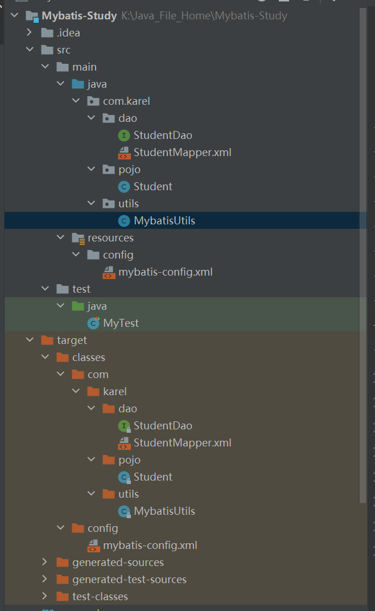

# 1.Mybatis 基础

## 1.1 Mybatis 基本常识

### 1.1.1 Mybatis 是什么？

一个基于Java的持久层框架：

**持久层：** 可以将业务数据**存储到磁盘，具备长期存储能力**，只要磁盘不损坏，在断电或者其他情况下，重新开启系统仍然可以读取到这些数据。

**优点：** 可以**使用巨大的磁盘空间**存储相当量的数据，并且很**廉价**

**缺点：慢**（相对于内存而言）

> 通常持久层可以指数据库，更为广泛的说，就是存储在磁盘上的文件。

### 1.1.2 为什么使用Mybatis?

在我们**传统的 JDBC 中**，我们除了需要自己提供 SQL 外，还必须操作 Connection、Statment、ResultSet，不仅如此，为了访问不同的表，不同字段的数据，我们需要些很多雷同模板化的代码，闲的**繁琐又枯燥**。

而我们在使用了 **MyBatis** 之后，**只需要提供 SQL 语句就好了**，其余的诸如：建立连接、操作 Statment、ResultSet，处理 JDBC 相关异常等等都可以交给 MyBatis 去处理，我们的**关注点于是可以就此集中在 SQL 语句上**，关注在增删改查这些操作层面上。

并且 MyBatis 支持使用简单的 XML 或注解来配置和映射原生信息，将接口和 Java 的 POJOs(Plain Old Java Objects,普通的 Java对象)映射成数据库中的记录。

> 简单来说，就是为了简化JDBC的操作。

## 1.2 Mybatis的基本操作

1. 首先在Maven里面引入Mybatis和sql的依赖。
2. 配置mybatis-config.xml 文件，这个主要配置数据库连接方面的内容
3. 编写实体类
4. 编写Mapper接口
5. 编写xml文件
6. 其它问题，如maven静态资源过滤，config中mapper扫描目录等

### 1.2.1 可能出错的地方

1. Mapper.xml 中需要对应接口和实体类。
2. Maven 静态资源过滤没有配置。
3. SQL连接的问题，如，时区，编码，对应数据库等。

## 1.3 Mybatis 缓存

### 1.3.1 什么是缓存 [ Cache ]？

- 存在内存中的临时数据。
- 将用户经常查询的数据放在缓存（内存）中，用户去查询数据就不用从磁盘上(关系型数据库数据文件)查询，从缓存中查询，从而提高查询效率，解决了高并发系统的性能问题。

### 1.3.2 为什么使用缓存？

- 减少和数据库的交互次数，减少系统开销，提高系统效率。

> 连接数据库是十分消耗资源的，需要使用缓存来提高访问速度。

### 1.3.3 什么样的数据能使用缓存？

- 经常查询并且不经常改变的数据。

