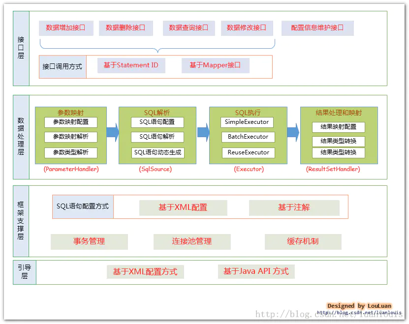
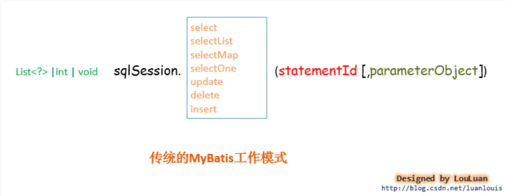
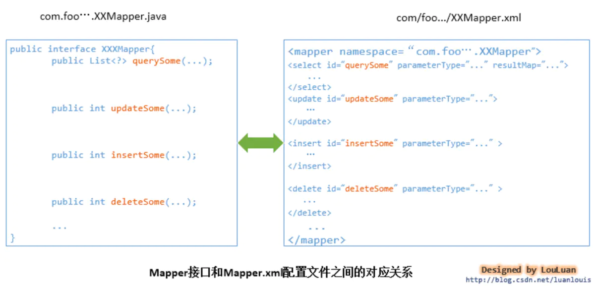
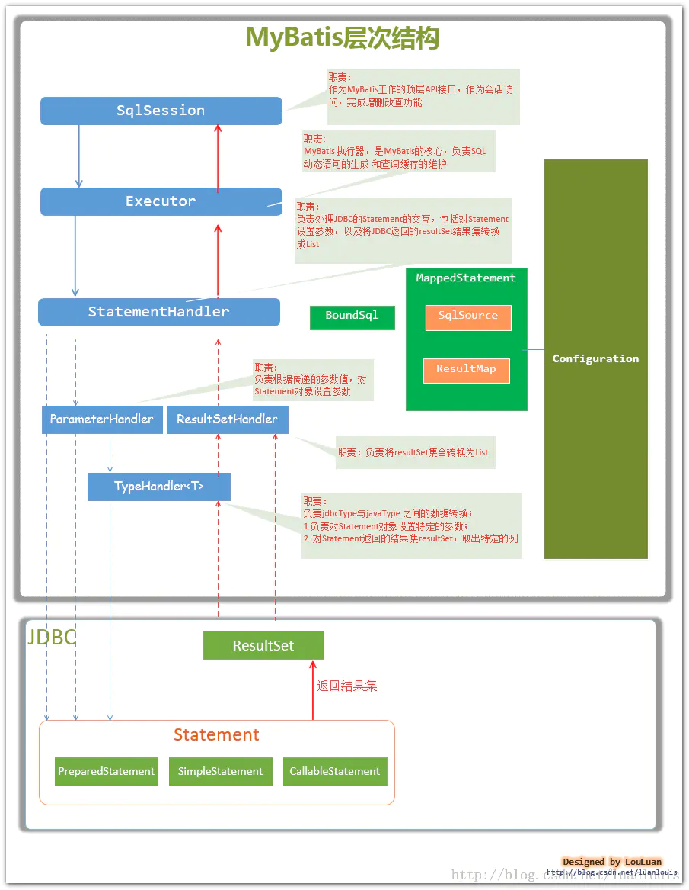
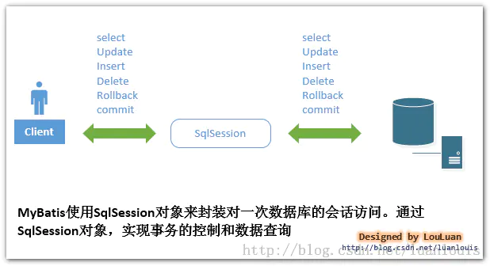

参考：https://www.jianshu.com/p/ec40a82cae28

## 1.1 传统JDBC 连接

1. 加载JDBC驱动；
2. 建立并获取数据库连接；
3. 创建 JDBC Statements 对象；
4. 设置SQL语句的传入参数；
5. 执行SQL语句并获得查询结果；
6. 对查询结果进行转换处理并将处理结果返回；
7. 释放相关资源（关闭Connection，关闭Statement，关闭ResultSet）；

// 传统JDBC连接

```java
public static List<Map<String,Object>> queryForList(){  
    Connection connection = null;  
    ResultSet rs = null;  
    PreparedStatement stmt = null;  
    List<Map<String,Object>> resultList = new ArrayList<Map<String,Object>>();  
          
    try {  
        // 加载JDBC驱动  
        Class.forName("oracle.jdbc.driver.OracleDriver").newInstance();  
        String url = "jdbc:oracle:thin:@localhost:1521:ORACLEDB";  
              
        String user = "trainer";   
        String password = "trainer";   
              
        // 获取数据库连接  
        connection = DriverManager.getConnection(url,user,password);   
              
        String sql = "select * from userinfo where user_id = ? ";  
        // 创建Statement对象（每一个Statement为一次数据库执行请求）  
        stmt = connection.prepareStatement(sql);  
              
        // 设置传入参数  
        stmt.setString(1, "zhangsan");  
              
        // 执行SQL语句  
        rs = stmt.executeQuery();  
              
        // 处理查询结果（将查询结果转换成List<Map>格式）  
        ResultSetMetaData rsmd = rs.getMetaData();  
        int num = rsmd.getColumnCount();  
              
        while(rs.next()){  
            Map map = new HashMap();  
            for(int i = 0;i < num;i++){  
                String columnName = rsmd.getColumnName(i+1);  
                map.put(columnName,rs.getString(columnName));  
            }  
            resultList.add(map);  
        }  
              
    } catch (Exception e) {  
        e.printStackTrace();  
    } finally {  
        try {  
            // 关闭结果集  
            if (rs != null) {  
                rs.close();  
                rs = null;  
            }  
            // 关闭执行  
            if (stmt != null) {  
                stmt.close();  
                stmt = null;  
            }  
            if (connection != null) {  
                connection.close();  
                connection = null;  
            }  
        } catch (SQLException e) {  
            e.printStackTrace();  
        }  
    }        
    return resultList;  
}
```

## 1.2 Mybatis 的优势

### 1.2.1 第一步优化：连接获取和释放

主要解决两点：

数据库连接的获取和关闭我们**可以使用数据库连接池来解决资源浪费的问题**。通过连接池就可以反复利用已经建立的连接去访问数据库了。减少连接的开启和关闭的时间。

**通过DataSource进行隔离解耦**，我们统一从DataSource里面获取数据库连接，**DataSource具体由DBCP实现还是由容器的JNDI实现都可以**，所以我们将DataSource的具体实现通过让用户配置来应对变化。

### 1.2.2 第二步优化：SQL统一存取

我们使用JDBC进行操作数据库时，**SQL语句基本都散落在各个JAVA类中**，这样有三个不足之处：

> 第一，可读性很差，不利于维护以及做性能调优。

> 第二，改动Java代码需要重新编译、打包部署。

> 第三，不利于取出SQL在数据库客户端执行（取出后还得删掉中间的Java代码，编写好的SQL语句写好后还得通过＋号在Java进行拼凑）。

可以考虑不把SQL语句写到Java代码中，那么把SQL语句放到哪里呢？首先需要有一个统一存放的地方，我们可以将这些**SQL语句统一集中放到配置文件或者数据库里面（以key-value的格式存放）**。然后通过SQL语句的key值去获取对应的SQL语句。

### 1.2.3 第三步优化：传入参数映射和动态SQL

> 主要解决两个问题：
>
> - 传参映射
> - 动态SQL

很多情况下，我们都可以通过在SQL语句中设置占位符来达到使用传入参数的目的，这种方式本身就有一定局限性，它是按照一定顺序传入参数的，要与占位符一一匹配。但是，如果我们**传入的参数是不确定的**（比如列表查询，根据用户填写的查询条件不同，传入查询的参数也是不同的，有时是一个参数、有时可能是三个参数），那么我们就得**在后台代码中自己根据请求的传入参数去拼凑相应的SQL语句**，这样的话还是**避免不了在Java代码里面写SQL语句的命运**。既然我们已经把SQL语句统一存放在配置文件或者数据库中了，**怎么做到能够根据前台传入参数的不同，动态生成对应的SQL语句呢？**

### 1.2.4 第四步优化：结果映射和结果缓存

主要为了解决两个问题

- 结果映射
- 结果缓存

我们分析一下，一般对执行结果的有哪些处理，**有可能将结果不做任何处理就直接返回，也有可能将结果转换成一个JavaBean对象返回、一个Map返回、一个List返回等**`，结果处理可能是多种多样的。从这里看，我们必须告诉SQL处理器两点：**第一，需要返回什么类型的对象；第二，需要返回的对象的数据结构怎么跟执行的结果映射**，这样才能将具体的值copy到对应的数据结构上。

接下来，**我们可以进而考虑对SQL执行结果的缓存来提升性能**。缓存数据都是key-value的格式，那么这个key怎么来呢？怎么保证唯一呢？即使同一条SQL语句几次访问的过程中由于传入参数的不同，得到的执行SQL语句也是不同的。那么缓存起来的时候是多对。**但是SQL语句和传入参数两部分合起来可以作为数据缓存的key值**。

### 1.2.5 解决重复SQL语句问题

当我们的代码程序出现重复代码时怎么办？**将重复的代码抽离出来成为独立的一个类，然后在各个需要使用的地方进行引用**。对于SQL重复的问题，我们也可以采用这种方式，通过将SQL片段模块化，**将重复的SQL片段独立成一个SQL块，然后在各个SQL语句引用重复的SQL块**，这样需要修改时只需要修改一处即可。

## 1.3 存在问题

Mybaits所有的数据库操作都是基于SQL语句，**导致什么样的数据库操作都要写SQL语句**。一个应用系统要写的SQL语句实在太多了。

**改进方法：**

我们对数据库进行的操作大部分都是对表数据的增删改查，很多都是对单表的数据进行操作，由这点我们可以想到一个问题：**单表操作可不可以不写SQL语句，通过JavaBean的默认映射器生成对应的SQL语句**，比如：一个类UserInfo对应于USER_INFO表， userId属性对应于USER_ID字段。**这样我们就可以通过反射可以获取到对应的表结构了，拼凑成对应的SQL语句显然不是问题**。

> 简单来说，就是能不能像Hibernate 或者 JPA 那样，形成类和表的全自动映射，做成像Mabatis-Plus 那样

## 1.4 整体框架



## 1.5 Mybatis 与数据库交互的两种方式

1. 使用传统的MyBatis提供的API；

   **这是传统的传递Statement Id 和查询参数给 SqlSession 对象，使用 SqlSession对象完成和数据库的交互**；

   

2. 使用Mapper接口；

   MyBatis 将配置文件中的每一个<mapper> 节点抽象为一个 Mapper 接口：

   **这个接口中声明的方法和<mapper> 节点中的<select|update|delete|insert> 节点项对应**，即<select|update|delete|insert> 节点的id值为Mapper 接口中的方法名称，**parameterType 值表示Mapper 对应方法的入参类型**，而**resultMap 值则对应了Mapper 接口表示的返回值类型或者返回结果集的元素类型**。

   

   **根据MyBatis 的配置规范配置好后，通过SqlSession.getMapper(XXXMapper.class)方法，MyBatis 会根据相应的接口声明的方法信息，通过动态代理机制生成一个Mapper 实例**，我们使用Mapper接口的某一个方法时，MyBatis会根据这个方法的方法名和参数类型，确定Statement Id，底层还是通过SqlSession.select("statementId",parameterObject);或者SqlSession.update("statementId",parameterObject); 等等来实现对数据库的操作，**MyBatis引用Mapper 接口这种调用方式，纯粹是为了满足面向接口编程的需要**。（其实还有一个原因是在于，面向接口的编程，使得用户在接口上可以使用注解来配置SQL语句，这样就可以脱离XML配置文件，实现“0配置”）。

   > 本质上来说，Mapper 还是会转为 sqlSession来执行

## 1.6 Mybatis 需要完成的额外功能

### 1.6.1  Mybatis 数据处理

主要完成两个功能：

1. 通过传入参数构建动态SQL语句；
2. SQL语句的执行以及封装查询结果集成List<E>；

### 1.6.2 框架支撑层

1. 事务管理机制
2. 连接池管理机制
3. 缓存机制
4. SQL语句的配置方式

### 1.6.3 引导层

**引导层是配置和启动MyBatis配置信息的方式**。MyBatis 提供两种方式来引导MyBatis ：**基于XML配置文件的方式和基于Java API 的方式**。

## 1.7 Mybatis 的主要构建

- **SqlSession：**作为MyBatis工作的主要顶层API，表示和数据库交互的会话，完成必要数据库增删改查功能；

- **Executor：**MyBatis执行器，是MyBatis 调度的核心，负责SQL语句的生成和查询缓存的维护；

- **StatementHandler：**封装了JDBC Statement操作，负责对JDBC statement 的操作，如设置参数、将Statement结果集转换成List集合。

- **ParameterHandler：**负责对用户传递的参数转换成JDBC Statement 所需要的参数；

- **ResultSetHandler：**负责将JDBC返回的ResultSet结果集对象转换成List类型的集合；

- **TypeHandler：**负责java数据类型和jdbc数据类型之间的映射和转换；

- **MappedStatement：**MappedStatement维护了一条<select|update|delete|insert>节点的封装；

- **SqlSource：**负责根据用户传递的parameterObject，动态地生成SQL语句，将信息封装到BoundSql对象中，并返回；

- **BoundSql：**表示动态生成的SQL语句以及相应的参数信息；

- **Configuration：**MyBatis所有的配置信息都维持在Configuration对象之中；

  

**它们的关系如下图所示：**



## 1.8 Mybatis SQLSession工作原理说明

### **创建SqlSession对象**

```java
SqlSession sqlSession = factory.openSession(); 
```



​	MyBatis封装了对数据库的访问，把对数据库的会话和事务控制放到了SqlSession对象中

**为SqlSession传递一个配置的Sql语句的Statement Id和参数，然后返回结果：**

```java
List<Employee> result = sqlSession.selectList("com.louis.mybatis.dao.EmployeesMapper.selectByMinSalary",params);
```

sqlSession.selectList()方法的定义：

```java
public <E> List<E> selectList(String statement, Object parameter) {  
    return this.selectList(statement, parameter, RowBounds.DEFAULT);  
}  
 
public <E> List<E> selectList(String statement, Object parameter, RowBounds rowBounds) {  
    try {  
        //1.根据Statement Id，在mybatis 配置对象Configuration中查找和配置文件相对应的MappedStatement      
        MappedStatement ms = configuration.getMappedStatement(statement);  
        //2. 将查询任务委托给MyBatis 的执行器 Executor  
        List<E> result = executor.query(ms, wrapCollection(parameter), rowBounds, Executor.NO_RESULT_HANDLER);  
        return result;  
    } catch (Exception e) {  
        throw ExceptionFactory.wrapException("Error querying database.  Cause: " + e, e);  
    } finally {  
        ErrorContext.instance().reset();  
    }  
} 
```

MyBatis在初始化的时候，会将`MyBatis`的配置信息全部加载到内存中，**使用`org.apache.ibatis.session.Configuration`实例来维护**。使用者可以使用`sqlSession.getConfiguration()`方法来获取。**`MyBatis`的配置文件中配置信息的组织格式和内存中对象的组织格式几乎完全对应的**。

其中，对应的Mapper 文件如下

```xml
<select id="selectByMinSalary" resultMap="BaseResultMap" parameterType="java.util.Map" >  
   select   
       EMPLOYEE_ID, FIRST_NAME, LAST_NAME, EMAIL, SALARY  
   from LOUIS.EMPLOYEES  
   <if test="min_salary != null">  
       where SALARY < #{min_salary,jdbcType=DECIMAL}  
   </if>  
</select>
```

**加载到内存中会生成一个对应的MappedStatement对象，然后会以`key="com.louis.mybatis.dao.EmployeesMapper.selectByMinSalary"` ，value为`MappedStatement`对象的形式维护到`Configuration`的一个Map中**。当以后需要使用的时候，只需要通过Id值来获取就可以了。

从上述的代码中我们可以看到SqlSession的职能是：**SqlSession根据Statement ID, 在mybatis配置对象`Configuration`中获取到对应的`MappedStatement`对象，然后调用mybatis执行器来执行具体的操作**。

### **MyBatis执行器Executor根据SqlSession传递的参数执行query()方法**

```java
/** 
   * BaseExecutor 类部分代码 
   * 
   */  
public <E> List<E> query(MappedStatement ms, Object parameter, RowBounds rowBounds, ResultHandler resultHandler) throws SQLException {
      // 1. 根据具体传入的参数，动态地生成需要执行的SQL语句，用BoundSql对象表示    
      BoundSql boundSql = ms.getBoundSql(parameter);  
      // 2. 为当前的查询创建一个缓存Key  
      CacheKey key = createCacheKey(ms, parameter, rowBounds, boundSql);  
      return query(ms, parameter, rowBounds, resultHandler, key, boundSql);  
}  
 
@SuppressWarnings("unchecked")  
public <E> List<E> query(MappedStatement ms, Object parameter, RowBounds rowBounds, ResultHandler resultHandler, CacheKey key, BoundSql boundSql) throws SQLException {  
       ErrorContext.instance().resource(ms.getResource()).activity("executing a query").object(ms.getId());  
       if (closed) throw new ExecutorException("Executor was closed.");  
       if (queryStack == 0 && ms.isFlushCacheRequired()) {  
           clearLocalCache();  
       }  
       List<E> list;  
       try {  
           queryStack++;  
           list = resultHandler == null ? (List<E>) localCache.getObject(key) : null;  
           if (list != null) {  
               handleLocallyCachedOutputParameters(ms, key, parameter, boundSql);  
           } else {  
               // 3.缓存中没有值，直接从数据库中读取数据    
               list = queryFromDatabase(ms, parameter, rowBounds, resultHandler, key, boundSql);  
           }  
       } finally {  
           queryStack--;  
       }  
       if (queryStack == 0) {  
           for (DeferredLoad deferredLoad : deferredLoads) {  
               deferredLoad.load();  
           }  
           deferredLoads.clear(); // issue #601  
           if (configuration.getLocalCacheScope() == LocalCacheScope.STATEMENT) {  
               clearLocalCache(); // issue #482  
           }  
       }  
       return list;  
}

private <E> List<E> queryFromDatabase(MappedStatement ms, Object parameter, RowBounds rowBounds, ResultHandler resultHandler, CacheKey key, BoundSql boundSql) throws SQLException {  
      List<E> list;  
      localCache.putObject(key, EXECUTION_PLACEHOLDER);  
      try {  
         
          //4. 执行查询，返回List 结果，然后    将查询的结果放入缓存之中  
          list = doQuery(ms, parameter, rowBounds, resultHandler, boundSql);  
      } finally {  
          localCache.removeObject(key);  
      }  
      localCache.putObject(key, list);  
      if (ms.getStatementType() == StatementType.CALLABLE) {  
          localOutputParameterCache.putObject(key, parameter);  
      }  
      return list;  
} 
```

```java
/** 
   * 
   * SimpleExecutor类的doQuery()方法实现 
   * 
   */  
public <E> List<E> doQuery(MappedStatement ms, Object parameter, RowBounds rowBounds, ResultHandler resultHandler, BoundSql boundSql) throws SQLException {  
      Statement stmt = null;  
      try {  
          Configuration configuration = ms.getConfiguration();  
          //5. 根据既有的参数，创建StatementHandler对象来执行查询操作  
          StatementHandler handler = configuration.newStatementHandler(wrapper, ms, parameter, rowBounds, resultHandler, boundSql);  
          //6. 创建java.Sql.Statement对象，传递给StatementHandler对象  
          stmt = prepareStatement(handler, ms.getStatementLog());  
          //7. 调用StatementHandler.query()方法，返回List结果集  
          return handler.<E>query(stmt, resultHandler);  
       } finally {  
           closeStatement(stmt);  
       }  
}
```

上述的`Executor.query()`方法几经转折，**最后会创建一个StatementHandler对象，然后将必要的参数传递给StatementHandler**，使用StatementHandler来完成对数据库的查询，最终返回List结果集。

1. 根据传递的参数，完成SQL语句的动态解析，生成BoundSql对象，供StatementHandler使用；
2. 为查询创建缓存，以提高性能；
3. 创建JDBC的Statement连接对象，传递给StatementHandler对象，返回List查询结果；

### **StatementHandler对象负责设置Statement对象中的查询参数、处理JDBC返回的resultSet，将resultSet加工为List 集合返回：**

prepareStatement() 方法的实现：

```java
/** 
   * 
   * SimpleExecutor类的doQuery()方法实现 
   * 
   */  
public <E> List<E> doQuery(MappedStatement ms, Object parameter, RowBounds rowBounds, ResultHandler resultHandler, BoundSql boundSql) throws SQLException { 
      Statement stmt = null; 
      try { 
          Configuration configuration = ms.getConfiguration(); 
          StatementHandler handler = configuration.newStatementHandler(wrapper, ms, parameter, rowBounds, resultHandler, boundSql); 
          // 1.准备Statement对象，并设置Statement对象的参数 
          stmt = prepareStatement(handler, ms.getStatementLog()); 
          // 2. StatementHandler执行query()方法，返回List结果 
          return handler.<E>query(stmt, resultHandler); 
      } finally {
          closeStatement(stmt); 
      } 
}  
 
private Statement prepareStatement(StatementHandler handler, Log statementLog) throws SQLException {
      Statement stmt;  
      Connection connection = getConnection(statementLog);  
      stmt = handler.prepare(connection);  
      //对创建的Statement对象设置参数，即设置SQL 语句中 ? 设置为指定的参数  
      handler.parameterize(stmt);  
      return stmt;  
}
```

以上我们可以总结`StatementHandler`对象主要完成两个工作：

1. 对于JDBC的`PreparedStatement`类型的对象，创建的过程中，我们使用的是SQL语句字符串会包含 若干个? 占位符，我们其后再对占位符进行设值。
    **`StatementHandler`通过`parameterize(statement)`方法对Statement进行设值；**
2. `StatementHandler`通过`List<E> query(Statement statement, ResultHandler resultHandler)`方法来完成执行Statement，和将Statement对象返回的`resultSet`封装成List；

