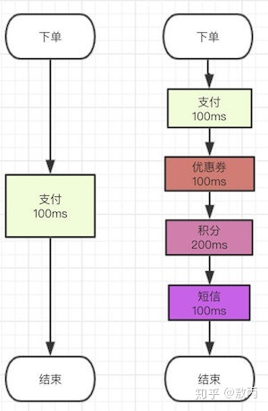
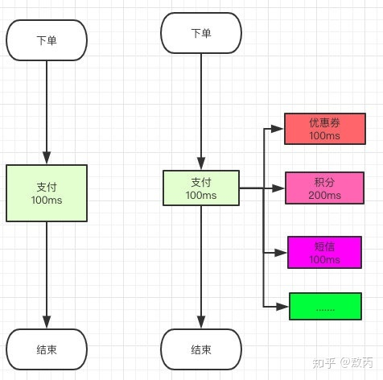

# 1.消息队列基础

### 1.1 基本概述

### 1.1.1 什么是消息队列？

### 1.1.2 消息队列有哪些？

当前使用较多的消息队列有`RabbitMQ`、`RocketMQ`、`ActiveMQ`、`Kafka`、`ZeroMQ`、`MetaMq`等，而部分数据库如`Redis`、`Mysql`以及`phxsql`也可实现消息队列的功能。

### 1.1.3 消息队列要解决引用场景有哪些？

主要的应用场景有三大应用场景：

**异步通信**

用下面一个例子来说明异步通信的情况：

我们之前的场景里面有很多步骤都是在一个流程里面需要做完的，就比如说我的下单系统吧，本来我们业务简单，下单了付了钱就好了，流程就走完了。

但是后面来了个产品经理，搞了个**优惠券系统**，OK问题不大，流程里面多100ms去扣减优惠券。

后来产品经理灵光一闪说我们可以搞个**积分系统**啊，也行吧，流程里面多了200ms去增减积分。

再后来后来隔壁的产品老王说：下单成功后我们要给用户发短信，也将就吧，100ms去发个短信。

通过异步的方式来解决该问题

**系统解耦**

这里解耦其实暗含为什么不用线程来完成上述异步通信的工作。

为啥我们不能用线程去做，因为用线程去做，你是不是要写代码？

你一个订单流程，你扣积分，扣优惠券，发短信，扣库存。。。等等这么多业务要调用这么多的接口，**每次加一个你要调用一个接口然后还要重新发布系统**，写一次两次还好，写多了你就说：老子不干了

而且真的全部都写在一起的话，不单单是耦合这一个问题，你出问题排查也麻烦，流程里面随便一个地方出问题搞不好会影响到其他的点，小伙伴说我每个流程都**try catch**不就行了，相信我别这么做，这样的代码就像个**定时炸弹** ，你不知道什么时候爆炸，平时不炸偏偏在你做活动的时候炸，你就领个**P0故障**收拾书包**提前回家过年**吧。

你下单了，你就把你**支付成功的消息告诉别的系统**，他们收到了去处理就好了，你只用走完自己的流程，把自己的消息发出去，那后面要接入什么系统简单，直接订阅你发送的支付成功消息，你支付成功了我**监听就好了**。

**那你的流程走完了，你不用管别人是否成功么？比如你下单了积分没加，优惠券没扣怎么办？** 

问题是个好问题，但是没必要考虑，业务系统本身就是自己的开发人员维护的，你积分扣失败关我下单的什么事情？你管好自己下单系统的就好了。

**Tip**：话是这么说，但是这其实是用了消息队列的一个缺点，涉及到**分布式事务**的知识点，我下面会提到。

**流量削峰**

就拿秒杀来说，你平时流量很低，但是你要做秒杀活动00 ：00的时候流量疯狂怼进来，你的服务器，**Redis**，**MySQL**各自的承受能力都不一样，你直接**全部流量照单全收**肯定有问题啊，直接就打挂了。

简单，把请求放到队列里面，然后至于每秒消费多少请求，就看自己的**服务器处理能力**，你能处理5000QPS你就消费这么多，可能会比正常的慢一点，但是**不至于打挂服务器**，等流量高峰下去了，你的服务也就没压力了。

### 1.1.4 消息队列的模型有哪些？

> 一种是队列模式，一种是基于订阅和发布的机制。

#### **队列模型**

最初的消息队列就是上一节讲的原始模型，它是一个严格意义上的队列（Queue）。消息按照什么顺序写进去，就按照什么顺序读出来。不过，队列没有 “读” 这个操作，读就是出队，从队头中 “删除” 这个消息。

这便是队列模型：它允许多个生产者往同一个队列发送消息。但是，如果有多个消费者，实际上是竞争的关系，也就是一条消息只能被其中一个消费者接收到，读完即被删除。

#### **发布-订阅模型**

如果需要将一份消息数据分发给多个消费者，并且每个消费者都要求收到全量的消息。很显然，队列模型无法满足这个需求。

一个可行的方案是：为每个消费者创建一个单独的队列，让生产者发送多份。这种做法比较笨，而且同一份数据会被复制多份，也很浪费空间。

为了解决这个问题，就演化出了另外一种消息模型：发布-订阅模型

在发布-订阅模型中，存放消息的容器变成了 “主题”，订阅者在接收消息之前需要先 “订阅主题”。最终，每个订阅者都可以收到同一个主题的全量消息。

仔细对比下它和 “队列模式” 的异同：生产者就是发布者，队列就是主题，消费者就是订阅者，无本质区别。唯一的不同点在于：一份消息数据是否可以被多次消费。

