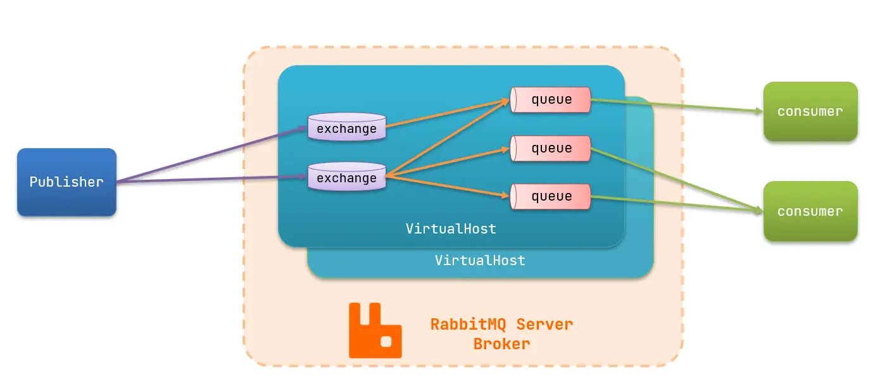
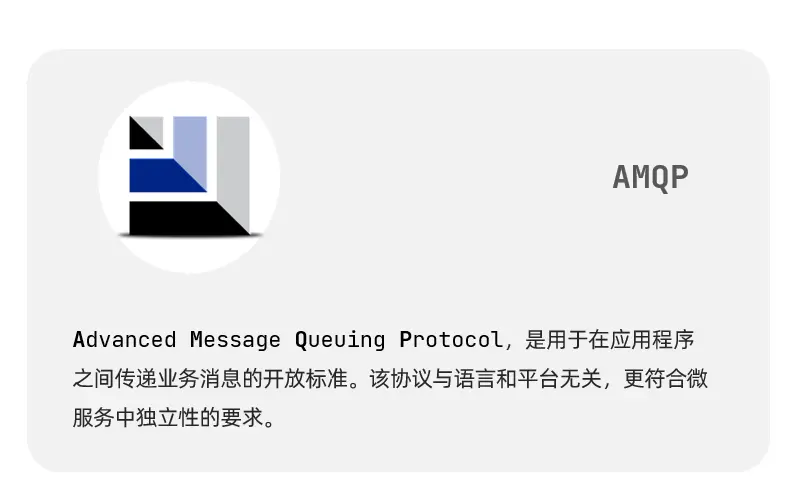
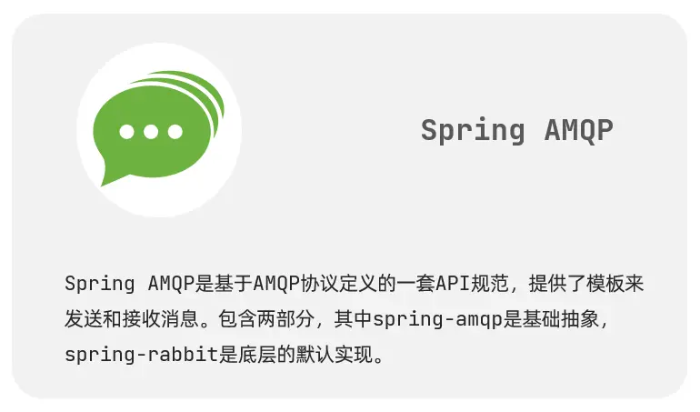
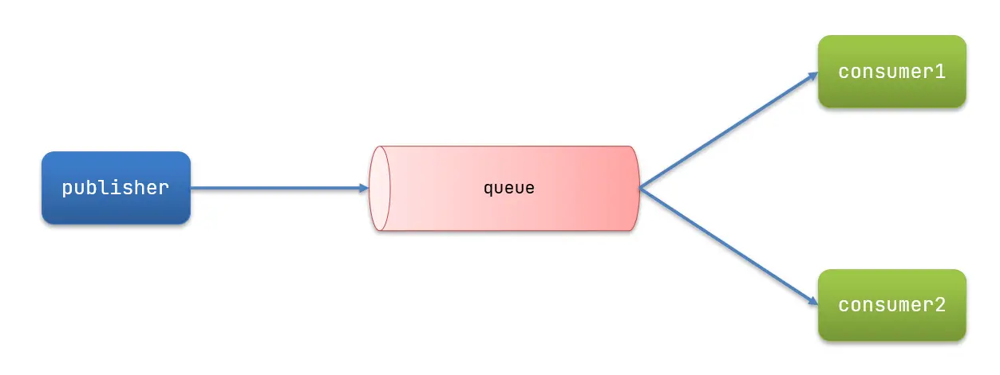
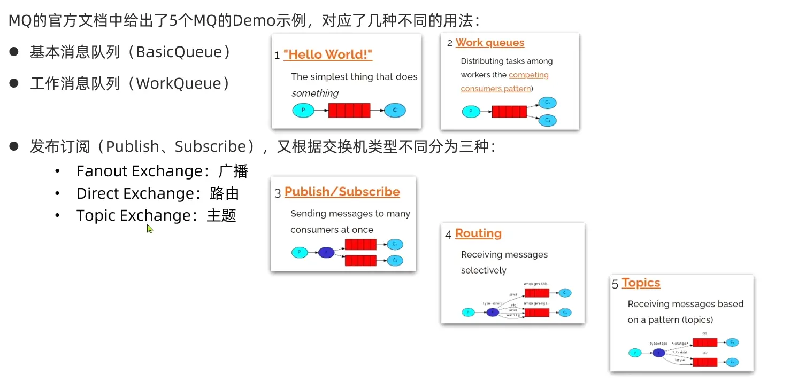

# 1.消息队列基础

部分参考内容：https://www.xn2001.com/archives/663.html

## 1.1 基本概述

需要解决的问题：

- 基本概念
- 交换机类型
- 如何保证消息的可靠投递
- 如何保证消息的顺序
- 如何保证消息不丢失
- 如何保证消息队列的高可用
- 如何解决消息积压问题
- 消息队列的序列化
- RabbitMQ 和 Kafka 等消息队列的区别

### 1.1.1 同步通信与异步通信

<u>同步调用和异步调用的优缺点对比：</u>

**同步调用的优点**：

- 时效性较强，可以立即得到结果

**同步调用的缺点**：

- 耦合度高
- 性能和吞吐能力下降
- 有额外的资源消耗
- 有级联失败问题

**异步调用好处**：

- 吞吐量提升：无需等待订阅者处理完成，响应更快速
- 故障隔离：服务没有直接调用，不存在级联失败问题
- 调用间没有阻塞，不会造成无效的资源占用
- 耦合度极低，每个服务都可以灵活插拔，可替换
- 流量削峰：不管发布事件的流量波动多大，都由 Broker 接收，订阅者可以按照自己的速度去处理事件

**异步调用缺点**：

- 架构复杂了，业务没有明显的流程线，不好管理
- 需要依赖于 Broker 的可靠、安全、性能


### 1.1.2 什么是消息队列？

**消息队列的基本架构：**



**RabbitMQ 中的一些角色**

- publisher：生产者
- consumer：消费者
- exchange：交换机，负责消息路由
- queue：队列，存储消息
- virtualHost：虚拟主机，**隔离不同租户**的 exchange、queue、消息的隔离


### 1.1.3 消息队列有哪些？

当前使用较多的消息队列有`RabbitMQ`、`RocketMQ`、`ActiveMQ`、`Kafka`、`ZeroMQ`、`MetaMq`等，而部分数据库如`Redis`、`Mysql`以及`phxsql`也可实现消息队列的功能。

|            | **RabbitMQ**            | **ActiveMQ**                      | **RocketMQ** | **Kafka**  |
| :--------- | :---------------------- | :-------------------------------- | :----------- | ---------- |
| 公司/社区  | Rabbit                  | Apache                            | 阿里         | Apache     |
| 开发语言   | Erlang                  | Java                              | Java         | Scala&Java |
| 协议支持   | AMQP、XMPP、SMTP、STOMP | OpenWire、STOMP、REST、XMPP、AMQP | 自定义协议   | 自定义协议 |
| 可用性     | 高                      | 一般                              | 高           | 高         |
| 单机吞吐量 | 一般                    | 差                                | 高           | 非常高     |
| 消息延迟   | 微秒级                  | 毫秒级                            | 毫秒级       | 毫秒以内   |
| 消息可靠性 | 高                      | 一般                              | 高           | 一般       |


### 1.1.4 消息队列要解决引用场景有哪些？

主要的应用场景有三大应用场景：

**异步通信**

用下面一个例子来说明异步通信的情况：

我们之前的场景里面有很多步骤都是在一个流程里面需要做完的，就比如说我的下单系统吧，本来我们业务简单，下单了付了钱就好了，流程就走完了。

但是后面来了个产品经理，搞了个**优惠券系统**，OK问题不大，流程里面多100ms去扣减优惠券。

后来产品经理灵光一闪说我们可以搞个**积分系统**啊，也行吧，流程里面多了200ms去增减积分。

再后来后来隔壁的产品老王说：下单成功后我们要给用户发短信，也将就吧，100ms去发个短信。


通过异步的方式来解决该问题


**系统解耦**

这里解耦其实暗含为什么不用线程来完成上述异步通信的工作。

为啥我们不能用线程去做，因为用线程去做，你是不是要写代码？

你一个订单流程，你扣积分，扣优惠券，发短信，扣库存。。。等等这么多业务要调用这么多的接口，**每次加一个你要调用一个接口然后还要重新发布系统**，写一次两次还好，写多了你就说：老子不干了

而且真的全部都写在一起的话，不单单是耦合这一个问题，你出问题排查也麻烦，流程里面随便一个地方出问题搞不好会影响到其他的点，小伙伴说我每个流程都**try catch**不就行了，相信我别这么做，这样的代码就像个**定时炸弹** ，你不知道什么时候爆炸，平时不炸偏偏在你做活动的时候炸，你就领个**P0故障**收拾书包**提前回家过年**吧。

你下单了，你就把你**支付成功的消息告诉别的系统**，他们收到了去处理就好了，你只用走完自己的流程，把自己的消息发出去，那后面要接入什么系统简单，直接订阅你发送的支付成功消息，你支付成功了我**监听就好了**。


**那你的流程走完了，你不用管别人是否成功么？比如你下单了积分没加，优惠券没扣怎么办？** 

问题是个好问题，但是没必要考虑，业务系统本身就是自己的开发人员维护的，你积分扣失败关我下单的什么事情？你管好自己下单系统的就好了。

**Tip**：话是这么说，但是这其实是用了消息队列的一个缺点，涉及到**分布式事务**的知识点，我下面会提到。

**流量削峰**

就拿秒杀来说，你平时流量很低，但是你要做秒杀活动00 ：00的时候流量疯狂怼进来，你的服务器，**Redis**，**MySQL**各自的承受能力都不一样，你直接**全部流量照单全收**肯定有问题啊，直接就打挂了。

简单，把请求放到队列里面，然后至于每秒消费多少请求，就看自己的**服务器处理能力**，你能处理5000QPS你就消费这么多，可能会比正常的慢一点，但是**不至于打挂服务器**，等流量高峰下去了，你的服务也就没压力了。

### 1.1.5 消息队列的模型有哪些？

> 一种是队列模式，一种是基于订阅和发布的机制。

#### **队列模型**

最初的消息队列就是上一节讲的原始模型，它是一个严格意义上的队列（Queue）。消息按照什么顺序写进去，就按照什么顺序读出来。不过，队列没有 “读” 这个操作，读就是出队，从队头中 “删除” 这个消息。


这便是队列模型：它允许多个生产者往同一个队列发送消息。但是，如果有多个消费者，实际上是竞争的关系，也就是一条消息只能被其中一个消费者接收到，读完即被删除。

#### **发布-订阅模型**

如果需要将一份消息数据分发给多个消费者，并且每个消费者都要求收到全量的消息。很显然，队列模型无法满足这个需求。

一个可行的方案是：为每个消费者创建一个单独的队列，让生产者发送多份。这种做法比较笨，而且同一份数据会被复制多份，也很浪费空间。

为了解决这个问题，就演化出了另外一种消息模型：发布-订阅模型


在发布-订阅模型中，存放消息的容器变成了 “主题”，订阅者在接收消息之前需要先 “订阅主题”。最终，每个订阅者都可以收到同一个主题的全量消息。

仔细对比下它和 “队列模式” 的异同：生产者就是发布者，队列就是主题，消费者就是订阅者，无本质区别。唯一的不同点在于：一份消息数据是否可以被多次消费。

### 1.1.6 AMQ 简单代码（非Spring）

**publisher实现：**

- 建立连接
- 创建 channel
- 声明队列
- 发送消息
- 关闭连接和 channel


```java
public class PublisherTest {
    @Test
    public void testSendMessage() throws IOException, TimeoutException {
        // 1.建立连接
        ConnectionFactory factory = new ConnectionFactory();
        // 1.1.设置连接参数，分别是：主机名、端口号、vhost、用户名、密码
        factory.setHost("192.168.211.128");
        factory.setPort(5672);
        factory.setVirtualHost("/");
        factory.setUsername("admin");
        factory.setPassword("123456");
        // 1.2.建立连接
        Connection connection = factory.newConnection();
        // 2.创建通道Channel
        Channel channel = connection.createChannel();
        // 3.创建队列
        String queueName = "simple.queue";
        channel.queueDeclare(queueName, false, false, false, null);
        // 4.发送消息
        String message = "Hello RabbitMQ！";
        channel.basicPublish("", queueName, null, message.getBytes());
        System.out.println("发送消息成功：[" + message + "]");
        // 5.关闭通道和连接
        channel.close();
        connection.close();
    }
}
```

consumer实现

- 建立连接
- 创建 channel
- 声明队列
- 订阅消息

```java
public class ConsumerTest {
    public static void main(String[] args) throws IOException, TimeoutException {
        // 1.建立连接
        ConnectionFactory factory = new ConnectionFactory();
        // 1.1.设置连接参数，分别是：主机名、端口号、vhost、用户名、密码
        factory.setHost("192.168.211.128");
        factory.setPort(5672);
        factory.setVirtualHost("/");
        factory.setUsername("admin");
        factory.setPassword("123456");
        // 1.2.建立连接
        Connection connection = factory.newConnection();
        // 2.创建通道Channel
        Channel channel = connection.createChannel();
        // 3.创建队列
        String queueName = "simple.queue";
        channel.queueDeclare(queueName, false, false, false, null);
        // 4.订阅消息
        channel.basicConsume(queueName, true, new DefaultConsumer(channel) {
            @Override
            public void handleDelivery(String consumerTag, Envelope envelope,
                                       AMQP.BasicProperties properties, byte[] body) {
                // 5.处理消息
                String message = new String(body);
                System.out.println("接收到消息：[" + message + "]");
            }
        });
        System.out.println("等待接收消息中");
    }
}
```

### 1.1.7  Spring AMQP

SpringAMQP 是基于 RabbitMQ 封装的一套模板，并且还利用 SpringBoot 对其实现了自动装配，使用起来非常方便。

SpringAMQP 的官方地址：https://spring.io/projects/spring-amqp





**SpringAMQP 提供了三个功能：**

- 自动声明队列、交换机及其绑定关系
- 基于注解的监听器模式，异步接收消息
- 封装了 RabbitTemplate 工具，用于发送消息

### 1.1.8 AMQP 模型的三大组件 ：

- **交换器 (Exchange)** ：消息代理服务器中用于把消息路由到队列的组件。
- **队列 (Queue)** ：用来存储消息的数据结构，位于硬盘或内存中。
- **绑定 (Binding)** ：一套规则，告知交换器消息应该将消息投递给哪个队列。

### 1.1.9 AMQP 协议的三层 ：

- **Module Layer**:协议最高层，主要定义了一些客户端调用的命令，客户端可以用这些命令实现自己的业务逻辑。
- **Session Layer**:中间层，主要负责客户端命令发送给服务器，再将服务端应答返回客户端，提供可靠性同步机制和错误处理。
- **TransportLayer**:最底层，主要传输二进制数据流，提供帧的处理、信道服用、错误检测和数据表示等。

### 1.1.10 Spring AMQP 基本使用

**依赖导入：**

```xaml
<!--AMQP依赖，包含RabbitMQ-->
<dependency>
    <groupId>org.springframework.boot</groupId>
    <artifactId>spring-boot-starter-amqp</artifactId>
</dependency>
```

**地址配置：**

```yaml
spring:
  rabbitmq:
    host: 192.168.150.101 # 主机名
    port: 5672 # 端口
    virtual-host: / # 虚拟主机
    username: admin # 用户名
    password: 123456 # 密码
```

**监听队列：**

```java
@Component
public class RabbitMQListener {
    @RabbitListener(queues = "simple.queue")
    public void listenSimpleQueueMessage(String msg) throws InterruptedException {
        System.out.println("消费者接收到消息：【" + msg + "】");
    }
}
```

**测试发送：**

```java
@RunWith(SpringRunner.class)
@SpringBootTest
public class SpringAmqpTest {
    @Autowired
    private RabbitTemplate rabbitTemplate;
    @Test
    public void testSimpleQueue() {
        // 队列名称
        String queueName = "simple.queue";
        // 消息
        String message = "你好啊，乐心湖！";
        // 发送消息
        rabbitTemplate.convertAndSend(queueName, message);
    }
}
```

### 1.1.11 其它问题



> 像上图中，如果 consumer1 的处理能力为25/s，consumer2 的处理能力为10/s
>
> 默认情况下，consumer1 和 consumer2 会平分消息队列中的所有消息，consumer1 会消费其中的1，3，5，7......，而 consumer2 会消费其中的 2，4，6，9....，导致一定的消息挤压在consumer2的现象。因为 consumer1 和 consumer2 会预取queue中的消息，但是因为消费能力不够，导致消费不掉。
>
> 可以通过控制  `prefetch` 参数来控制预取的数目

```yaml
spring:
  rabbitmq:
    listener:
      simple:
        prefetch: 1 # 每次只能获取一条消息，处理完成才能获取下一个消息
```


## 1.2 消息队列 Exchange类型

- fanout (广播类型)
- direct (完全匹配)
- topic (正则匹配)
- headers (头信息匹配)


##  1.3 RabbitMQ 有哪些工作模式？

- 简单模式
- work 工作模式
- pub/sub 发布订阅模式
- Routing 路由模式
- Topic 主题模式




## 1.4  如何保证消息的可靠性

可以参考：

https://www.jianshu.com/p/d7dd40a15798

消息到 MQ 的过程中搞丢，MQ 自己搞丢，MQ 到消费过程中搞丢。

- 生产者到 RabbitMQ：事务机制和 Confirm 机制，注意：事务机制和 Confirm 机制是互斥的，两者不能共存，会导致 RabbitMQ 报错。
- RabbitMQ 自身：持久化、集群、普通模式、镜像模式。
- RabbitMQ 到消费者：basicAck 机制、死信队列、消息补偿机制。


**发布确认：**

- 单个发布确认（较为耗时）
- 批量发布确认 （收集一定数量的消息后，再确认）`channel.waitForConfirms()`
- 异步发布确认 `channel.addConfirmListener`(ack, nack) 

SpringBoot 版本：

-  `spring.rabbitmq.publisher-confirm-type`
-  开发回调方法

**消息未成功投递回调** （SpringBoot）

两个步骤：

- `rabbitTemplate.setMandatory(true);`  // 开启投递失败回调
- `rabbitTemplate.setReturnCallback(this);` // 处理回调

**消费者消费成功回调**

默认情况下，消费者从队列中获取消息后会自动ack，我们可以通过手动ack来保证消费者主动的控制ack行为，这样我们可以避免业务异常导致消息丢失的情况。

```java
channel.basicConsume("confirm.queue",false,deliverCallback,cancelCallback);
```


**其他方法保证消息的可靠投递：**

<u>消息编号的序列化：</u>

可以利用消息队列的有序性来验证是否有消息丢失。原理非常简单，在 Producer 端，我们给每个发出的消息附加一个连续递增的序号，然后在 Consumer 端来检查这个序号的连续性。

如果没有消息丢失，Consumer 收到消息的序号必然是连续递增的，或者说收到的消息，其中的序号必然是上一条消息的序号 +1。如果检测到序号不连续，那就是丢消息了。还可以通过缺失的序号来确定丢失的是哪条消息，方便进一步排查原因。

大多数消息队列的客户端都支持拦截器机制，你可以利用这个拦截器机制，在 Producer 发送消息之前的拦截器中将序号注入到消息中，在 Consumer 收到消息的拦截器中检测序号的连续性，这样实现的好处是消息检测的代码不会侵入到你的业务代码中，待你的系统稳定后，也方便将这部分检测的逻辑关闭或者删除。


##  1.5 如何保证 RabbitMQ 消息的顺序性？

> 有全局严格顺序和局部严格顺序的区分，一般不要求全局顺序
>
> 如果你的业务必须要求全局严格顺序，就只能把消息队列数配置成 1，生产者和消费者也只能是一个实例，这样才能保证全局严格顺序。

- 拆分多个 queue(消息队列)，每个 queue(消息队列) 一个 consumer(消费者)，就是多一些 queue (消息队列)而已，确实是麻烦点；
- 或者就一个 queue (消息队列)但是对应一个 consumer(消费者)，然后这个 consumer(消费者)内部用内存队列做排队，然后分发给底层不同的 worker 来处理。（该方法存在丢失问题）
- 可以通过一致性Hash算法，保证相同的key值只会落在同一个队列上，保证局部的顺序


## 1.6 如何保证 RabbitMQ 高可用的？

## 1.7  如何解决消息挤压问题？

> 根本原因：
>
> 要么是发送变快了，要么是消费变慢了（重点考察问题分析的能力）
>
> - 发送端限流
> - 消费端在设计的时候，消费能力要大于发送端
> - 是否存在异常消息被反复消费的情况
> - 临时扩容，临时增加10倍的MQ，并把消息导入到新MQ中， 开辟10倍的新comsumer去消费
> - 完善监控告警机制
> - 紧急上线专门用于记录消息的队列，将消息先批量取出来，记录数据库，离线慢慢处理


**发送方在发送消息时需要完成：**

- 发送端准备数据、序列化消息、构造请求等逻辑的时间，也就是发送端在发送网络请求之前的耗时；
- 发送消息和返回响应在网络传输中的耗时；
- Broker 处理消息的时延。


## 1.8  如何解决消息队列的延时以及过期失效问题？

## 1.9 消息队列的序列化

## 1.10 消息队列的延时一般是多少，QPS一般是多少？并发量一般是多少？

## 1.11 消息队列如何保证消息不重复消费？

# 2.  死信队列

DLX，全称为 `Dead-Letter-Exchange`，死信交换器，死信邮箱。当消息在一个队列中变成死信 (`dead message`) 之后，它能被重新被发送到另一个交换器中，这个交换器就是 DLX，绑定 DLX 的队列就称之为死信队列。

## 2.1 导致的死信的几种原因：

- 消息被拒（`Basic.Reject /Basic.Nack`) 且 `requeue = false`。
- 消息 TTL 过期。
- 队列满了，无法再添加。

# 3. 延时队列

延迟队列指的是存储对应的延迟消息，消息被发送以后，并不想让消费者立刻拿到消息，而是等待特定时间后，消费者才能拿到这个消息进行消费。

RabbitMQ本身是没有延迟队列的，要实现延迟消息，一般有两种方式：

1. 通过RabbitMQ本身队列的特性来实现，需要使用RabbitMQ的死信交换机（Exchange）和消息的存活时间TTL（Time To Live）。
2. 在RabbitMQ 3.5.7及以上的版本提供了一个插件（rabbitmq-delayed-message-exchange）来实现延迟队列功能。同时，插件依赖Erlang/OPT 18.0及以上。

也就是说，AMQP 协议以及RabbitMQ本身没有直接支持延迟队列的功能，但是可以通过TTL和DLX模拟出延迟队列的功能。

> 过期时间
>
> 死信路由

