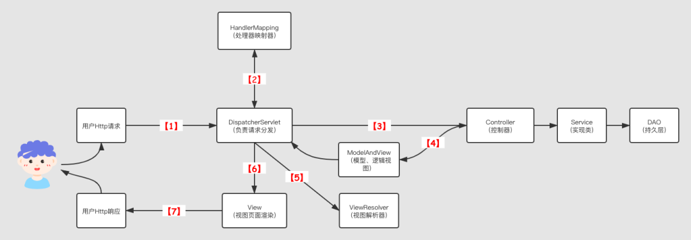
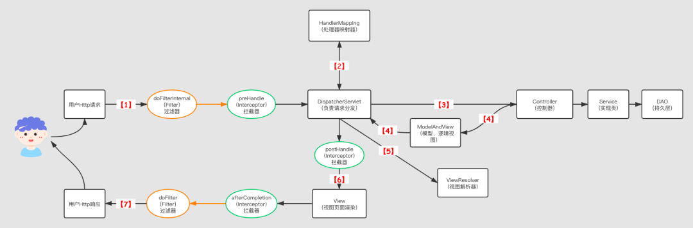
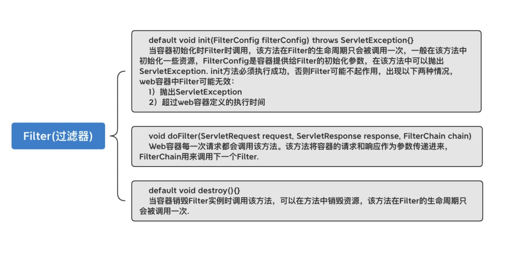
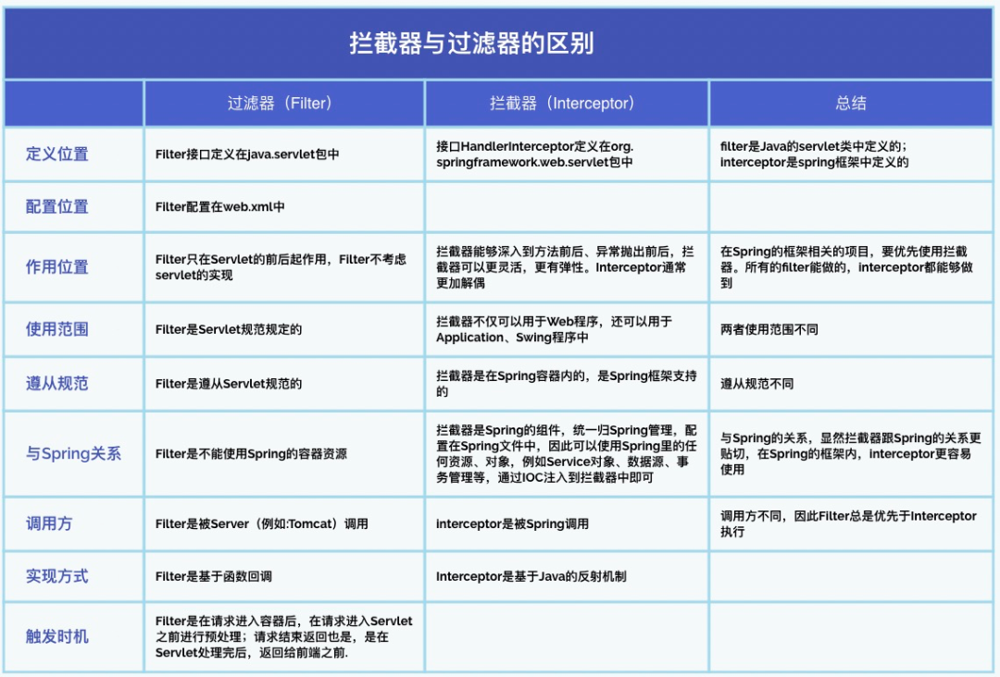

# 1. 计算机网络与Web

## 1.1 Token Session Cookie

Cookie中有那些属性？

- 过期时间，Expires、Max Age
- 域名和路径，Domain和Path
- 大小，Size
- Secure，Secure选项用来设置cookie只在确保安全的请求中才会发送
- httpOnly，这个选项用来设置cookie是否能通过 js 去访问，这个选项用来设置cookie是否能通过 js 去访问，默认情况下，客户端是可以通过js代码去访问

## 1.2 状态码

- 200 成功

- 300 多种选择，请求的资源包括多个位置，浏览器自行选择

- 301 永久移动

- 302 临时移动

- 400 语法错误

- 401 未授权，要求身份认证

- 403 理解但是拒绝执行，跨域，没有对应的路径

- 404 not Found

- 405 方法不允许

- 413 请求体过大

- 500 服务器错误

- 502

  > 502 Bad Gateway即在服务器以代理服务器或网关的形式工作时，收到从上游服务器到达的执行请求的非法响应

- 503 服务不可达 Service Unavailable 服务器暂时因为超载等原因暂时无法处理请求

- 504 Gateway Time-out 充当网关或代理的服务器，未及时从远端服务器获取请求

- 505 不支持的http协议

## 1.3 jwt

json web token, json的一种传输方式

## <u>1.4  请求一个网页会发生什么？</u>

> 1. ARP
> 2. DNS
> 3. TCP socket
> 4. http nginx 

## 1.5 HTTPS是否保存状态？HTTPS具体的实现？

https的特点：

- 内容加密：采用混合加密技术，中间者无法直接查看明文内容
- 验证身份：通过证书认证客户端访问的是自己的服务器
- 保护数据完整性：防止传输的内容被中间人冒充或者篡改

## 1.6 TCP 的滑动窗口与拥塞控制及流量控制

详情见：https://www.cnblogs.com/xiaolincoding/p/12732052.html

- 重传机制
- 滑动窗口
- 流量控制
- 拥塞控制

### 1. 重传机制

重传机制分有以下四种：

- 超时重传

  > 超时重传时间RTP，略大于往返时间RTT，是经过统计学测量得到的

- 快速重传

  > 快速重传的工作方式是当收到三个相同的 ACK 报文时，会在定时器过期之前，重传丢失的报文段。


### 2. 滑动窗口

- 发送窗口（已发送未确认，可用窗口），已发送已确认，未发送


滑动窗口的指针：

- `SND.WND`：表示发送窗口的大小（大小是由接收方指定的）；
- `SND.UNA`：是一个绝对指针，它指向的是已发送但未收到确认的第一个字节的序列号，也就是 #2 的第一个字节。
- `SND.NXT`：也是一个绝对指针，它指向未发送但可发送范围的第一个字节的序列号，也就是 #3 的第一个字节。
- 最后这个指向的是滑动窗口的末尾，是个相对指针，未SND.WND + SND.UNA


### 3. 流量控制

> 解决端对端的收发控制问题

流量控制的死锁问题？

> 如果接收端告诉发送端窗口为0，然后发送端不发送数据，这个时候接收端又调整了窗口大小，但是这个数据包丢失了，这样双方都特么在等对方
>
> 解决方法：**窗口探测** 报文。

**糊涂窗口综合症**：

> 窗口太小，发送的报文携带的数据很少


### 4. 拥塞控制

> 对整个网络进行拥塞控制

拥塞窗口：

**拥塞窗口 cwnd**是发送方维护的一个的状态变量，它会根据**网络的拥塞程度动态变化的**。

拥塞控制主要是四个算法：

- 慢启动
- 拥塞避免
- 拥塞发生
- 快速恢复

**拥塞发生**

当网络出现拥塞，也就是会发生数据包重传，重传机制主要有两种：

- 超时重传
- 快速重传

## 1.7 http 1.0 1.1 2.0

http:2.0 特色功能：

- 二进制分帧

  > 如将，http1.X中的首部信息header封装到Headers帧中，而request body将被封装到Data帧中。

- 头部压缩

- 多路复用

- 服务推送

## 1.8 CSRF XSS 等网络攻击

# 2.Spring

## <u>2.1 循环依赖</u>

## <u>2.2 Bean的加载过程</u>

## <u>2.3 IOC的基本操作</u>

## <u>2.4 SpringBoot自动装配原理</u>

## <u>2.5 SpringCloud</u>

## 2.6 对Spring的理解？

## 2.7 httpClient

## 2.8 @RequestBody注解

## 2.9 SpringAOP体现在那些组件中


# 3. Redis

## 3.1 Redis  集群的实现

## 3.2 保证Redis缓存和数据库一致

## 3.3 布隆过滤器

## 3.4 如何用[redis](https://www.nowcoder.com/jump/super-jump/word?word=redis)设计一个延迟队列?


# 4. 数据库

## 4.1 MVCC 

## 4.2 binlog

## 4.3 inner join, left join

## 4.4 主键索引与普通索引

## 4.5 2000万条数据B+树的高度

## 4.6 数据库的隔离级别

## 4.7 MySQl的快照读问题

## 4.8 SQL 优化？数据库优化？


# 5. 算法与数据结构(Java)

## 5.1 会用到字符串常量池？

## 5.2 红黑树

## 5.3 类的加载机制

## 5.4 hash解决冲突 （ 开放定址法、链地址法、再哈希法、建立公共溢出区 ）


# 6. 操作系统相关

## 6.1 进程和线程之间的通信


# 7. Java

## 7.1 Java是值传递还是引用传递？

## 7.2 JVM本地方法是啥？

## 7.3 栈上是否发生GC?	 

> 目前认为栈上不GC

## 7.4 过滤器与拦截器

过滤器（Filter) 拦截器（Interceptor)

**过滤器**

- servlet规范中的一部分，任何java web工程都可以使用
- 在url-pattern中配置了/*之后，可以对所有要访问的资源进行拦截

**拦截器** 

- 拦截器是SpringMVC框架自己的，只有使用了SpringMVC框架的工程才能使用
- 拦截器只会拦截访问的控制器方法， 如果访问的是jsp/html/css/image/js是不会进行拦截的


**拦截器的定义：**

　　拦截器是面向切面（AOP）编程中应用的一种统一处理方案，就是在你的Controller、Servie或者一个Method调用一个Method，或者在Method调用一个Method之后，统一的进行处理的方案，基于Java的反射机制。

　　拦截器，在AOP（Aspect-Oriented Programming）中可以用于在某个方法或者字段被访问之前，进行拦截，然后在之前或者之后加入某些统一的处理方法。拦截是AOP的一种具象的实现方式。

　　拦截器将很多service或者Controller中共有的行为提炼出来，在某些方法执行的前后执行，提炼为通用的处理方式，让被拦截的方法都能享受这一共有的功能，让代码更加简洁，同时，当共有的功能需要发生调整、变动的时候，不必修改很多的类或者方法，只要修改这个拦截器就可以了，可复用性很强。

　　Spring MVC 中的Interceptor拦截请求是通过**HandlerInterceptor**来实现的。

**过滤器的定义：**

　Filter可以认为是Servlet的一种“加强版”，它主要用于对用户请求进行预处理，也可以对HttpServletResponse进行后处理，是个典型的处理链。Filter也可以对用户请求生成响应，这一点与Servlet相同，但实际上很少会使用Filter向用户请求生成响应。使用Filter完整的流程是：Filter对用户请求进行预处理，接着将请求交给Servlet进行处理并生成响应，最后Filter再对服务器响应进行后处理。

　　在Web中称之为Filter，通过配置多个过滤器，Web系统可以对所有的Servlet请求进行一层一层的过滤，以完成一些特殊的功能。例如常用的资源访问权限控制、特殊字符以及敏感词过滤、响应信息压缩等功能。

　　Servlet中的过滤器Filter是实现了javax.servlet.Filter接口的服务器端程序，主要的用途是设置字符集、控制权限、控制转向、做一些业务逻辑判断等。其工作原理是，只要你在web.xml文件配置好要拦截的客户端请求，它都会帮你拦截到请求，此时你就可以对请求或响应(Request、Response)统一设置编码，简化操作；同时还可进行逻辑判断，如用户是否已经登陆、有没有权限访问该页面等等工作。它是随你的web应用启动而启动的，只初始化一次，以后就可以拦截相关请求，只有当你的web应用停止或重新部署的时候才销毁。

<u>**有拦截器和没有拦截器请求与分发的区别**</u>






**拦截器主要方法概览**


过滤器需要实现的方法：




区别：




- 过滤器基于函数回调，拦截器基于Java反射
- 拦截器是AOP思想的具体应用。


## 7.5 注解的原理

## 7.6 有哪些锁？


# 8. 其他

## 8.1 大设计思想

## 8.2 项目

## 8.3 工厂模式

## 8.4 CAP原则与RPC

## 8.5 git 命令

## 8.6 \#{}和${}区别, sql注入问题

## 8.7 select、poll、epoll有啥区别？

## 8.8 linux 如何查看端口是否被占用？

netstat命令

特定端口查看  netstat -anp |grep 3306

```js
1.先用ps -ef | grep xxx(某个进程)，可以查看某个进程的pid。
2.再用netstat -anp | grep pid号，可以查看到该进程占用的端口号!
```

## 8.9 一致性哈希算法


# 9. 算法

## 9.1 随机数的生成

## 9.2 链表中环的长度


# 10. 项目

## 10.1 压力测试


