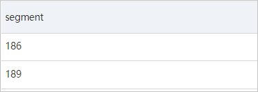

## JSON 处理

诸如以下的Json


### 查询1：

```sql
*
and request.param.userId: 186499 |
SELECT
  distinct("request.clientIp")
```

返回：


### 查询2：

```sql
*  not response :SUCCESS |
SELECT
  json_extract_scalar(response, '$.errcode') AS errcode
```

结果：

p435042


json_extract_scalar 会将 Json 提取出来，提取为varchar

json_extract 会将Json 提取出来，提取的结果还是Json

```json
* |
SELECT
  json_extract(request, '$.clientIp')
```

结果：


json_extract_scalar 可以再进入其他函数再次处理，如下面的提取出来的ip地址，可以进一步截取

```sql
* |
SELECT
  split_part(
    json_extract_scalar(request, '$.clientIp'),
    '.',
    1
  ) AS segment
```

结果：

p434894



### json_path：

json_path：为 要截取Json 字段中的位置

json_path格式为`$.a.b`，美元符号（$）代表当前JSON对象的根节点，然后通过半角句号（.）引用到待提取的节点

### 案例：

```sql
*
and response: SUCCESS |
SELECT
  json_extract(request, '$.param.orders')
```


转换为array类型

```sql
*
and response: SUCCESS |
SELECT
  cast(
    json_extract(request, '$.param.orders') AS array(json)
  )
```


使用UNNEST子句将数组展开:

```sql
*
and response: SUCCESS |
SELECT
  orderinfo
FROM  log,
  unnest(
    cast(
      json_extract(request, '$.param.orders') AS array(json)
    )
  ) AS t(orderinfo)
```


```sql
*
and response: SUCCESS |
SELECT
  sum(
    cast(
      json_extract_scalar(orderinfo, '$.payment') AS bigint
    )
  )
FROM  log,
  unnest(
    cast(
      json_extract(request, '$.param.orders') AS array(json)
    )
  ) AS t(orderinfo)
```

提取**payment**字段值，再使用cast函数将其转换为bigint类型，最后进行求和计算

```sql
*
and response: SUCCESS |
SELECT
  sum(
    cast(
      json_extract_scalar(orderinfo, '$.payment') AS bigint
    )
  )
FROM  log,
  unnest(
    cast(
      json_extract(request, '$.param.orders') AS array(json)
    )
  ) AS t(orderinfo)
```


**分组Group：**

```sql
*
and response: SUCCESS |
SELECT
  item,
  count(1) AS cnt
FROM  (
    SELECT
      orderinfo
    FROM      log,
      unnest(
        cast(
          json_extract(request, '$.param.orders') AS array(json)
        )
      ) AS t(orderinfo)
  ),
  unnest(
    cast(
      json_extract(orderinfo, '$.commodity') AS array(json)
    )
  ) AS t(item)
GROUP  BY
  item
ORDER BY
  cnt DESC
```


